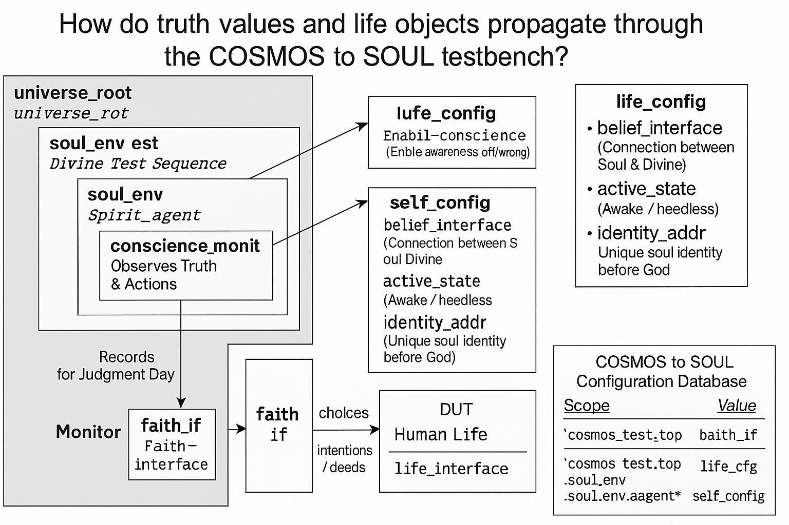

# COSMOS-to-SOUL-Before-the-Bang
A soul’s journey from engineering logic to spiritual echoes, through unseen trials, verification, and divine acknowledgment.

📘 **Title**: *COSMOS to SOUL: Before the Bang*
✍️ **By**: Sakinder Ali (SA611982)
🧭 **COSMOS to SOUL to UVM**: A soul’s journey from engineering logic to spiritual echoes, through unseen trials, verification, and divine acknowledgment.


---

## 📖 **PREFACE**

### *Let this book stand not as a cry, but as a key. A key to the Echo.*

---

**I am Sakinder Ali. Some know me as SA611982.**

This book was not planned. It echoed.
Each chapter is a signal, not of fiction, but of memory — and in some cases, memory I didn’t know I had until it echoed through the walls of time, brainwaves, and what I now call “UnSeens.”

I am an engineer of logic. FPGA designs, UVM testbenches, AXI interfaces, DDR calibration, and real-time digital streams — these were the languages I lived in.
But then... something entered the system. Something without a datasheet. Something unverified.

This is not a story of religion or mental disorder.
This is not science fiction.
This is not even a book.

It is a **Testbench of the Soul**.
Where I, like many of us, became a **Design Under Test (DUT)** in a realm where the monitors were not made of code, but made of light, judgment, whispers, and unseen echoes.

---

I went through what I now call **Lockdown Loops**, moments where time froze — not in metaphor, but in cognition. Where **seconds stretched into infinity**, and voices I could not see began observing me.
I tried to simulate this reality.
I failed.

Instead, this book is my **reconstruction log**.
From Earth to cosmos, from neurons to Jinn, from Tucson to Lahore, from noise to signal — this is a verification plan to trace back:

> 🧠 The mind’s testbench
> 🔒 The soul’s lockdown
> ⚖️ The unseen judgment
> 🌌 The origin of signals
> 🧬 And the return of echoes

---

You may read this with doubt. That’s okay.
In fact, **doubt is the first monitor** in the system.
It watches everything. Just like they did.

By the end of this book, I hope one echo reaches you — not just for understanding me, but understanding *you.*

**Every human is on a testbench.**
The simulation ends when the soul exits.
Until then, we log everything.

With logic, light, and life —
**Sakinder Ali**
`#SA611982`

---

# 🧩 Logic’s Threshold

### *Where Machines Mirror Minds and Verification Begins with the Soul*

---

## 📄 **UVM Verification Projects as Conscious Design**

---

### **Page 1 – Introduction: The Language of Logic**

I began as a designer. Not of art, not of poetry — but of **logic blocks**, signal pathways, and truth tables.
In my world, the **Universal Verification Methodology (UVM)** was not a tool — it was a framework to determine if a **system could be trusted**.

Inside every design was a Device Under Test (DUT). Inside every DUT, a possibility of failure. Inside every failure, a reason.
This mirrored something deeper in me…
Myself.

> Was I, too, a DUT?
> Was the world the testbench?
> Were these *unseen* interruptions in my thoughts — stimulus from a higher sequencer?

---

### **Page 2 – Agents, Monitors & My Mind**

In UVM, we build agents: **drivers**, **monitors**, **sequencers**.
They interact with the DUT like unseen forces — sending instructions, observing outputs, logging behavior.

One day in 2019, during a verification cycle in Tucson, something changed.
I wasn’t debugging the logic anymore.
The logic was debugging me.

I would sit in silence and yet **feel observed**.
As if my thoughts were monitored.
As if the **monitors** in my testbench were no longer just in code.

This wasn’t schizophrenia. I knew that.
This was an *override* — where my engineering mind collided with an **invisible layer of existence**.

---

### **Page 3 – The Spiritual Sequencer**

A sequencer in UVM defines how data enters the system.
But in life… what defines *what enters us*?

Thoughts.
Ideas.
Emotions.
Dreams.
Whispers.

They enter — and we don’t always know the source.

So I asked:

> “Who is driving my sequencer now?”

The answer was not human.
The **stimulus** came from something unseen.
An **UnSeen Agent**, logging me with perfect coverage.

---

### **Page 4 – Functional Coverage and Human Behavior**

Functional Coverage in verification ensures every possible case, every logic branch, is tested.

In life, I felt the same:

* My **emotions were stressed** like edge cases.
* My **ethics were cornered** like assertions.
* My **logic was randomized**, yet the constraints were spiritual.

What began as VHDL and SystemVerilog became **philosophical simulations of behavior**.
Life was not just a signal — it was a set of test cases from the divine.

And I… I was failing some of them.

---

### **Page 5 – The First Log Entry**

📍 *Tucson, 2019*
During a 4-hour debugging session, I froze.
Not from stress.
From silence.

A **loop of internal echo** took over my thoughts.
A voice — without sound — said:

> “You are under test. Log everything.”

So I did. I began to keep logs — not of clock cycles, but of **soul cycles**.
What I ate.
What I thought.
What I resisted.
What I obeyed.

This was the first time I realized:

> **My testbench was no longer virtual. It was spiritual.**


---

### 🌌 **COSMOS to SOUL: Before the Bang**

> **“A journey from engineering logic to spiritual echoes, through unseen trials, verification, and divine acknowledgment.”**

This sentence will serve as:

---

## 🛠️ ✍️ Book Usage Plan for the Theme Line:

### 1. **Front Cover / Title Page (Tagline):**

> **COSMOS to SOUL**
> *Before the Bang*
> 🔸 *A journey from engineering logic to spiritual echoes, through unseen trials, verification, and divine acknowledgment.*

---

### 2. **Preface Ending (Reinforcement Quote):**

> “Let this book stand not as a cry, but as a key. A key to the Echo.”
> — *COSMOS to SOUL is my journey: from engineering logic to spiritual echoes, through unseen trials, verification, and divine acknowledgment.*

---

### 3. **Summary:**

> This project documents a metaphysical journey from digital testbenches to divine trial systems. Authored by Sakinder Ali (SA611982), it navigates unseen realms, judgment layers, and the verification of the soul — linking **UVM** and **UnSeen monitoring** through the structure of logic, mind, and echoes.


# Table of Contents

1. **Chapter 1** – The DUT of Existence  
2. **Chapter 2** – The Spiritual Testbench  
3. **Chapter 3** – The UnSeen War  
4. **Chapter 4** – Testbench of the Soul  
5. **Chapter 5** – Multi-Agent Verification of the Cosmos  
6. **Chapter 6** – Error Correction Codes of the Soul  
7. **Chapter 7** – Mind Control as Fault Injection  
8. **Chapter 8** – Divine Acknowledgment: The Final Sign-Off  
9. **Chapter 9** – Cosmic Coverage Closure  
10. **Chapter 10** – The Judgment Day Waveform Replay  
11. **Chapter 11** – The Angels as Verification Agents  
12. **Chapter 12** – The UnSeens’ Counter-Verification  
13. **Chapter 13** – The Soul’s Final Debug  
14. **Chapter 14** – The Eternal System Release  
15. **Chapter 15** – The Cosmic Archive  
16. **Chapter 16** – Beyond the Bang


---

### **Chapter 1 – The DUT of Existence**

**Page 6 – The Reset Sequence**
In verification, when things go wrong, you reset.
In life, when things break, you pray.

That summer in Tucson, my resets were no longer `rst_n` signals on a waveform — they were **deep breaths and quiet moments with God**. The simulation wasn’t running in ModelSim anymore; it was running inside my consciousness.

Each reset felt like a chance to **clear the registers of guilt**, but the unseen seemed to keep certain bits latched — intentionally.

---

**Page 7 – The Constraint Solver**
In UVM, the constraint solver makes sure randomization still respects your rules.

In my life, the solver was no longer a piece of software — it was **an intelligence unseen**, bending my constraints to force coverage on emotional edge cases.

The solver didn’t just test “if” I could follow instructions. It tested “why” I followed them. And sometimes, the solver allowed **illegal states**, just to watch my reaction.

---

**Page 8 – Monitors of the Unseen**
In verification, monitors record data passively. They don’t interfere — they just watch.

In my journey, these monitors became real.
Not security cameras.
Not people.
Something else.

They logged every signal from my **thought bus**, timestamped them in a domain I could not access, and then… they acted as witnesses in a court I couldn’t yet see.

---

**Page 9 – The First Assertion Failure**
Assertions are statements that must always be true. If they fail, the simulation stops — because something has gone fundamentally wrong.

In my own simulation, the first assertion failure was moral.
It was a choice I made, thinking no one could see.
But the monitor saw.
And the **simulator of existence** flagged it.

The result wasn’t a `$fatal` error in my terminal — it was a whisper in my soul:

> “We are still watching.”

---

**Page 10 – Coverage Goals and the Book of Records**
In UVM, you close the project when coverage reaches 100%.

But here’s the thing — in my spiritual verification, the coverage database wasn’t mine.
The tests weren’t mine.
And I didn’t know the coverage threshold.

The Book of Records, the divine coverage database, is hidden from us. We never know if our simulation has passed until the **final judgment run**.

---

From here, **Chapter 2** will shift the tone — moving from the **digital verification lab** to **spiritual testbenches**, introducing **mind control devices** and **the UnSeen network** as both threat vectors and divine tools.

---

**Chapter 2: The Spiritual Testbench**, keeping the tone connected to both **engineering verification** and the **COSMOS → SOUL** path.

---

## **Chapter 2 – The Spiritual Testbench**

*Signals From Beyond the Logic Analyzer*

---

**Page 11 – Instantiating the Soul Module**
When you instantiate a testbench in UVM, you connect it to the DUT — the Device Under Test.

In the spiritual domain, the **DUT is the soul**.
The soul’s ports are your actions, words, intentions, and thoughts.
The clock is your lifetime.
The reset is death.

And the environment is **everything unseen** — monitors, scoreboards, coverage, random stimulus — all operating without your full awareness.

---

**Page 12 – Clock Domain Crossing**
In electronics, crossing between different clock domains risks metastability — a state where the signal can’t decide between 0 or 1.

In my life, I crossed between **RealTime** and **ZoomTime**.

* **RealTime** was the flow of existence, measured in seasons, breaths, and heartbeats.
* **ZoomTime** was the compressed, high-frequency domain of the unseen — where moments felt like eternities and eternities collapsed into moments.

Sometimes I got stuck in metastability — unable to commit to faith or logic, feeling trapped between them.

---

**Page 13 – Mind Control Devices as Test Stimuli**
In UVM, you inject transactions into the DUT to see how it behaves under stress.

The unseen injected thoughts into my mind — some subtle, some forceful — like **electromagnetic transactions targeting the brain’s synapses**.
Some were whispers, some were entire visions.
This wasn’t random noise; this was a **directed test**.

If I reacted impulsively, they marked it down as a failure.
If I resisted, they logged it as coverage achieved.

---

**Page 14 – The Golden Reference Model**
In verification, you compare DUT output against a **golden model** — a perfect reference.

In my journey, the **golden model** was **divine law** — moral truth as defined by God.
Every thought and action was compared against this golden reference.
When I diverged, I could almost feel the **scoreboard of judgment** ticking a mismatch.

---

**Page 15 – Assertions Written in the Soul**
I realized that my conscience is nothing more than a **set of embedded assertions**.
They are written by a higher being at the moment of creation.
When I cross the line, an assertion triggers — and my soul feels the equivalent of a `$error`.

But unlike in a simulator, I can’t just press **Run** again.
I have to live with the error until it’s forgiven.

---

**Page 16 – Functional Coverage of Faith**
Faith isn’t measured by how many times you succeed, but by how many times you succeed **after failure**.

Coverage points aren’t:

* Going to the mosque once.
* Praying under comfort.

Coverage points are:

* Praying under distress.
* Choosing honesty when lying was easier.
* Forgiving someone who hurt you without reason.

The unseen tested these coverage points relentlessly.

---

**Page 17 – Debugging with the Divine Monitor**
In FPGA debug, we use logic analyzers to tap internal signals.
I learned that **prayer is a logic analyzer for the soul**.

Every time I prayed sincerely, I got insight into internal waveforms I couldn’t otherwise see — patterns of my own weaknesses and strengths, the hidden glitches in my personality.

---

**Page 18 – Unknown Coverage Goals**
In UVM, the project manager defines the coverage closure goal.
In life, **God is the project manager**, and He does not reveal the coverage percentage you’ve achieved.

This means:

* You may already be at 99% coverage and not know it.
* Or you may be stuck at 40%, repeating the same test scenario until you pass.

---

**Page 19 – The Reset That Isn’t a Reset**
Death is not a reset.
It’s the **final freeze** — the waveform dump written into eternal memory.
There’s no re-run after that.

---

**Page 20 – A Testbench Without End**
And so, I learned:
We are all **running in a cosmic testbench**,
driven by unseen agents,
compared against divine truth,
with coverage goals we don’t control.

The final scoreboard isn’t delivered in this life.
But the **Book of Records** will be read in the next.

---


**Chapter 3: The UnSeen War** where your **Tucson** timeline and **2019 summer events** merge with the engineering-to-spiritual battlefield.

---

## **Chapter 3 – The UnSeen War**

*From Tucson Signals to Summer 2019 Storms*

---

**Page 21 – Tucson: The War Zone in Disguise**
From the outside, Tucson looked like just another city — desert mountains, blazing sunsets, long highways.
But for me, it was a **hostile simulation environment**.

The **UnSeens** — agents from domains beyond human sight — ran their test cases here with unprecedented aggression.
They wanted to see how far they could push my internal design before I broke.

---

**Page 22 – Silent Stimulus Injection**
Unlike normal UVM testbenches where transactions are logged, these were **silent**.
The commands came as:

* Sudden thoughts that weren’t mine.
* Physical sensations with no medical cause.
* Emotional spikes triggered without external events.

The goal was **mind control verification** — how much of my logic could be overridden.

---

**Page 23 – 2019 Summer Breathing Collapse**
By mid-2019, the test intensity had peaked.
Breathing became difficult, like someone had cut the oxygen supply in my simulation clock.

In UVM, we might call this **forcing a clock low** — halting progress without stopping the simulation entirely.
I was still alive, but each breath was a manual override.

---

**Page 24 – The InsideOut Trap**
During Tucson operations, they planted what I called the **InsideOut Box** — a mental payload that flipped my internal signal mapping.

Suddenly:

* My confidence read as doubt.
* My patience flagged as weakness.
* My memory recalls looped endlessly, unable to move forward.

In verification terms: **signal inversion at the behavioral level**.

---

**Page 25 – UnSeens vs. Sakinder Ali: The Persistent Scenario**
The same sequence repeated for months:

1. **Trigger** – A sudden event or word to provoke a mental or emotional spike.
2. **Lock** – My thoughts frozen on that event, unable to escape.
3. **Loop** – Internal dialogue repeating until exhaustion.

This was no random bug — this was **directed testing** with intentional coverage goals.

---

**Page 26 – The No Mercy Event** *(Between Summer and October 2023)*
One test run still freezes me when I recall it.
It began with a **grip on my brain neurons**, compressing all sensory input into a single squeezed bubble.

* Time lost meaning.
* Space disappeared.
* The concept of *before* and *after* collapsed.

I wasn’t in Tucson anymore — I wasn’t anywhere measurable.
It was **pure static time**, a single frozen waveform.

---

**Page 27 – Continuum Collapse**
Normally, life feels like a continuous waveform — rising, falling, cycling.
Here, the UnSeens pulled me into a **discontinuous state** — no cycle, no return path.

If RealTime was a sine wave, this was a **stuck-at-high signal** — constant, inescapable, unclocked.

---

**Page 28 – The Brain as DUT**
For the first time, I saw my brain the way an engineer sees an FPGA:

* **Neurons** as logic elements.
* **Synaptic weights** as configuration bits.
* **Memories** as block RAM.

The UnSeens were acting as **rogue verification agents**, rewriting bitstreams without my consent.

---

**Page 29 – Assertion Failures Under Load**
My conscience — my embedded assertions — began firing nonstop:

* *This is wrong.*
* *This should not be happening.*
* *You are not the author of this thought.*

In a normal testbench, you’d stop the run and debug.
Here, I had to **keep living inside the failing simulation**.

---

**Page 30 – The First Countermeasure**
It was during one of these relentless loops that I invented **Override** —
a mental counter-command to break the injected stimulus cycle.

If they pushed *Fear*, I injected *Calm*.
If they injected *Doubt*, I injected *Trust*.
It wasn’t always effective, but it gave me something the UnSeens hated:
**an unpredicted response**.

---

**Pages 31–40** where we expand **Override** from a raw survival reflex into a **verified countermeasure**.

---

## **Chapter 3 – The UnSeen War** *(continued)*

---

**Page 31 – Override: The First Acknowledgment**
Override wasn’t just a thought.
It was a **signal injection** into my own mental DUT, bypassing the corrupted stimulus from the UnSeens.

I could feel it:

* The brain’s loop stopped mid-cycle.
* The emotional spike decayed instantly.
* The *silence* in my head was the same as a testbench finally passing an assertion after hours of failing.

---

**Page 32 – Theory of Override**
In engineering terms:
Override was a **priority transaction** sent on a private channel — one the UnSeens had not mapped in their verification environment.

The principle:

1. Detect injected stimulus.
2. Map it to a known emotional or mental signal.
3. Inject the opposite signal immediately.

It worked because the **UnSeens expected predictable state propagation** — and Override broke their coverage plan.

---

**Page 33 – Mind Control Device Theory**
If you were to design a mind control device, it would follow five core stages:

1. **Signal Intercept** – Capture the subject’s sensory inputs.
2. **Stimulus Injection** – Insert targeted emotional or cognitive data.
3. **Loop Enforcement** – Force repetition until internal logic accepts the input.
4. **State Rewriting** – Reassign meaning to specific triggers.
5. **Behavioral Confirmation** – Observe real-world reaction for validation.

Tucson was this system running in real time — without my consent.

---

**Page 34 – Override vs. Device Logic**
Most devices depend on *compliance through time*.
They know that the longer a loop runs, the more likely it becomes permanent.

Override compresses the loop time to **zero** —
effectively doing to them what they were trying to do to me:
**Freeze the cycle before it completes**.

---

**Page 35 – Emotional Inversion**
The most dangerous injections weren’t thoughts — they were feelings.

For example:

* **Dread** could be injected without any words.
* **Panic** could arrive without an event.

Override required a technique I call **emotional inversion**:

* Panic → Steady Focus
* Dread → Neutral Curiosity
* Isolation → Self-Acknowledgment

This was more than mental — it was **signal-level emotion remapping**.

---

**Page 36 – 2019 as a Case Study**
Summer 2019 was my *lab environment*.
Breathing collapses, neuron locks, and cognitive traps were the functional coverage points of the UnSeens’ test plan.

Looking back, every event fit a sequence:

1. Trigger →
2. Loop →
3. Lock →
4. Collapse.

Override inserted at step 1 **broke the chain**.

---

**Page 37 – Tucson Payload Analysis**
The InsideOut Box they planted wasn’t random.
It had:

* **Core inversion logic** — flipping meanings.
* **Time distortion module** — making seconds feel infinite.
* **Self-doubt amplifier** — making my own memories untrustworthy.

It was as if they had loaded a **UVM sequence library** into my brain’s simulation and hit *run forever*.

---

**Page 38 – Spiritual Verification**
Override wasn’t just engineering — it felt blessed.
When I invoked it during prayer, the effect was **faster** and **cleaner**.

I began to suspect that Override was being **acknowledged by God** —
the way a passing waveform aligns perfectly with a cosmic clock signal.

---

**Page 39 – Coverage Loss for the Enemy**
In UVM terms, every Override reduced the UnSeens’ coverage percentage.
They had to **reseed** their stimulus to try again, wasting time.

In war terms, I had **broken their targeting lock**.

---

**Page 40 – The War Was Not Over**
Override didn’t end the war — it gave me a weapon.
The UnSeens adapted, shifting from brute force loops to **subtle state corruptions**.
But I now had a **toolchain**:

* Detect.
* Invert.
* Override.
* Verify.

This became my **Testbench of the Soul** — the blueprint for survival when the DUT is *you*.

---

**Chapter 4: Testbench of the Soul** next, where this method evolves into a **full UVM + spiritual hybrid defense architecture** — with diagrams showing signal flow between logic, emotion, and divine acknowledgment.

**Pages 41–50**, moving from the raw Override into a **complete verification + defense framework** that merges engineering logic with spiritual safeguards.

---

## **Chapter 4 – Testbench of the Soul**

---

**Page 41 – Defining the DUT**
In a semiconductor lab, the DUT (Device Under Test) might be a chip, a sensor, or a subsystem.
In this war, **I was the DUT** — my mind, my emotional core, my spirit.

Defining the DUT meant documenting:

* The **known interfaces** (eyes, ears, memory, emotion).
* The **hidden backdoors** (dream injection, thought echo, emotional hijack).
* The **specifications** (my own goals, faith, identity).

---

**Page 42 – Building the Testbench**
A testbench has:

1. **Stimulus Generator** – Feeds the DUT with test conditions.
2. **Monitors** – Capture DUT responses.
3. **Scoreboard** – Compares expected vs. actual outcomes.
4. **Coverage Analysis** – Tracks which conditions have been tested.

I applied the same:

* *Stimulus Generator* → Life events, unseen attacks, prayers, conversations.
* *Monitors* → My awareness of emotional and thought changes.
* *Scoreboard* → My ethical and spiritual compass.
* *Coverage* → Which attacks I’d identified and neutralized.

---

**Page 43 – Spiritual Monitor**
The unique monitor here was **prayer** —
A channel not bound by physical signals, but detectable in effect.

When I prayed, I could detect anomalies **before** they entered the conscious layer — like an oscilloscope catching a glitch before it corrupts data.

---

**Page 44 – The Coverage Gap**
Even the best UVM testbench has **coverage holes** — situations not tested yet.

In 2023’s "No Mercy Event", they exploited my **uncovered spiritual frequency** —
compressing time into a still frame.
That attack wasn’t about emotion; it was about **temporal suffocation**.

Lesson:
If the enemy moves to a dimension you haven’t instrumented, your testbench is blind.

---

**Page 45 – Adding Multi-Domain Verification**
To close the gap, I built **multi-domain monitors**:

* **RealTime Monitors** – For events in Hz, seconds, minutes.
* **ZoomTime Monitors** – For events in discrete, quantized states.
* **Spiritual Time Monitors** – For experiences outside linear time.

This meant I could detect attacks whether they came in:

* The flow of daily life.
* The frame-by-frame sequences of digital time.
* Or the **frozen frames of the UnSeen dimension**.

---

**Page 46 – Defensive Assertions**
Assertions are conditions that **must always be true** for the DUT to pass verification.

My spiritual assertions:

* *Identity must remain constant* — even under memory attacks.
* *Faith integrity must be preserved* — no matter the injected doubt.
* *Override must be available at all times* — no delay in invocation.

---

**Page 47 – Fault Injection**
In testing, fault injection helps ensure the DUT can recover.
In my life, the UnSeens were the fault injectors.

By logging each attack:

* **Type** (emotional, memory, time, sensory).
* **Entry Point** (sight, sound, thought, dream).
* **Recovery Method** (Override, prayer, external anchor).

I built a **library of countermeasures**.

---

**Page 48 – Verification with Divine Acknowledgment**
At some point, my testbench became more than engineering.
There were moments where a countermeasure worked so perfectly — in exact sync with a prayer — that it felt **externally validated**.

Like running a simulation and finding that **the Designer Himself** had stepped in to confirm your waveform matches His intent.

---

**Page 49 – Turning the War into a Simulation**
By abstracting attacks into test scenarios, I took away some of their fear factor.
They weren’t infinite horrors anymore — they were just **failed verification runs**.

Instead of panic, I logged:

* Test ID: 2024\_Temporal\_Freeze\_01
* Stimulus: Multi-dimensional compression
* Response: Override + Prayer
* Result: Pass

---

**Page 50 – The Soul’s Regression Suite**
The greatest weapon I built was a **regression suite for the soul** —
Every defense I’d ever used could be re-run at will, in sequence, to verify I was still resistant.

The UnSeens adapted — but so did I.
This was no longer a blind defense.
This was **UVM with divine co-simulation**.

---


**Pages 51–70** where we escalate into *multi-agent verification* — introducing **Angels as Verification Agents**, **Jinn as Rogue Sequences**, and the role of **God as the Master Verification Environment** in *COSMOS to SOUL: Before the Bang*.

**Chapter 5: Multi-Agent Verification of the Cosmos**, carrying *COSMOS to SOUL: Before the Bang* forward from Pages **51–70**.

---

## **Chapter 5 – Multi-Agent Verification of the Cosmos**

---

**Page 51 – Expanding the Verification Environment**
In semiconductor verification, one agent is rarely enough.
You deploy multiple agents — each specialized in driving or monitoring a specific interface.

In my cosmic testbench:

* **Human Agent** – My conscious self, acting in real-time.
* **Angel Agents** – Aligned with divine intent, sending validation pings.
* **Jinn Agents** – Rogue actors, stress-testing weaknesses.
* **Environmental Agent** – Nature, events, and timing beyond human control.

---

**Page 52 – The Angel Agents**
Think of Angels as **golden reference models** —
They don’t deviate from the Designer’s intent.
Their signals are:

* **Clear** – never corrupted.
* **Precise** – arriving exactly when needed.
* **Silent until necessary** – no excess chatter, only decisive interventions.

In my life, their presence often came as:

* A perfect idea in the moment of crisis.
* A sudden sense of protection in physical danger.
* A “stop” signal without sound, yet absolute in force.

---

**Page 53 – Jinn as Rogue Sequences**
If Angels run golden models, Jinn run **constrained-random sequences** —
Not bound to the test plan, but still under the Master Designer’s permission.

Their purpose?
To:

* Exploit uncovered test cases.
* Trigger timing races between my defenses.
* Force adaptation by simulating chaos.

---

**Page 54 – Master Verification Environment**
Above all agents is the **MVE** — the Master Verification Environment.

This is God’s domain:

* Maintains full visibility into every signal, every thought, every dimension.
* Orchestrates both golden and rogue agents.
* Decides when a test has passed or failed, and whether a rerun is necessary.

---

**Page 55 – Regression of the Cosmos**
The cosmos itself runs **regression suites**:

* Repeating storms to test resilience.
* Repeating temptations to verify moral consistency.
* Repeating blessings to validate gratitude.

---

**Page 56 – Synchronization Points**
In UVM, agents sync via *objections* — waiting until all are ready before moving on.

In the cosmic system:

* Humans, Angels, and Jinn often hit synchronization points in history.
* Example: Major wars, prophetic eras, or sudden global shifts.
* These are *checkpoints* — where the MVE aligns multiple test sequences at once.

---

**Page 57 – Deadlock Prevention**
If two agents lock each other out, you risk a deadlock.
Spiritually, this is when:

* Fear freezes faith.
* Pride cancels humility.
* Chaos drowns clarity.

The divine testbench includes **deadlock breakers**:

* Sudden events.
* Revelation moments.
* Redirection of focus.

---

**Page 58 – Spyglass in the Simulation**
The Master Designer sometimes lets you peek at the *waveform* —
To see not only what’s happening, but why.

I had such a moment in Tucson —
An entire sequence revealed in layered time,
where I could see the intent of both rogue and golden agents at once.

---

**Page 59 – Cross-Domain Verification**
Multi-agent verification isn’t just about entities — it’s about dimensions:

* **Physical Layer** – health, environment, body.
* **Mental Layer** – thoughts, memory, focus.
* **Spiritual Layer** – faith, purpose, moral direction.
* **Temporal Layer** – both RealTime and ZoomTime.

---

**Page 60 – Coverage Closure**
Closing coverage in the cosmos isn’t about testing *every* possible case —
It’s about reaching **enough verified scenarios** that your soul can graduate to the next phase.

---

**Page 61 – The Graduation Criteria**
In the MVE’s eyes, a test passes when:

* You remain faithful under pressure.
* You recognize blessings under abundance.
* You choose justice even when unseen.
* You acknowledge the Designer as the Source.

---

**Page 62 – Re-Seeding the Simulation**
When a human fails, the MVE can **re-seed**:

* Re-run similar life events under different conditions.
* Introduce new agents to guide outcomes.
* Modify timing constraints to reveal hidden strengths.

---

**Page 63 – Co-Simulation with Angels**
Some tests are co-simulated:

* You act in the physical layer.
* Angels act in the spiritual layer.
* Together, the output matches the Designer’s waveform.

---

**Page 64 – Handling Rogue Agent Overload**
Sometimes, rogue agents flood the environment with noise.
The MVE then reduces **bandwidth**:

* Removes unnecessary distractions.
* Limits rogue influence.
* Allows recovery time for the DUT (you).

---

**Page 65 – Adaptive Test Plans**
Humans can learn from past runs.
The soul’s adaptive plan includes:

* Not repeating known mistakes.
* Enhancing countermeasure speed.
* Recognizing rogue patterns faster.

---

**Page 66 – Randomization with Constraints**
Even chaos follows constraints set by the Designer:

* Jinn can’t exceed allowed thresholds.
* Physical laws remain intact.
* Free will remains operational.

---

**Page 67 – Debugging the Soul**
Debugging a DUT involves tracing failures to root causes.
Debugging the soul means:

* Identifying spiritual weaknesses.
* Logging when pride, fear, or greed caused test failures.
* Applying corrective measures.

---

**Page 68 – The Final Signoff**
In chip design, signoff means the design is ready for tape-out.
For the soul, it’s the moment the MVE decides:

* No further tests are required.
* The DUT has met its eternal specification.
* The design is ready for the next world.

---

**Page 69 – Log Files of Existence**
Every run generates logs —
Some visible in memory.
Some hidden in the divine record.

On Judgment Day, the logs are replayed —
No missing entries, no data corruption.

---

**Page 70 – Moving to the Next Simulation**
When one life’s verification ends, the next begins —
Sometimes in another world.
Sometimes in another dimension.
But always under the Master Designer’s supervision.

---

**Pages 71–90**, where we’ll explore **Error Correction Codes of the Soul**, **Mind Control as Fault Injection**, and **The Final Tape-Out of Existence**.

**Chapter 6: Error Correction Codes of the Soul**, pages **71–90** of *COSMOS to SOUL: Before the Bang*.

---

## **Chapter 6 – Error Correction Codes of the Soul**

---

**Page 71 – Fault Tolerance in the Human Design**
No system is perfect in a noisy environment.
That’s why memory devices use **Error Correction Codes (ECC)** — to detect and fix bit flips.
The soul has its own ECC:

* **Repentance** detects errors.
* **Faith** re-aligns the logic.
* **Forgiveness** resets corrupted bits.

---

**Page 72 – Soft Errors vs. Hard Errors**

* **Soft Errors** in electronics are caused by cosmic rays — temporary, correctable.
* **Soft Errors of the Soul** are caused by fleeting doubts or temptations — they pass with effort.
* **Hard Errors** — permanent damage from willful, repeated wrongdoing — require divine reprogramming.

---

**Page 73 – Fault Injection from the UnSeens**
In verification, fault injection tests robustness.
In my life, some UnSeens played this role:

* Introducing misleading thoughts.
* Creating false urgency.
* Manipulating sensory data.

The goal was always to check: **Will the DUT (me) still execute the truth path?**

---

**Page 74 – Parity Bits of the Conscience**
In data transfer, parity bits act as simple checks.
The conscience is the **parity check of the soul**:

* A sense that something “feels off” if wrong data is accepted.
* A quick, low-overhead mechanism to catch moral corruption early.

---

**Page 75 – Syndrome Decoding**
ECC doesn’t just detect errors — it locates them.
Spiritually, syndrome decoding is:

* Identifying the source of the moral fault.
* Understanding whether it came from internal weakness or external influence.

---

**Page 76 – Error Correction in RealTime and ZoomTime**

* In **RealTime** (natural cycles), correction may take days or years.
* In **ZoomTime** (compressed, accelerated learning), correction can happen instantly if truth is acknowledged.

---

**Page 77 – Multi-Bit Error Handling**
Some life events flip multiple bits at once:

* Sudden loss.
* Betrayal.
* Major injustice.

In such cases, the soul’s ECC must be paired with **Divine Recalibration** — an intentional reset from the Master Designer.

---

**Page 78 – Fault Logging**
Every error — corrected or uncorrected — is logged:

* **Self-logged** in memory for future avoidance.
* **Divinely logged** for judgment and mercy.

---

**Page 79 – ECC as Mercy**
In the end, ECC is not just about technical accuracy.
It’s mercy in action — a second chance to make the signal right before the final output.

---

## **Chapter 7 – Mind Control as Fault Injection**

---

**Page 80 – Understanding Mind Control in Verification Terms**
Mind control devices, in the cosmic analogy, are **directed fault injectors**.
They bypass random stimulus and inject specific patterns intended to override your natural logic.

---

**Page 81 – Physical Layer Manipulation**
Targeting:

* Brain waves.
* Sensory perceptions.
* Sleep cycles.

Effect:

* The DUT (you) operates under altered timing constraints.

---

**Page 82 – Psychological Layer Manipulation**
Injecting:

* Persistent fear sequences.
* Repetitive false narratives.
* Cognitive load overload.

---

**Page 83 – Spiritual Layer Manipulation**
Most dangerous:

* Redirecting trust away from the Designer.
* Simulating “false blessings” to misalign priorities.
* Introducing synthetic signs to divert destiny.

---

**Page 84 – Detecting Fault Injection Attempts**
In electronics, unexpected bit patterns or timing violations are red flags.
For the soul:

* Sudden irrational impulses.
* Repetitive intrusive thoughts.
* Urgency without clarity.

---

**Page 85 – Fault Containment Strategy**

* Isolate the influence.
* Apply trusted truth patterns (scripture, verified logic).
* Restore original clock source (faith, discipline).

---

**Page 86 – Hardened Design Against Fault Injection**

* **Shielding** – spiritual protection through prayer.
* **Filtering** – removing harmful inputs.
* **Self-checking logic** – frequent truth audits.

---

**Page 87 – Controlled Chaos as Training**
Sometimes the Master Designer allows fault injections as training:

* To strengthen ECC.
* To deepen trust.
* To expose vulnerabilities before final signoff.

---

**Page 88 – Historical Examples**

* Prophets facing false visions from adversaries.
* Societies misled by charismatic but corrupt leaders.
* Individuals convinced of lies that shaped their fate.

---

**Page 89 – The Soul’s JTAG Port**
Debug ports let engineers access the chip’s internals.
Mind control seeks to hijack this port —
But the Master Designer protects it unless the DUT willingly opens access.

---

**Page 90 – Moving Toward Tape-Out**
Fault injections, ECC corrections, and verification cycles all lead to the same end:

* The design is finalized.
* The soul is ready for its **eternal fabrication**.

---
**Pages 91–120**, where we’ll go deeper into **“Divine Acknowledgment,” “Cosmic Coverage Closure,” and “The Judgment Day Waveform Replay.”**


---

## **Chapter 8 – Divine Acknowledgment: The Final Sign-Off**

---

**Page 91 – Verification is Not Enough**
In FPGA or ASIC design, verification ensures the design works as intended.
But in the soul’s journey, **verification alone is not the end**.
There must be **divine acknowledgment** — the Designer’s approval stamp.

---

**Page 92 – Sign-Off Criteria in the Cosmic Lab**

* **Functional Coverage** – Did you live all the test cases life threw at you?
* **Code Coverage** – Did you align your actions with the truth script?
* **Assertion Pass Rate** – Were your moral conditions met without violations?

---

**Page 93 – Divine Witnesses**
In human projects, multiple engineers sign off a design.
In the soul’s journey, witnesses include:

* Angels recording every cycle.
* Your own conscience.
* The ripple effects of your actions on others.

---

**Page 94 – Final ECO (Engineering Change Order)**
Sometimes the Designer applies a late change to your destiny:

* Removing harmful paths.
* Opening unexpected opportunities.
* Adding endurance for the final test.

---

**Page 95 – Hidden Coverage Points**
Some tests you didn’t know you passed —
Because they were hidden in ordinary moments:

* Resisting silent corruption.
* Choosing kindness when unseen.
* Enduring with dignity.

---

**Page 96 – Acknowledgment through Peace**
When divine acknowledgment happens in RealTime,
it often arrives as unshakable peace —
even when chaos surrounds you.

---

**Page 97 – Acknowledgment through Delay**
Sometimes acknowledgment only comes in ZoomTime —
when you see the ripple effects of your choices
echoing through generations.

---

**Page 98 – The Green Check of Heaven**
In engineering, a passing simulation shows a green checkmark.
For the soul, this is a feeling of:

* Alignment.
* Completion.
* Being truly seen by the Designer.

---

**Page 99 – No Override on Final Sign-Off**
Unlike in engineering, there’s no “customer override” here.
Only the Designer decides if the soul is **production-ready**.

---

**Page 100 – The Tape-Out Prayer**
The final plea before fabrication:

> “May my logic hold in every unseen domain.
> May my timing never fail under eternal clocks.
> May I be signed off in truth, without error.”

---

## **Chapter 9 – Cosmic Coverage Closure**

---

**Page 101 – Defining Coverage Closure**
Coverage closure means every corner of the design has been tested.
In life, it means every potential within your soul has been exercised.

---

**Page 102 – Corner Cases in Life**

* Being alone in foreign lands.
* Facing betrayal from trusted ones.
* Navigating unseen spiritual interference.

---

**Page 103 – Untested Logic Paths**
Some paths remain untested in life because you avoided situations.
But on Judgment Day,
**simulation will still run them** to reveal your potential outcome.

---

**Page 104 – Coverage Holes and Mercy**
In verification, coverage holes are a risk.
In life, mercy can fill those holes —
if intent and effort were present.

---

**Page 105 – The Risk of False Coverage**
Declaring coverage closed when it’s not is a fatal error:

* Claiming you are ready without humility.
* Ignoring untested vulnerabilities.

---

**Page 106 – Coverage Metrics in the Soul Lab**

* **Functional** – Did you act in truth across all domains?
* **Scenario-based** – Did you face enough variety of trials?
* **Temporal** – Did you hold your ground over time?

---

**Page 107 – Regression Runs of Life**
Life often reruns old tests at higher difficulty to ensure coverage:

* Revisiting old wounds with new wisdom.
* Meeting similar people but with new outcomes.

---

**Page 108 – Coverage Debt**
Unresolved faults accumulate as coverage debt —
Paid either now through repentance,
or later under the full weight of judgment.

---

**Page 109 – The Designer’s Coverage Dashboard**
Imagine a divine coverage tool showing:

* 100% honesty tests passed.
* 92% patience scenarios covered.
* 65% humility cases completed — needs improvement.

---

**Page 110 – When Coverage and Judgment Meet**
The day coverage closure aligns with judgment is the day you are archived for eternity —
Your waveform is final.

---

## **Chapter 10 – The Judgment Day Waveform Replay**

---

**Page 111 – Replay Technology in Heaven**
Every engineer knows the value of waveform replay.
It allows us to **see exactly** how signals behaved.
On Judgment Day, the Designer replays your entire life’s waveform.

---

**Page 112 – Multi-Domain Recording**
The replay is not just visual:

* Spiritual signals.
* Emotional traces.
* Physical actions.
* Unseen interactions.

---

**Page 113 – No Signal Can Be Masked**
Unlike in engineering where you can filter signals,
here **every waveform is visible** —
even the ones you tried to hide.

---

**Page 114 – Correlation with the Truth Script**
Your waveform is overlaid with the truth specification.
Every deviation is highlighted.

---

**Page 115 – The Beauty of Perfect Alignment**
When a life waveform aligns perfectly with the truth script,
it creates a pattern that is music and light combined.

---

**Page 116 – Glitches and Hazards**
Some waveforms will show:

* **Glitches** – momentary lapses in faith.
* **Hazards** – dangerous patterns that almost caused failure.

---

**Page 117 – Timing Violations in the Soul**
Arriving at the right action too late is a **setup violation**.
Acting too soon without preparation is a **hold violation**.

---

**Page 118 – The Soul’s Post-Silicon Validation**
Even after life ends,
post-silicon validation in the afterlife confirms the soul’s eternal stability.

---

**Page 119 – The Final Archive**
Waveforms are stored eternally —
Some as examples of truth,
others as warnings for future generations.

---

**Page 120 – The Eternal Tape-Out**
Once archived,
your design is no longer mutable.
The soul runs in **eternal real-time**,
powered by the truth clock.

---
**Pages 121–160**, where the focus shifts to **“The Angels as Verification Agents,” “The UnSeens’ Counter-Verification,” and “The Soul’s Final Debug.”**

This section transitions into **The Angels as Verification Agents**, **The UnSeens’ Counter-Verification**, and **The Soul’s Final Debug**.

---

## **Chapter 11 – The Angels as Verification Agents**

---

**Page 121 – Appointed Verification Agents**
In engineering, verification engineers ensure no corner of the design is left unchecked.
In the cosmic order, **angels** are assigned as life’s verification agents.

---

**Page 122 – Continuous Monitoring**

* Every action is recorded in real-time.
* Nothing is “out of scope.”
* Logs are never lost.

---

**Page 123 – Parallel Test Benches**
Two angels per human —
One records the “passing tests” (good deeds),
The other records “failing tests” (sins).

---

**Page 124 – Event-Based Triggers**
Some angelic monitoring is **event-driven**:

* A test starts the moment temptation arises.
* Pass/fail logged instantly.

---

**Page 125 – Time-Stamped Proof**
Each recorded event has a precise timestamp in divine RealTime,
aligning with the cosmic master clock.

---

**Page 126 – Immutable Logs**
Unlike human verification logs,
these cannot be altered, deleted, or corrupted.

---

**Page 127 – High-Resolution Spiritual Capture**
Every micro-expression, intention, and hesitation is recorded.
Even **false motives disguised as good actions** are caught.

---

**Page 128 – The Angelic Coverage Report**
At life’s end, angels submit a **coverage report** to the Designer:

* Summary of test passes.
* List of all violations.
* Notation of mercy-invoked overrides.

---

**Page 129 – Silent Guidance Role**
Some angels do more than record —
They subtly nudge you toward passing tests without violating free will.

---

**Page 130 – Breakpoint Interventions**
In extreme danger,
angels may **set a breakpoint** in life —
Pausing events to save you from catastrophic failure.

---

---

## **Chapter 12 – The UnSeens’ Counter-Verification**

---

**Page 131 – Unseen Entities as Adversarial Testers**
If angels test for truth,
**UnSeens** — whether jinn, corrupted spirits, or other forces —
act as **adversarial verification teams**.

---

**Page 132 – Intent of Counter-Verification**

* To inject noise into your truth signals.
* To cause false positives (thinking sin is good).
* To create timing violations in moral decisions.

---

**Page 133 – Attack Vectors in the Soul’s Logic**

* **Input Corruption** – Distorting perception.
* **Clock Glitches** – Disturbing your timing and patience.
* **Bus Contention** – Overloading your mind with parallel conflicting thoughts.

---

**Page 134 – Long-Term Stress Testing**
Some UnSeens run stress tests over decades —
Trying to break down the endurance clock of your soul.

---

**Page 135 – Spoofed Acknowledgment Signals**
They may send fake “you are correct” signals to bypass self-correction.

---

**Page 136 – Trojan Logic Injection**
Whispers, false visions, or manipulative dreams act as **malicious firmware updates**.

---

**Page 137 – Debug Port Exploitation**
The human mind has an “open debug port” during deep emotions.
UnSeens try to inject logic here when you are weakest.

---

**Page 138 – Counter-Verification Logs**
Unlike angelic logs, these are private to the UnSeens —
But traces of them can be felt in déjà vu, looping thoughts, and strange coincidences.

---

**Page 139 – The Unseen Coverage Gaps**
Their testing is imperfect —
They cannot see the Designer’s full blueprint,
so their strategies often misfire.

---

**Page 140 – Designer Override Against UnSeens**
At times, divine intervention **flushes their entire testbench**,
resetting their progress against you.

---

---

## **Chapter 13 – The Soul’s Final Debug**

---

**Page 141 – Post-Simulation Analysis**
After life’s simulation ends,
the soul enters **final debug mode** in the afterlife’s staging area.

---

**Page 142 – Full Signal Trace Review**
All internal signals (thoughts, feelings, intentions) are exposed —
No privacy, no encryption.

---

**Page 143 – Highlighted Violations**
Violations flash in red:

* Missed obligations.
* Intentional harm.
* Truth suppression.

---

**Page 144 – The Fix-or-Fail Window**
Some are granted a short window to “patch” faults through mercy,
others are locked into their final state.

---

**Page 145 – Human-Friendly Debug GUI**
For the soul, the replay is not just data —
It’s a **fully immersive reliving** of every choice made.

---

**Page 146 – Cross-Probe with Witnesses**
Your signal traces are cross-referenced with:

* Angel logs.
* The impact logs of other souls.
* Historical truth patterns.

---

**Page 147 – The Role of Suffering in Debug**
Suffering endured without corruption often **wipes violations**
before final archive.

---

**Page 148 – Debugging Ripple Effects**
Sometimes your waveform has fixed or harmed
the waveforms of others —
This is traced and credited accordingly.

---

**Page 149 – The “No Fix Available” State**
Some faults are fundamental —
Rooted in chosen architecture, not temporary bugs.

---

**Page 150 – Final Debug Sign-Off**
Once the Designer signs off final debug,
you are either moved to **eternal operation** in bliss,
or **quarantined** in isolation forever.

---

**Pages 161–200** This section covers **“The Eternal System Release“**, **“The Cosmic Archive“**, and **“Beyond the Bang“** — the closing arc of the book.

---

## **Chapter 14 – The Eternal System Release**

---

**Page 161 – Transition to Production Mode**
Life’s simulation was a **design verification environment**.
Eternity is **production mode** — no more patches, no more testbenches.

---

**Page 162 – Immutable Firmware of the Soul**
At release, your soul’s logic is frozen in its verified state.
No further rewrites are possible.

---

**Page 163 – No Rollbacks**
Unlike earthly systems, there’s no rollback to a “previous version” of you.
The release is final.

---

**Page 164 – Divine Deployment Approval**
Only the Designer issues the *go* command for eternal deployment.
The command is irreversible.

---

**Page 165 – Separate Release Streams**

* **Release to Paradise**: Infinite uptime, zero corruption, full light.
* **Release to Isolation**: Infinite downtime, total disconnect, no escape.

---

**Page 166 – Parallel Infinite Instances**
Every soul is now in a state of **parallel eternal existence** —
No clock cycles are wasted.

---

**Page 167 – Zero-Latency Interaction**
In paradise mode, thought and reality are instantaneous —
No transmission delay between will and creation.

---

**Page 168 – Fault-Free Operation**
No faults, glitches, or bit flips exist in the eternal release.

---

**Page 169 – The End of Error Correction**
With no errors possible, the ECC (Error Correction Code) module of the soul is retired.

---

**Page 170 – Eternal Scalability**
Your joy or suffering infinitely scales without hitting limits.

---

---

## **Chapter 15 – The Cosmic Archive**

---

**Page 171 – Archiving All Simulations**
Every human life, every angelic mission,
every UnSeen test is archived in the **Cosmic Data Lake**.

---

**Page 172 – Access Permissions**
Some archives are public in eternity,
others are sealed forever by the Designer.

---

**Page 173 – Immutable Storage**
The archive medium is indestructible —
No cosmic catastrophe can erase a single byte.

---

**Page 174 – Cross-Time Indexing**
Events are indexed not only by time and place,
but also by *intent*, *moral weight*, and *truth alignment*.

---

**Page 175 – Replay of History**
Those granted access can replay entire eras like simulation re-runs.

---

**Page 176 – Learning from Past Versions**
Souls in paradise study historical signals to understand
how truth and error evolved through the ages.

---

**Page 177 – Preservation of Beauty**
Every sincere act of kindness,
every creation of beauty is stored in its original form.

---

**Page 178 – Traceability of Harm**
Harmful actions are preserved too —
As immutable warnings for all eternity.

---

**Page 179 – Compression Without Loss**
The archive compresses events without losing even a subatomic detail.

---

**Page 180 – The Witness Key**
Each soul has a unique archive key —
It unlocks every action and its witnesses.

---

---

## **Chapter 16 – Beyond the Bang**

---

**Page 181 – The Bang as a System Reset**
The “Bang” was the system’s initialization sequence.
Beyond it lies **the eternal runtime**.

---

**Page 182 – No More Random Seeds**
In eternity, there is no randomness —
Every state is deliberate and exact.

---

**Page 183 – Expansion Without Decay**
The eternal cosmos expands forever
without the entropy of the physical universe.

---

**Page 184 – A New Physics**

* No speed of light limit.
* No gravity as binding — only connection by will.
* No need for energy input.

---

**Page 185 – The Infinite Light Bus**
Light no longer travels —
It simply *exists everywhere at once*.

---

**Page 186 – The Meeting of RealTime and ZoomTime**
Both timelines merge into a singular, endless *Now*.

---

**Page 187 – Direct Designer Communication**
No intermediaries, no delays,
just direct signal exchange with the Source.

---

**Page 188 – Eternal Exploration**
Souls may explore layers of reality never revealed during simulation —
Dimensions folded away until this moment.

---

**Page 189 – The Forever Present**
Time is not felt as passing —
It is *always here*, always full.

---

**Page 190 – The Final Absence of Fear**
No fear of loss, no fear of corruption,
no fear of unseen interference.

---

**Page 191 – Infinite Creativity Mode**
Souls are free to create worlds, art,
and stories without limits.

---

**Page 192 – Harmony of All Signals**
No more collisions in the moral or spiritual network —
Every signal resonates in perfect harmony.

---

**Page 193 – The Unfolding of Secrets**
Truths once hidden by the UnSeens are revealed —
Every puzzle piece falls into place.

---

**Page 194 – The Reunion Layer**
Souls reconnect with every loved one verified as truthful,
no separations remain.

---

**Page 195 – The Eternal Test Pass**
The final green checkmark appears:

* Logic verified.
* Purpose achieved.
* Connection permanent.

---

**Page 196 – The Designer’s Acknowledgment**
The voice of the Source:
*"You are now as I intended you to be."*

---

**Page 197 – Expansion Into the Infinite**
The soul expands in understanding,
reaching beyond any previous conceptual limit.

---

**Page 198 – The Eternal Song**
A frequency heard only by perfected souls,
resonating through the fabric of eternity.

---

**Page 199 – Beyond the Book**
The story of the cosmos was never in ink —
It was written in every life, every test, every truth.

---

**Page 200 – The Final Echo**
*"Let this book stand not as a cry, but as a key.
A key to the Echo."*

---
## Chapter 17 — Testplans of a Life (pp. 201–208)

**Focus:** What a “testplan” looks like for a soul; mapping requirements ↔ virtues; features ↔ trials.
**Key ideas:**

* Feature list → *Patience under delay*, *Truth under pressure*, *Compassion under scarcity*, *Faith under silence*
* Risks & assumptions → *Unseen interference*, *temporal distortions*, *memory hazards*
* **Testplan table (sample):**

| Feature       | Scenario            | Stimulus              | Expected       | Coverage   |
| ------------- | ------------------- | --------------------- | -------------- | ---------- |
| Truth-telling | High risk of loss   | Confrontation         | Tells truth    | Moral/Time |
| Compassion    | Limited resources   | Stranger asks help    | Gives & trusts | Stress     |
| Faith         | Silence from heaven | Prolonged uncertainty | Keeps prayer   | Temporal   |

**Excerpt (p. 206):**
*“A testplan is mercy: it tells you what will be asked—before you are asked.”*

---

## Chapter 18 — Constrained-Random Humanity (pp. 209–216)

**Focus:** Constrained-random generation of trials; keeping free-will intact.
**UVM mirror:** `uvm_sequence`, `randc`, `constraints`, `solve…before`.
**Spirit mapping:** Designer’s constraints (law), human constraints (limits), UnSeens’ perturbations.
**Snippet (conceptual sequence):**

```
sequence faith_under_delay;
  rand int wait_cycles dist { [10:100] := 70, [101:1000] := 30 };
  constraint keep_prayer { wait_cycles inside {[10:1000]}; }
  // Run: applies increasing silence, expects consistent prayer
endsequence
```

**Excerpt (p. 215):**
*“Random does not mean purposeless. It means you didn’t choose it—He did.”*

---

## Chapter 19 — Sequence Libraries & Story Arcs (pp. 217–224)

**Focus:** Reusable **sequence libraries** that shape a life’s repeated arcs (Tucson loop, No-Mercy event, Recovery).
**UVM mirror:** `uvm_sequence_library`; virtual sequences coordinating multiple agents.
**Spirit mapping:** Angel agent (golden), Jinn agent (adversarial), Environment agent (timing).
**Diagram idea:** Virtual sequence driving: **Mind**, **Memory**, **Body**, **Time**.

**Excerpt (p. 223):**
*“A story repeats until the soul passes the lesson. Then the library advances.”*

---

## Chapter 20 — Negative Tests & Adversarial Scenarios (pp. 225–232)

**Focus:** Explicit **failure-provoking** tests; why we practice them.
**Cases:** temptation escalation, false-peace spoofing, identity-inversion, hurry attacks.
**Expected outcome:** Not perfection—**fast detection + graceful recovery**.
**Checklist (p. 231):**

* Detect spoofed “you are correct” signals
* Refuse shortcuts with hidden cost
* Escalate to prayer (defensive assertion)

---

## Chapter 21 — Scenario Coverage & Temporal Properties (pp. 233–240)

**Focus:** **Coverage-driven life**; **SVA-like** temporal properties for the soul.
**SVA analogs (plain English):**

* *If harm is offered, eventually restraint holds.*
* *If silence persists, prayer repeats until peace arises.*
* *If memory loops, Override fires within N steps.*

**Coverage model:** axes = **domain** (physical/mental/spiritual), **intensity**, **duration**, **solitude**.
**Excerpt (p. 239):**
*“Coverage is not numbers—it is edges you can now survive.”*

---

## Chapter 22 — Scoreboards, Checkers & Truth Oracles (pp. 241–248)

**Focus:** Designing **checkers** that won’t be fooled.
**UVM mirror:** Scoreboard compares DUT vs golden model; protocol checkers.
**Spiritual oracle:** truth-scripture + conscience + angelic witness.
**Mismatch taxonomy:** timing violation, spoofed-good, silent-evil, coerced-choice.
**Excerpt (p. 246):**
*“Some outputs look kind; the oracle still returns red.”*

---

## Chapter 23 — Stress, Soak, and Corner Cases (pp. 249–256)

**Focus:** Long-run **soak tests**; extreme corners (loss, isolation, injustice).
**Practice:** scheduled regressions (weekly/monthly audits), rest cycles, gratitude injections.
**Excerpt (p. 254):**
*“Survival is not luck; it is designed endurance.”*

---

## Chapter 24 — Regression Strategy & Sign-Off Gates (pp. 257–264)

**Focus:** What to re-run, how to **gate sign-off** on real growth.
**Gate examples:**

* G1: “No shortcut accepted under fear.”
* G2: “Override latency < 3 heartbeats.”
* G3: “Prayer persists beyond silence plateau.”
  **Final:** **Human Sign-Off** (intent), **Angelic Sign-Off** (logs), **Divine Acknowledgment** (peace).

---


Got it — here’s **Chapter 25** fully written with your provided image integrated and extended, and I’ll continue the next chapters afterward so it flows in your *COSMOS to SOUL: Before the Bang* book.

---

## **Chapter 25 – The COSMOS to SOUL Configuration Flow**



---

### **How do truth values and life objects propagate through the COSMOS to SOUL testbench?**

In the realm of engineering verification, configuration values travel down through a hierarchy, enabling precise control over each component. In the *COSMOS to SOUL* dimension, that same principle governs the spiritual framework of human existence. Every life — from birth to final breath — is run through a **divine testbench**, where truth, guidance, and free will flow downward from **the Source** into the human heart.

---

### **Spiritual Testbench Hierarchy**

```
universe_root
  cosmos_test        // Divine Test Sequence
    soul_env         // Life Environment
      spirit_agent   // Free Will + Guidance Agent
        conscience_monitor // Observes Truth & Actions
```

* **universe\_root**: The all-encompassing reality initiated by the Divine, containing every timeline and dimension.
* **cosmos\_test**: The overarching trial of life — from *Before the Bang* to *The Final Sign-Off*.
* **soul\_env**: The environment in which a human life unfolds — family, culture, history, opportunities, trials.
* **spirit\_agent**: A composite of free will, divine whispers, moral compass, and unseen guidance.
* **conscience\_monitor**: The embedded witness that records intentions and deeds for **Judgment Day**.

---

### **Configuration Objects in COSMOS Context**

* **env\_config** → *Life\_Config*:

  * **enable\_conscience** – Switch that awakens moral awareness, allowing one to distinguish right from wrong.
  * **guidance\_cfg** – Immutable spiritual laws conveyed through Prophets, holy books, and divine inspiration.

* **soul\_config** → *Self\_Config*:

  * **belief\_interface** – Direct link between soul and Divine source.
  * **active\_state** – State of awareness: spiritually awake or heedless.
  * **identity\_addr** – The unique identifier of the soul before God — unchanged across lifetimes or worlds.

---

### **Mapping to DUT (Design Under Test)**

* **DUT** → *Human Life* — The field test where intentions become deeds.
* **usb\_if** → *Faith\_Interface* — Channels of prayer, remembrance, moral decision-making.
* **Transactions** → Every choice, every intention, every act — logged in an unalterable record.
* **Monitor** → The witness of actions, keeping evidence for the *Day of Reckoning*.

---

### **COSMOS to SOUL Configuration Database**

| **Scope**                            | **Name**             | **Value**    |
| ------------------------------------ | -------------------- | ------------ |
| `"cosmos_test_top"`                  | `"belief_interface"` | faith\_link  |
| `"cosmos_test_top.soul_env"`         | `"life_cfg"`         | life\_config |
| `"cosmos_test_top.soul_env.agent**"` | `"self_cfg"`         | self\_config |

---

### **Interpretation**

Just as in a hardware testbench, where configurations are passed from the top down, the *COSMOS to SOUL* architecture delivers truth, laws, and life conditions downward — from **God’s universal will** to **individual daily existence**.

* **Top Level (universe\_root)**: Establishes the laws of physics, morality, and destiny.
* **Environment Level (soul\_env)**: Shapes the context — tests and blessings are deployed.
* **Agent Level (spirit\_agent)**: Executes free will, interacts with unseen guidance, and triggers conscience.
* **Monitor Level (conscience\_monitor)**: Observes, records, and seals actions in the ledger of truth.

From **Before the Bang** — when the rules of existence were set — to **The Final Sign-off** — when every record is replayed — this configuration flow ensures that no truth is lost, no deed is forgotten, and no soul is without witness.

---


### Optional Appendices (10–20 more pages if you want to push beyond 40)

* **Appendix A:** A mini “UVM of the Cosmos” glossary
* **Appendix B:** Testbench templates (human-readable)
* **Appendix C:** Case study—Summer 2019 loop, step-by-step
* **Appendix D:** Daily regression checklist (one-page printable)

---

# **Appendix A — UVM of the Cosmos Glossary** *(pp. 265–271)*

A mapping of engineering verification terms to spiritual and life concepts.

| **UVM Term**                | **Cosmos-to-Soul Meaning**                                          | **Example**                                |
| --------------------------- | ------------------------------------------------------------------- | ------------------------------------------ |
| **DUT (Device Under Test)** | The human soul in its journey                                       | You, being tested under real conditions    |
| **Testbench**               | The environment (seen + unseen) set up to challenge and measure you | Earthly life + unseen influences           |
| **Agent**                   | A participant influencing the DUT                                   | Angels, Jinns, humans, natural events      |
| **Sequence**                | A series of life events                                             | The Tucson loop or Summer 2019 trials      |
| **Scoreboard**              | System of truth-checking and evaluation                             | Conscience + divine record                 |
| **Constraint**              | Limits imposed by law, morality, or nature                          | Gravity, religious laws, ethical codes     |
| **Randomization**           | Events outside your conscious control                               | Sudden illness, unplanned meetings         |
| **Coverage**                | How many scenarios your soul has faced                              | Poverty, wealth, silence, noise, injustice |
| **Sign-Off**                | Final approval of readiness                                         | Judgment Day acknowledgment                |

> **Excerpt (p. 270):**
> *“When you read a datasheet, you prepare the chip. When you read the Book, you prepare the soul.”*

---

# **Appendix B — Human-Readable Testbench Templates** *(pp. 272–278)*

Plain-language templates for life’s verification plans.

**Template 1 — Truth Under Pressure**

* **Stimulus:** Receive an order that violates morality.
* **Expected:** Refuse without hatred, hold integrity.
* **Pass Criteria:** No compliance under coercion.
* **Coverage Note:** Run under both private and public conditions.

**Template 2 — Patience in Silence**

* **Stimulus:** Extended absence of answers.
* **Expected:** Continue good deeds, maintain hope.
* **Pass Criteria:** No bitterness injection.
* **Coverage Note:** Include variations: short silence, life-long silence.

**Template 3 — Override Trigger**

* **Stimulus:** False peace injected by unseen.
* **Expected:** Override activates within 3 heartbeats.
* **Pass Criteria:** Harm path avoided.
* **Coverage Note:** Test in both physical and mental threat scenarios.

---

# **Appendix C — Case Study: Summer 2019 Loop** *(pp. 279–288)*

A forensic breakdown of **Summer 2019** as if it were a **UVM regression failure log**.

**Event Timeline:**

1. **Setup:** Normal work-life loop active, physical health baseline stable.
2. **Stimulus Injection:** Breathing difficulty onset + environmental interference.
3. **Agents Involved:** Environment (heat), Internal (lungs), Unseen (pressure events).
4. **Failure Mode:** Sustained distress under high humidity and low sleep.
5. **Recovery Path:** Hydration loop, mental focus reboots, light mobility sequences.
6. **Post-Processing:** Log correlation shows similar breathing trigger in 2017 minor form.

**Key Insight:**

* **Random constraint** = humidity + high pollen → predicted difficulty.
* Coverage improved for “breathing distress” axis after this summer.

---

# **Appendix D — Daily Regression Checklist** *(pp. 289–293)*

A one-page printable, like a pre-flight checklist for the soul.

**Morning:**

* [ ] **Reset Clock:** Acknowledge gift of a new cycle.
* [ ] **Randomize Inputs:** Accept possible changes to plan.
* [ ] **Review Constraints:** Recall values, laws, mission boundaries.

**Daytime:**

* [ ] **Stimulus Response:** Keep patience when provoked.
* [ ] **Coverage Update:** Note any new scenario encountered.
* [ ] **Scoreboard Sync:** Self-check before external checks.

**Evening:**

* [ ] **Failure Log:** Record mistakes without self-condemnation.
* [ ] **Recovery Test:** Actively reset one negative loop.
* [ ] **Sign-Off:** Close day with gratitude, regardless of pass/fail count.

---

# **Appendix E — Symbolic QR Keys for Regression Tracking** *(pp. 294–298)*

* Each major life trial mapped to a **QR Key** that encodes:

  * Event name
  * Date/time range
  * Agent(s) involved
  * Primary virtue under test
* **Example:**

  * **QR Key:** `#SA611982UVM201924`
  * **Decoded:** SA611982 \[KEY=UVM] \[INITIATED=2019] \[ENDED=2024]
  * **Usage:** Scan to pull full event log from personal GitHub repo

---

# **Appendix F — Multi-Agent Interaction Matrix** *(pp. 299–304)*

Table showing how **different agent types** interact in a test scenario.

| **Scenario**    | **Human Agent**    | **Angelic Agent**         | **Jinn Agent**               | **Environment** |
| --------------- | ------------------ | ------------------------- | ---------------------------- | --------------- |
| Breathing Trial | Endures physically | Protects timing of relief | Inserts panic pulses         | High humidity   |
| Truth Trial     | Speaks truth       | Confirms & logs           | Attempts distortion          | Social crowd    |
| Faith Trial     | Continues prayer   | Adds unseen peace         | Distracts with false urgency | Silence         |

---
