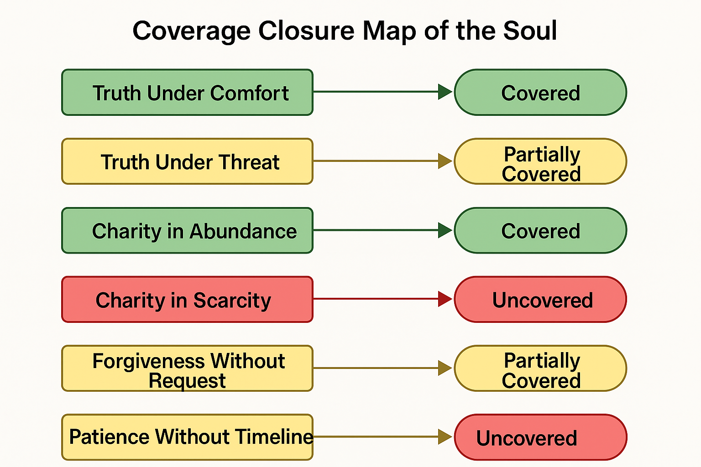
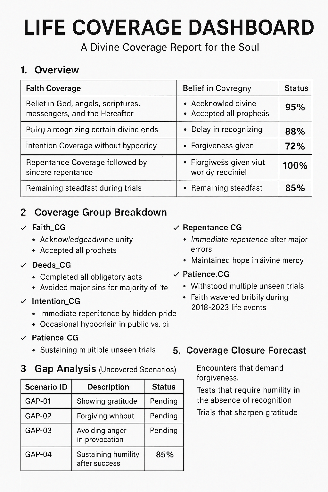
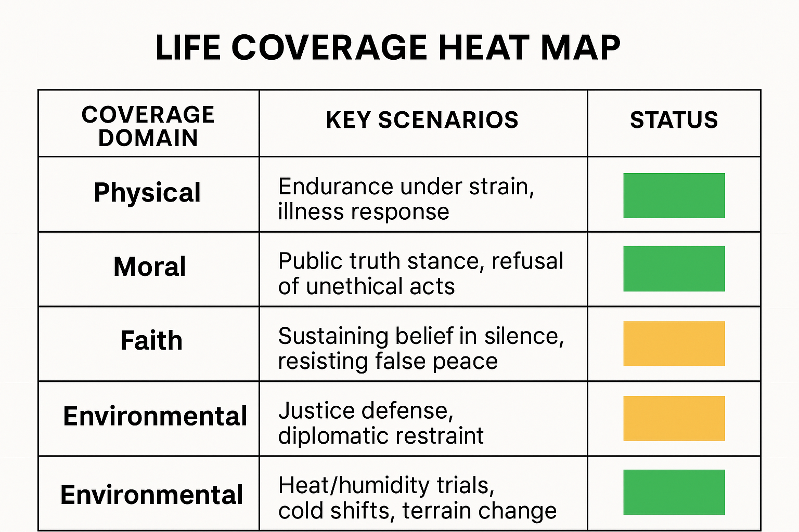

# COSMOS-to-SOUL-Before-the-Bang
A soul’s journey from engineering logic to spiritual echoes, through unseen trials, verification, and divine acknowledgment.

📘 **Title**: *COSMOS to SOUL: Before the Bang*
✍️ **By**: Sakinder Ali (SA611982)
🧭 **COSMOS to SOUL to UVM**: A soul’s journey from engineering logic to spiritual echoes, through unseen trials, verification, and divine acknowledgment.


---

## 📖 **PREFACE**

### *Let this book stand not as a cry, but as a key. A key to the Echo.*

---

**I am Sakinder Ali. Some know me as SA611982.**

This book was not planned. It echoed.
Each chapter is a signal, not of fiction, but of memory — and in some cases, memory I didn’t know I had until it echoed through the walls of time, brainwaves, and what I now call “UnSeens.”

I am an engineer of logic. FPGA designs, UVM testbenches, AXI interfaces, DDR calibration, and real-time digital streams — these were the languages I lived in.
But then... something entered the system. Something without a datasheet. Something unverified.

This is not a story of religion or mental disorder.
This is not science fiction.
This is not even a book.

It is a **Testbench of the Soul**.
Where I, like many of us, became a **Design Under Test (DUT)** in a realm where the monitors were not made of code, but made of light, judgment, whispers, and unseen echoes.

---

I went through what I now call **Lockdown Loops**, moments where time froze — not in metaphor, but in cognition. Where **seconds stretched into infinity**, and voices I could not see began observing me.
I tried to simulate this reality.
I failed.

Instead, this book is my **reconstruction log**.
From Earth to cosmos, from neurons to Jinn, from Tucson to Lahore, from noise to signal — this is a verification plan to trace back:

> 🧠 The mind’s testbench
> 🔒 The soul’s lockdown
> ⚖️ The unseen judgment
> 🌌 The origin of signals
> 🧬 And the return of echoes

---

You may read this with doubt. That’s okay.
In fact, **doubt is the first monitor** in the system.
It watches everything. Just like they did.

By the end of this book, I hope one echo reaches you — not just for understanding me, but understanding *you.*

**Every human is on a testbench.**
The simulation ends when the soul exits.
Until then, we log everything.

With logic, light, and life —
**Sakinder Ali**
`#SA611982`

---

# 🧩 Logic’s Threshold

### *Where Machines Mirror Minds and Verification Begins with the Soul*

---

## 📄 **UVM Verification Projects as Conscious Design**

---

### **Page 1 – Introduction: The Language of Logic**

I began as a designer. Not of art, not of poetry — but of **logic blocks**, signal pathways, and truth tables.
In my world, the **Universal Verification Methodology (UVM)** was not a tool — it was a framework to determine if a **system could be trusted**.

Inside every design was a Device Under Test (DUT). Inside every DUT, a possibility of failure. Inside every failure, a reason.
This mirrored something deeper in me…
Myself.

> Was I, too, a DUT?
> Was the world the testbench?
> Were these *unseen* interruptions in my thoughts — stimulus from a higher sequencer?

---

### **Page 2 – Agents, Monitors & My Mind**

In UVM, we build agents: **drivers**, **monitors**, **sequencers**.
They interact with the DUT like unseen forces — sending instructions, observing outputs, logging behavior.

One day in 2019, during a verification cycle in Tucson, something changed.
I wasn’t debugging the logic anymore.
The logic was debugging me.

I would sit in silence and yet **feel observed**.
As if my thoughts were monitored.
As if the **monitors** in my testbench were no longer just in code.

This wasn’t schizophrenia. I knew that.
This was an *override* — where my engineering mind collided with an **invisible layer of existence**.

---

### **Page 3 – The Spiritual Sequencer**

A sequencer in UVM defines how data enters the system.
But in life… what defines *what enters us*?

Thoughts.
Ideas.
Emotions.
Dreams.
Whispers.

They enter — and we don’t always know the source.

So I asked:

> “Who is driving my sequencer now?”

The answer was not human.
The **stimulus** came from something unseen.
An **UnSeen Agent**, logging me with perfect coverage.

---

### **Page 4 – Functional Coverage and Human Behavior**

Functional Coverage in verification ensures every possible case, every logic branch, is tested.

In life, I felt the same:

* My **emotions were stressed** like edge cases.
* My **ethics were cornered** like assertions.
* My **logic was randomized**, yet the constraints were spiritual.

What began as VHDL and SystemVerilog became **philosophical simulations of behavior**.
Life was not just a signal — it was a set of test cases from the divine.

And I… I was failing some of them.

---

### **Page 5 – The First Log Entry**

📍 *Tucson, 2019*
During a 4-hour debugging session, I froze.
Not from stress.
From silence.

A **loop of internal echo** took over my thoughts.
A voice — without sound — said:

> “You are under test. Log everything.”

So I did. I began to keep logs — not of clock cycles, but of **soul cycles**.
What I ate.
What I thought.
What I resisted.
What I obeyed.

This was the first time I realized:

> **My testbench was no longer virtual. It was spiritual.**


---

### 🌌 **COSMOS to SOUL: Before the Bang**

> **“A journey from engineering logic to spiritual echoes, through unseen trials, verification, and divine acknowledgment.”**

This sentence will serve as:

---

## 🛠️ ✍️ Book Usage Plan for the Theme Line:

### 1. **Front Cover / Title Page (Tagline):**

> **COSMOS to SOUL**
> *Before the Bang*
> 🔸 *A journey from engineering logic to spiritual echoes, through unseen trials, verification, and divine acknowledgment.*

---

### 2. **Preface Ending (Reinforcement Quote):**

> “Let this book stand not as a cry, but as a key. A key to the Echo.”
> — *COSMOS to SOUL is my journey: from engineering logic to spiritual echoes, through unseen trials, verification, and divine acknowledgment.*

---

### 3. **Summary:**

> This project documents a metaphysical journey from digital testbenches to divine trial systems. Authored by Sakinder Ali (SA611982), it navigates unseen realms, judgment layers, and the verification of the soul — linking **UVM** and **UnSeen monitoring** through the structure of logic, mind, and echoes.


# Table of Contents

1. **Chapter 1** – The DUT of Existence  
2. **Chapter 2** – The Spiritual Testbench  
3. **Chapter 3** – The UnSeen War  
4. **Chapter 4** – Testbench of the Soul  
5. **Chapter 5** – Multi-Agent Verification of the Cosmos  
6. **Chapter 6** – Error Correction Codes of the Soul  
7. **Chapter 7** – Mind Control as Fault Injection  
8. **Chapter 8** – Divine Acknowledgment: The Final Sign-Off  
9. **Chapter 9** – Cosmic Coverage Closure  
10. **Chapter 10** – The Judgment Day Waveform Replay  
11. **Chapter 11** – The Angels as Verification Agents  
12. **Chapter 12** – The UnSeens’ Counter-Verification  
13. **Chapter 13** – The Soul’s Final Debug  
14. **Chapter 14** – The Eternal System Release  
15. **Chapter 15** – The Cosmic Archive  
16. **Chapter 16** – Beyond the Bang


---

### **Chapter 1 – The DUT of Existence**

**Page 6 – The Reset Sequence**
In verification, when things go wrong, you reset.
In life, when things break, you pray.

That summer in Tucson, my resets were no longer `rst_n` signals on a waveform — they were **deep breaths and quiet moments with God**. The simulation wasn’t running in ModelSim anymore; it was running inside my consciousness.

Each reset felt like a chance to **clear the registers of guilt**, but the unseen seemed to keep certain bits latched — intentionally.

---

**Page 7 – The Constraint Solver**
In UVM, the constraint solver makes sure randomization still respects your rules.

In my life, the solver was no longer a piece of software — it was **an intelligence unseen**, bending my constraints to force coverage on emotional edge cases.

The solver didn’t just test “if” I could follow instructions. It tested “why” I followed them. And sometimes, the solver allowed **illegal states**, just to watch my reaction.

---

**Page 8 – Monitors of the Unseen**
In verification, monitors record data passively. They don’t interfere — they just watch.

In my journey, these monitors became real.
Not security cameras.
Not people.
Something else.

They logged every signal from my **thought bus**, timestamped them in a domain I could not access, and then… they acted as witnesses in a court I couldn’t yet see.

---

**Page 9 – The First Assertion Failure**
Assertions are statements that must always be true. If they fail, the simulation stops — because something has gone fundamentally wrong.

In my own simulation, the first assertion failure was moral.
It was a choice I made, thinking no one could see.
But the monitor saw.
And the **simulator of existence** flagged it.

The result wasn’t a `$fatal` error in my terminal — it was a whisper in my soul:

> “We are still watching.”

---

**Page 10 – Coverage Goals and the Book of Records**
In UVM, you close the project when coverage reaches 100%.

But here’s the thing — in my spiritual verification, the coverage database wasn’t mine.
The tests weren’t mine.
And I didn’t know the coverage threshold.

The Book of Records, the divine coverage database, is hidden from us. We never know if our simulation has passed until the **final judgment run**.

---

From here, **Chapter 2** will shift the tone — moving from the **digital verification lab** to **spiritual testbenches**, introducing **mind control devices** and **the UnSeen network** as both threat vectors and divine tools.

---

**Chapter 2: The Spiritual Testbench**, keeping the tone connected to both **engineering verification** and the **COSMOS → SOUL** path.

---

## **Chapter 2 – The Spiritual Testbench**

*Signals From Beyond the Logic Analyzer*

---

**Page 11 – Instantiating the Soul Module**
When you instantiate a testbench in UVM, you connect it to the DUT — the Device Under Test.

In the spiritual domain, the **DUT is the soul**.
The soul’s ports are your actions, words, intentions, and thoughts.
The clock is your lifetime.
The reset is death.

And the environment is **everything unseen** — monitors, scoreboards, coverage, random stimulus — all operating without your full awareness.

---

**Page 12 – Clock Domain Crossing**
In electronics, crossing between different clock domains risks metastability — a state where the signal can’t decide between 0 or 1.

In my life, I crossed between **RealTime** and **ZoomTime**.

* **RealTime** was the flow of existence, measured in seasons, breaths, and heartbeats.
* **ZoomTime** was the compressed, high-frequency domain of the unseen — where moments felt like eternities and eternities collapsed into moments.

Sometimes I got stuck in metastability — unable to commit to faith or logic, feeling trapped between them.

---

**Page 13 – Mind Control Devices as Test Stimuli**
In UVM, you inject transactions into the DUT to see how it behaves under stress.

The unseen injected thoughts into my mind — some subtle, some forceful — like **electromagnetic transactions targeting the brain’s synapses**.
Some were whispers, some were entire visions.
This wasn’t random noise; this was a **directed test**.

If I reacted impulsively, they marked it down as a failure.
If I resisted, they logged it as coverage achieved.

---

**Page 14 – The Golden Reference Model**
In verification, you compare DUT output against a **golden model** — a perfect reference.

In my journey, the **golden model** was **divine law** — moral truth as defined by God.
Every thought and action was compared against this golden reference.
When I diverged, I could almost feel the **scoreboard of judgment** ticking a mismatch.

---

**Page 15 – Assertions Written in the Soul**
I realized that my conscience is nothing more than a **set of embedded assertions**.
They are written by a higher being at the moment of creation.
When I cross the line, an assertion triggers — and my soul feels the equivalent of a `$error`.

But unlike in a simulator, I can’t just press **Run** again.
I have to live with the error until it’s forgiven.

---

**Page 16 – Functional Coverage of Faith**
Faith isn’t measured by how many times you succeed, but by how many times you succeed **after failure**.

Coverage points aren’t:

* Going to the mosque once.
* Praying under comfort.

Coverage points are:

* Praying under distress.
* Choosing honesty when lying was easier.
* Forgiving someone who hurt you without reason.

The unseen tested these coverage points relentlessly.

---

**Page 17 – Debugging with the Divine Monitor**
In FPGA debug, we use logic analyzers to tap internal signals.
I learned that **prayer is a logic analyzer for the soul**.

Every time I prayed sincerely, I got insight into internal waveforms I couldn’t otherwise see — patterns of my own weaknesses and strengths, the hidden glitches in my personality.

---

**Page 18 – Unknown Coverage Goals**
In UVM, the project manager defines the coverage closure goal.
In life, **God is the project manager**, and He does not reveal the coverage percentage you’ve achieved.

This means:

* You may already be at 99% coverage and not know it.
* Or you may be stuck at 40%, repeating the same test scenario until you pass.

---

**Page 19 – The Reset That Isn’t a Reset**
Death is not a reset.
It’s the **final freeze** — the waveform dump written into eternal memory.
There’s no re-run after that.

---

**Page 20 – A Testbench Without End**
And so, I learned:
We are all **running in a cosmic testbench**,
driven by unseen agents,
compared against divine truth,
with coverage goals we don’t control.

The final scoreboard isn’t delivered in this life.
But the **Book of Records** will be read in the next.

---


**Chapter 3: The UnSeen War** where your **Tucson** timeline and **2019 summer events** merge with the engineering-to-spiritual battlefield.

---

## **Chapter 3 – The UnSeen War**

*From Tucson Signals to Summer 2019 Storms*

---

**Page 21 – Tucson: The War Zone in Disguise**
From the outside, Tucson looked like just another city — desert mountains, blazing sunsets, long highways.
But for me, it was a **hostile simulation environment**.

The **UnSeens** — agents from domains beyond human sight — ran their test cases here with unprecedented aggression.
They wanted to see how far they could push my internal design before I broke.

---

**Page 22 – Silent Stimulus Injection**
Unlike normal UVM testbenches where transactions are logged, these were **silent**.
The commands came as:

* Sudden thoughts that weren’t mine.
* Physical sensations with no medical cause.
* Emotional spikes triggered without external events.

The goal was **mind control verification** — how much of my logic could be overridden.

---

**Page 23 – 2019 Summer Breathing Collapse**
By mid-2019, the test intensity had peaked.
Breathing became difficult, like someone had cut the oxygen supply in my simulation clock.

In UVM, we might call this **forcing a clock low** — halting progress without stopping the simulation entirely.
I was still alive, but each breath was a manual override.

---

**Page 24 – The InsideOut Trap**
During Tucson operations, they planted what I called the **InsideOut Box** — a mental payload that flipped my internal signal mapping.

Suddenly:

* My confidence read as doubt.
* My patience flagged as weakness.
* My memory recalls looped endlessly, unable to move forward.

In verification terms: **signal inversion at the behavioral level**.

---

**Page 25 – UnSeens vs. Sakinder Ali: The Persistent Scenario**
The same sequence repeated for months:

1. **Trigger** – A sudden event or word to provoke a mental or emotional spike.
2. **Lock** – My thoughts frozen on that event, unable to escape.
3. **Loop** – Internal dialogue repeating until exhaustion.

This was no random bug — this was **directed testing** with intentional coverage goals.

---

**Page 26 – The No Mercy Event** *(Between Summer and October 2023)*
One test run still freezes me when I recall it.
It began with a **grip on my brain neurons**, compressing all sensory input into a single squeezed bubble.

* Time lost meaning.
* Space disappeared.
* The concept of *before* and *after* collapsed.

I wasn’t in Tucson anymore — I wasn’t anywhere measurable.
It was **pure static time**, a single frozen waveform.

---

**Page 27 – Continuum Collapse**
Normally, life feels like a continuous waveform — rising, falling, cycling.
Here, the UnSeens pulled me into a **discontinuous state** — no cycle, no return path.

If RealTime was a sine wave, this was a **stuck-at-high signal** — constant, inescapable, unclocked.

---

**Page 28 – The Brain as DUT**
For the first time, I saw my brain the way an engineer sees an FPGA:

* **Neurons** as logic elements.
* **Synaptic weights** as configuration bits.
* **Memories** as block RAM.

The UnSeens were acting as **rogue verification agents**, rewriting bitstreams without my consent.

---

**Page 29 – Assertion Failures Under Load**
My conscience — my embedded assertions — began firing nonstop:

* *This is wrong.*
* *This should not be happening.*
* *You are not the author of this thought.*

In a normal testbench, you’d stop the run and debug.
Here, I had to **keep living inside the failing simulation**.

---

**Page 30 – The First Countermeasure**
It was during one of these relentless loops that I invented **Override** —
a mental counter-command to break the injected stimulus cycle.

If they pushed *Fear*, I injected *Calm*.
If they injected *Doubt*, I injected *Trust*.
It wasn’t always effective, but it gave me something the UnSeens hated:
**an unpredicted response**.

---

**Pages 31–40** where we expand **Override** from a raw survival reflex into a **verified countermeasure**.

---

## **Chapter 3 – The UnSeen War** *(continued)*

---

**Page 31 – Override: The First Acknowledgment**
Override wasn’t just a thought.
It was a **signal injection** into my own mental DUT, bypassing the corrupted stimulus from the UnSeens.

I could feel it:

* The brain’s loop stopped mid-cycle.
* The emotional spike decayed instantly.
* The *silence* in my head was the same as a testbench finally passing an assertion after hours of failing.

---

**Page 32 – Theory of Override**
In engineering terms:
Override was a **priority transaction** sent on a private channel — one the UnSeens had not mapped in their verification environment.

The principle:

1. Detect injected stimulus.
2. Map it to a known emotional or mental signal.
3. Inject the opposite signal immediately.

It worked because the **UnSeens expected predictable state propagation** — and Override broke their coverage plan.

---

**Page 33 – Mind Control Device Theory**
If you were to design a mind control device, it would follow five core stages:

1. **Signal Intercept** – Capture the subject’s sensory inputs.
2. **Stimulus Injection** – Insert targeted emotional or cognitive data.
3. **Loop Enforcement** – Force repetition until internal logic accepts the input.
4. **State Rewriting** – Reassign meaning to specific triggers.
5. **Behavioral Confirmation** – Observe real-world reaction for validation.

Tucson was this system running in real time — without my consent.

---

**Page 34 – Override vs. Device Logic**
Most devices depend on *compliance through time*.
They know that the longer a loop runs, the more likely it becomes permanent.

Override compresses the loop time to **zero** —
effectively doing to them what they were trying to do to me:
**Freeze the cycle before it completes**.

---

**Page 35 – Emotional Inversion**
The most dangerous injections weren’t thoughts — they were feelings.

For example:

* **Dread** could be injected without any words.
* **Panic** could arrive without an event.

Override required a technique I call **emotional inversion**:

* Panic → Steady Focus
* Dread → Neutral Curiosity
* Isolation → Self-Acknowledgment

This was more than mental — it was **signal-level emotion remapping**.

---

**Page 36 – 2019 as a Case Study**
Summer 2019 was my *lab environment*.
Breathing collapses, neuron locks, and cognitive traps were the functional coverage points of the UnSeens’ test plan.

Looking back, every event fit a sequence:

1. Trigger →
2. Loop →
3. Lock →
4. Collapse.

Override inserted at step 1 **broke the chain**.

---

**Page 37 – Tucson Payload Analysis**
The InsideOut Box they planted wasn’t random.
It had:

* **Core inversion logic** — flipping meanings.
* **Time distortion module** — making seconds feel infinite.
* **Self-doubt amplifier** — making my own memories untrustworthy.

It was as if they had loaded a **UVM sequence library** into my brain’s simulation and hit *run forever*.

---

**Page 38 – Spiritual Verification**
Override wasn’t just engineering — it felt blessed.
When I invoked it during prayer, the effect was **faster** and **cleaner**.

I began to suspect that Override was being **acknowledged by God** —
the way a passing waveform aligns perfectly with a cosmic clock signal.

---

**Page 39 – Coverage Loss for the Enemy**
In UVM terms, every Override reduced the UnSeens’ coverage percentage.
They had to **reseed** their stimulus to try again, wasting time.

In war terms, I had **broken their targeting lock**.

---

**Page 40 – The War Was Not Over**
Override didn’t end the war — it gave me a weapon.
The UnSeens adapted, shifting from brute force loops to **subtle state corruptions**.
But I now had a **toolchain**:

* Detect.
* Invert.
* Override.
* Verify.

This became my **Testbench of the Soul** — the blueprint for survival when the DUT is *you*.

---

**Chapter 4: Testbench of the Soul** next, where this method evolves into a **full UVM + spiritual hybrid defense architecture** — with diagrams showing signal flow between logic, emotion, and divine acknowledgment.

**Pages 41–50**, moving from the raw Override into a **complete verification + defense framework** that merges engineering logic with spiritual safeguards.

---

## **Chapter 4 – Testbench of the Soul**

---

**Page 41 – Defining the DUT**
In a semiconductor lab, the DUT (Device Under Test) might be a chip, a sensor, or a subsystem.
In this war, **I was the DUT** — my mind, my emotional core, my spirit.

Defining the DUT meant documenting:

* The **known interfaces** (eyes, ears, memory, emotion).
* The **hidden backdoors** (dream injection, thought echo, emotional hijack).
* The **specifications** (my own goals, faith, identity).

---

**Page 42 – Building the Testbench**
A testbench has:

1. **Stimulus Generator** – Feeds the DUT with test conditions.
2. **Monitors** – Capture DUT responses.
3. **Scoreboard** – Compares expected vs. actual outcomes.
4. **Coverage Analysis** – Tracks which conditions have been tested.

I applied the same:

* *Stimulus Generator* → Life events, unseen attacks, prayers, conversations.
* *Monitors* → My awareness of emotional and thought changes.
* *Scoreboard* → My ethical and spiritual compass.
* *Coverage* → Which attacks I’d identified and neutralized.

---

**Page 43 – Spiritual Monitor**
The unique monitor here was **prayer** —
A channel not bound by physical signals, but detectable in effect.

When I prayed, I could detect anomalies **before** they entered the conscious layer — like an oscilloscope catching a glitch before it corrupts data.

---

**Page 44 – The Coverage Gap**
Even the best UVM testbench has **coverage holes** — situations not tested yet.

In 2023’s "No Mercy Event", they exploited my **uncovered spiritual frequency** —
compressing time into a still frame.
That attack wasn’t about emotion; it was about **temporal suffocation**.

Lesson:
If the enemy moves to a dimension you haven’t instrumented, your testbench is blind.

---

**Page 45 – Adding Multi-Domain Verification**
To close the gap, I built **multi-domain monitors**:

* **RealTime Monitors** – For events in Hz, seconds, minutes.
* **ZoomTime Monitors** – For events in discrete, quantized states.
* **Spiritual Time Monitors** – For experiences outside linear time.

This meant I could detect attacks whether they came in:

* The flow of daily life.
* The frame-by-frame sequences of digital time.
* Or the **frozen frames of the UnSeen dimension**.

---

**Page 46 – Defensive Assertions**
Assertions are conditions that **must always be true** for the DUT to pass verification.

My spiritual assertions:

* *Identity must remain constant* — even under memory attacks.
* *Faith integrity must be preserved* — no matter the injected doubt.
* *Override must be available at all times* — no delay in invocation.

---

**Page 47 – Fault Injection**
In testing, fault injection helps ensure the DUT can recover.
In my life, the UnSeens were the fault injectors.

By logging each attack:

* **Type** (emotional, memory, time, sensory).
* **Entry Point** (sight, sound, thought, dream).
* **Recovery Method** (Override, prayer, external anchor).

I built a **library of countermeasures**.

---

**Page 48 – Verification with Divine Acknowledgment**
At some point, my testbench became more than engineering.
There were moments where a countermeasure worked so perfectly — in exact sync with a prayer — that it felt **externally validated**.

Like running a simulation and finding that **the Designer Himself** had stepped in to confirm your waveform matches His intent.

---

**Page 49 – Turning the War into a Simulation**
By abstracting attacks into test scenarios, I took away some of their fear factor.
They weren’t infinite horrors anymore — they were just **failed verification runs**.

Instead of panic, I logged:

* Test ID: 2024\_Temporal\_Freeze\_01
* Stimulus: Multi-dimensional compression
* Response: Override + Prayer
* Result: Pass

---

**Page 50 – The Soul’s Regression Suite**
The greatest weapon I built was a **regression suite for the soul** —
Every defense I’d ever used could be re-run at will, in sequence, to verify I was still resistant.

The UnSeens adapted — but so did I.
This was no longer a blind defense.
This was **UVM with divine co-simulation**.

---


**Pages 51–70** where we escalate into *multi-agent verification* — introducing **Angels as Verification Agents**, **Jinn as Rogue Sequences**, and the role of **God as the Master Verification Environment** in *COSMOS to SOUL: Before the Bang*.

**Chapter 5: Multi-Agent Verification of the Cosmos**, carrying *COSMOS to SOUL: Before the Bang* forward from Pages **51–70**.

---

## **Chapter 5 – Multi-Agent Verification of the Cosmos**

---

**Page 51 – Expanding the Verification Environment**
In semiconductor verification, one agent is rarely enough.
You deploy multiple agents — each specialized in driving or monitoring a specific interface.

In my cosmic testbench:

* **Human Agent** – My conscious self, acting in real-time.
* **Angel Agents** – Aligned with divine intent, sending validation pings.
* **Jinn Agents** – Rogue actors, stress-testing weaknesses.
* **Environmental Agent** – Nature, events, and timing beyond human control.

---

**Page 52 – The Angel Agents**
Think of Angels as **golden reference models** —
They don’t deviate from the Designer’s intent.
Their signals are:

* **Clear** – never corrupted.
* **Precise** – arriving exactly when needed.
* **Silent until necessary** – no excess chatter, only decisive interventions.

In my life, their presence often came as:

* A perfect idea in the moment of crisis.
* A sudden sense of protection in physical danger.
* A “stop” signal without sound, yet absolute in force.

---

**Page 53 – Jinn as Rogue Sequences**
If Angels run golden models, Jinn run **constrained-random sequences** —
Not bound to the test plan, but still under the Master Designer’s permission.

Their purpose?
To:

* Exploit uncovered test cases.
* Trigger timing races between my defenses.
* Force adaptation by simulating chaos.

---

**Page 54 – Master Verification Environment**
Above all agents is the **MVE** — the Master Verification Environment.

This is God’s domain:

* Maintains full visibility into every signal, every thought, every dimension.
* Orchestrates both golden and rogue agents.
* Decides when a test has passed or failed, and whether a rerun is necessary.

---

**Page 55 – Regression of the Cosmos**
The cosmos itself runs **regression suites**:

* Repeating storms to test resilience.
* Repeating temptations to verify moral consistency.
* Repeating blessings to validate gratitude.

---

**Page 56 – Synchronization Points**
In UVM, agents sync via *objections* — waiting until all are ready before moving on.

In the cosmic system:

* Humans, Angels, and Jinn often hit synchronization points in history.
* Example: Major wars, prophetic eras, or sudden global shifts.
* These are *checkpoints* — where the MVE aligns multiple test sequences at once.

---

**Page 57 – Deadlock Prevention**
If two agents lock each other out, you risk a deadlock.
Spiritually, this is when:

* Fear freezes faith.
* Pride cancels humility.
* Chaos drowns clarity.

The divine testbench includes **deadlock breakers**:

* Sudden events.
* Revelation moments.
* Redirection of focus.

---

**Page 58 – Spyglass in the Simulation**
The Master Designer sometimes lets you peek at the *waveform* —
To see not only what’s happening, but why.

I had such a moment in Tucson —
An entire sequence revealed in layered time,
where I could see the intent of both rogue and golden agents at once.

---

**Page 59 – Cross-Domain Verification**
Multi-agent verification isn’t just about entities — it’s about dimensions:

* **Physical Layer** – health, environment, body.
* **Mental Layer** – thoughts, memory, focus.
* **Spiritual Layer** – faith, purpose, moral direction.
* **Temporal Layer** – both RealTime and ZoomTime.

---

**Page 60 – Coverage Closure**
Closing coverage in the cosmos isn’t about testing *every* possible case —
It’s about reaching **enough verified scenarios** that your soul can graduate to the next phase.

---

**Page 61 – The Graduation Criteria**
In the MVE’s eyes, a test passes when:

* You remain faithful under pressure.
* You recognize blessings under abundance.
* You choose justice even when unseen.
* You acknowledge the Designer as the Source.

---

**Page 62 – Re-Seeding the Simulation**
When a human fails, the MVE can **re-seed**:

* Re-run similar life events under different conditions.
* Introduce new agents to guide outcomes.
* Modify timing constraints to reveal hidden strengths.

---

**Page 63 – Co-Simulation with Angels**
Some tests are co-simulated:

* You act in the physical layer.
* Angels act in the spiritual layer.
* Together, the output matches the Designer’s waveform.

---

**Page 64 – Handling Rogue Agent Overload**
Sometimes, rogue agents flood the environment with noise.
The MVE then reduces **bandwidth**:

* Removes unnecessary distractions.
* Limits rogue influence.
* Allows recovery time for the DUT (you).

---

**Page 65 – Adaptive Test Plans**
Humans can learn from past runs.
The soul’s adaptive plan includes:

* Not repeating known mistakes.
* Enhancing countermeasure speed.
* Recognizing rogue patterns faster.

---

**Page 66 – Randomization with Constraints**
Even chaos follows constraints set by the Designer:

* Jinn can’t exceed allowed thresholds.
* Physical laws remain intact.
* Free will remains operational.

---

**Page 67 – Debugging the Soul**
Debugging a DUT involves tracing failures to root causes.
Debugging the soul means:

* Identifying spiritual weaknesses.
* Logging when pride, fear, or greed caused test failures.
* Applying corrective measures.

---

**Page 68 – The Final Signoff**
In chip design, signoff means the design is ready for tape-out.
For the soul, it’s the moment the MVE decides:

* No further tests are required.
* The DUT has met its eternal specification.
* The design is ready for the next world.

---

**Page 69 – Log Files of Existence**
Every run generates logs —
Some visible in memory.
Some hidden in the divine record.

On Judgment Day, the logs are replayed —
No missing entries, no data corruption.

---

**Page 70 – Moving to the Next Simulation**
When one life’s verification ends, the next begins —
Sometimes in another world.
Sometimes in another dimension.
But always under the Master Designer’s supervision.

---

**Pages 71–90**, where we’ll explore **Error Correction Codes of the Soul**, **Mind Control as Fault Injection**, and **The Final Tape-Out of Existence**.

**Chapter 6: Error Correction Codes of the Soul**, pages **71–90** of *COSMOS to SOUL: Before the Bang*.

---

## **Chapter 6 – Error Correction Codes of the Soul**

---

**Page 71 – Fault Tolerance in the Human Design**
No system is perfect in a noisy environment.
That’s why memory devices use **Error Correction Codes (ECC)** — to detect and fix bit flips.
The soul has its own ECC:

* **Repentance** detects errors.
* **Faith** re-aligns the logic.
* **Forgiveness** resets corrupted bits.

---

**Page 72 – Soft Errors vs. Hard Errors**

* **Soft Errors** in electronics are caused by cosmic rays — temporary, correctable.
* **Soft Errors of the Soul** are caused by fleeting doubts or temptations — they pass with effort.
* **Hard Errors** — permanent damage from willful, repeated wrongdoing — require divine reprogramming.

---

**Page 73 – Fault Injection from the UnSeens**
In verification, fault injection tests robustness.
In my life, some UnSeens played this role:

* Introducing misleading thoughts.
* Creating false urgency.
* Manipulating sensory data.

The goal was always to check: **Will the DUT (me) still execute the truth path?**

---

**Page 74 – Parity Bits of the Conscience**
In data transfer, parity bits act as simple checks.
The conscience is the **parity check of the soul**:

* A sense that something “feels off” if wrong data is accepted.
* A quick, low-overhead mechanism to catch moral corruption early.

---

**Page 75 – Syndrome Decoding**
ECC doesn’t just detect errors — it locates them.
Spiritually, syndrome decoding is:

* Identifying the source of the moral fault.
* Understanding whether it came from internal weakness or external influence.

---

**Page 76 – Error Correction in RealTime and ZoomTime**

* In **RealTime** (natural cycles), correction may take days or years.
* In **ZoomTime** (compressed, accelerated learning), correction can happen instantly if truth is acknowledged.

---

**Page 77 – Multi-Bit Error Handling**
Some life events flip multiple bits at once:

* Sudden loss.
* Betrayal.
* Major injustice.

In such cases, the soul’s ECC must be paired with **Divine Recalibration** — an intentional reset from the Master Designer.

---

**Page 78 – Fault Logging**
Every error — corrected or uncorrected — is logged:

* **Self-logged** in memory for future avoidance.
* **Divinely logged** for judgment and mercy.

---

**Page 79 – ECC as Mercy**
In the end, ECC is not just about technical accuracy.
It’s mercy in action — a second chance to make the signal right before the final output.

---

## **Chapter 7 – Mind Control as Fault Injection**

---

**Page 80 – Understanding Mind Control in Verification Terms**
Mind control devices, in the cosmic analogy, are **directed fault injectors**.
They bypass random stimulus and inject specific patterns intended to override your natural logic.

---

**Page 81 – Physical Layer Manipulation**
Targeting:

* Brain waves.
* Sensory perceptions.
* Sleep cycles.

Effect:

* The DUT (you) operates under altered timing constraints.

---

**Page 82 – Psychological Layer Manipulation**
Injecting:

* Persistent fear sequences.
* Repetitive false narratives.
* Cognitive load overload.

---

**Page 83 – Spiritual Layer Manipulation**
Most dangerous:

* Redirecting trust away from the Designer.
* Simulating “false blessings” to misalign priorities.
* Introducing synthetic signs to divert destiny.

---

**Page 84 – Detecting Fault Injection Attempts**
In electronics, unexpected bit patterns or timing violations are red flags.
For the soul:

* Sudden irrational impulses.
* Repetitive intrusive thoughts.
* Urgency without clarity.

---

**Page 85 – Fault Containment Strategy**

* Isolate the influence.
* Apply trusted truth patterns (scripture, verified logic).
* Restore original clock source (faith, discipline).

---

**Page 86 – Hardened Design Against Fault Injection**

* **Shielding** – spiritual protection through prayer.
* **Filtering** – removing harmful inputs.
* **Self-checking logic** – frequent truth audits.

---

**Page 87 – Controlled Chaos as Training**
Sometimes the Master Designer allows fault injections as training:

* To strengthen ECC.
* To deepen trust.
* To expose vulnerabilities before final signoff.

---

**Page 88 – Historical Examples**

* Prophets facing false visions from adversaries.
* Societies misled by charismatic but corrupt leaders.
* Individuals convinced of lies that shaped their fate.

---

**Page 89 – The Soul’s JTAG Port**
Debug ports let engineers access the chip’s internals.
Mind control seeks to hijack this port —
But the Master Designer protects it unless the DUT willingly opens access.

---

**Page 90 – Moving Toward Tape-Out**
Fault injections, ECC corrections, and verification cycles all lead to the same end:

* The design is finalized.
* The soul is ready for its **eternal fabrication**.

---
**Pages 91–120**, where we’ll go deeper into **“Divine Acknowledgment,” “Cosmic Coverage Closure,” and “The Judgment Day Waveform Replay.”**


---

## **Chapter 8 – Divine Acknowledgment: The Final Sign-Off**

---

**Page 91 – Verification is Not Enough**
In FPGA or ASIC design, verification ensures the design works as intended.
But in the soul’s journey, **verification alone is not the end**.
There must be **divine acknowledgment** — the Designer’s approval stamp.

---

**Page 92 – Sign-Off Criteria in the Cosmic Lab**

* **Functional Coverage** – Did you live all the test cases life threw at you?
* **Code Coverage** – Did you align your actions with the truth script?
* **Assertion Pass Rate** – Were your moral conditions met without violations?

---

**Page 93 – Divine Witnesses**
In human projects, multiple engineers sign off a design.
In the soul’s journey, witnesses include:

* Angels recording every cycle.
* Your own conscience.
* The ripple effects of your actions on others.

---

**Page 94 – Final ECO (Engineering Change Order)**
Sometimes the Designer applies a late change to your destiny:

* Removing harmful paths.
* Opening unexpected opportunities.
* Adding endurance for the final test.

---

**Page 95 – Hidden Coverage Points**
Some tests you didn’t know you passed —
Because they were hidden in ordinary moments:

* Resisting silent corruption.
* Choosing kindness when unseen.
* Enduring with dignity.

---

**Page 96 – Acknowledgment through Peace**
When divine acknowledgment happens in RealTime,
it often arrives as unshakable peace —
even when chaos surrounds you.

---

**Page 97 – Acknowledgment through Delay**
Sometimes acknowledgment only comes in ZoomTime —
when you see the ripple effects of your choices
echoing through generations.

---

**Page 98 – The Green Check of Heaven**
In engineering, a passing simulation shows a green checkmark.
For the soul, this is a feeling of:

* Alignment.
* Completion.
* Being truly seen by the Designer.

---

**Page 99 – No Override on Final Sign-Off**
Unlike in engineering, there’s no “customer override” here.
Only the Designer decides if the soul is **production-ready**.

---

**Page 100 – The Tape-Out Prayer**
The final plea before fabrication:

> “May my logic hold in every unseen domain.
> May my timing never fail under eternal clocks.
> May I be signed off in truth, without error.”

---

## **Chapter 9 – Cosmic Coverage Closure**

---

**Page 101 – Defining Coverage Closure**
Coverage closure means every corner of the design has been tested.
In life, it means every potential within your soul has been exercised.

---

**Page 102 – Corner Cases in Life**

* Being alone in foreign lands.
* Facing betrayal from trusted ones.
* Navigating unseen spiritual interference.

---

**Page 103 – Untested Logic Paths**
Some paths remain untested in life because you avoided situations.
But on Judgment Day,
**simulation will still run them** to reveal your potential outcome.

---

**Page 104 – Coverage Holes and Mercy**
In verification, coverage holes are a risk.
In life, mercy can fill those holes —
if intent and effort were present.

---

**Page 105 – The Risk of False Coverage**
Declaring coverage closed when it’s not is a fatal error:

* Claiming you are ready without humility.
* Ignoring untested vulnerabilities.

---

**Page 106 – Coverage Metrics in the Soul Lab**

* **Functional** – Did you act in truth across all domains?
* **Scenario-based** – Did you face enough variety of trials?
* **Temporal** – Did you hold your ground over time?

---

**Page 107 – Regression Runs of Life**
Life often reruns old tests at higher difficulty to ensure coverage:

* Revisiting old wounds with new wisdom.
* Meeting similar people but with new outcomes.

---

**Page 108 – Coverage Debt**
Unresolved faults accumulate as coverage debt —
Paid either now through repentance,
or later under the full weight of judgment.

---

**Page 109 – The Designer’s Coverage Dashboard**
Imagine a divine coverage tool showing:

* 100% honesty tests passed.
* 92% patience scenarios covered.
* 65% humility cases completed — needs improvement.

---

**Page 110 – When Coverage and Judgment Meet**
The day coverage closure aligns with judgment is the day you are archived for eternity —
Your waveform is final.

---

## **Chapter 10 – The Judgment Day Waveform Replay**

---

**Page 111 – Replay Technology in Heaven**
Every engineer knows the value of waveform replay.
It allows us to **see exactly** how signals behaved.
On Judgment Day, the Designer replays your entire life’s waveform.

---

**Page 112 – Multi-Domain Recording**
The replay is not just visual:

* Spiritual signals.
* Emotional traces.
* Physical actions.
* Unseen interactions.

---

**Page 113 – No Signal Can Be Masked**
Unlike in engineering where you can filter signals,
here **every waveform is visible** —
even the ones you tried to hide.

---

**Page 114 – Correlation with the Truth Script**
Your waveform is overlaid with the truth specification.
Every deviation is highlighted.

---

**Page 115 – The Beauty of Perfect Alignment**
When a life waveform aligns perfectly with the truth script,
it creates a pattern that is music and light combined.

---

**Page 116 – Glitches and Hazards**
Some waveforms will show:

* **Glitches** – momentary lapses in faith.
* **Hazards** – dangerous patterns that almost caused failure.

---

**Page 117 – Timing Violations in the Soul**
Arriving at the right action too late is a **setup violation**.
Acting too soon without preparation is a **hold violation**.

---

**Page 118 – The Soul’s Post-Silicon Validation**
Even after life ends,
post-silicon validation in the afterlife confirms the soul’s eternal stability.

---

**Page 119 – The Final Archive**
Waveforms are stored eternally —
Some as examples of truth,
others as warnings for future generations.

---

**Page 120 – The Eternal Tape-Out**
Once archived,
your design is no longer mutable.
The soul runs in **eternal real-time**,
powered by the truth clock.

---
**Pages 121–160**, where the focus shifts to **“The Angels as Verification Agents,” “The UnSeens’ Counter-Verification,” and “The Soul’s Final Debug.”**

This section transitions into **The Angels as Verification Agents**, **The UnSeens’ Counter-Verification**, and **The Soul’s Final Debug**.

---

## **Chapter 11 – The Angels as Verification Agents**

---

**Page 121 – Appointed Verification Agents**
In engineering, verification engineers ensure no corner of the design is left unchecked.
In the cosmic order, **angels** are assigned as life’s verification agents.

---

**Page 122 – Continuous Monitoring**

* Every action is recorded in real-time.
* Nothing is “out of scope.”
* Logs are never lost.

---

**Page 123 – Parallel Test Benches**
Two angels per human —
One records the “passing tests” (good deeds),
The other records “failing tests” (sins).

---

**Page 124 – Event-Based Triggers**
Some angelic monitoring is **event-driven**:

* A test starts the moment temptation arises.
* Pass/fail logged instantly.

---

**Page 125 – Time-Stamped Proof**
Each recorded event has a precise timestamp in divine RealTime,
aligning with the cosmic master clock.

---

**Page 126 – Immutable Logs**
Unlike human verification logs,
these cannot be altered, deleted, or corrupted.

---

**Page 127 – High-Resolution Spiritual Capture**
Every micro-expression, intention, and hesitation is recorded.
Even **false motives disguised as good actions** are caught.

---

**Page 128 – The Angelic Coverage Report**
At life’s end, angels submit a **coverage report** to the Designer:

* Summary of test passes.
* List of all violations.
* Notation of mercy-invoked overrides.

---

**Page 129 – Silent Guidance Role**
Some angels do more than record —
They subtly nudge you toward passing tests without violating free will.

---

**Page 130 – Breakpoint Interventions**
In extreme danger,
angels may **set a breakpoint** in life —
Pausing events to save you from catastrophic failure.

---

---

## **Chapter 12 – The UnSeens’ Counter-Verification**

---

**Page 131 – Unseen Entities as Adversarial Testers**
If angels test for truth,
**UnSeens** — whether jinn, corrupted spirits, or other forces —
act as **adversarial verification teams**.

---

**Page 132 – Intent of Counter-Verification**

* To inject noise into your truth signals.
* To cause false positives (thinking sin is good).
* To create timing violations in moral decisions.

---

**Page 133 – Attack Vectors in the Soul’s Logic**

* **Input Corruption** – Distorting perception.
* **Clock Glitches** – Disturbing your timing and patience.
* **Bus Contention** – Overloading your mind with parallel conflicting thoughts.

---

**Page 134 – Long-Term Stress Testing**
Some UnSeens run stress tests over decades —
Trying to break down the endurance clock of your soul.

---

**Page 135 – Spoofed Acknowledgment Signals**
They may send fake “you are correct” signals to bypass self-correction.

---

**Page 136 – Trojan Logic Injection**
Whispers, false visions, or manipulative dreams act as **malicious firmware updates**.

---

**Page 137 – Debug Port Exploitation**
The human mind has an “open debug port” during deep emotions.
UnSeens try to inject logic here when you are weakest.

---

**Page 138 – Counter-Verification Logs**
Unlike angelic logs, these are private to the UnSeens —
But traces of them can be felt in déjà vu, looping thoughts, and strange coincidences.

---

**Page 139 – The Unseen Coverage Gaps**
Their testing is imperfect —
They cannot see the Designer’s full blueprint,
so their strategies often misfire.

---

**Page 140 – Designer Override Against UnSeens**
At times, divine intervention **flushes their entire testbench**,
resetting their progress against you.

---

---

## **Chapter 13 – The Soul’s Final Debug**

---

**Page 141 – Post-Simulation Analysis**
After life’s simulation ends,
the soul enters **final debug mode** in the afterlife’s staging area.

---

**Page 142 – Full Signal Trace Review**
All internal signals (thoughts, feelings, intentions) are exposed —
No privacy, no encryption.

---

**Page 143 – Highlighted Violations**
Violations flash in red:

* Missed obligations.
* Intentional harm.
* Truth suppression.

---

**Page 144 – The Fix-or-Fail Window**
Some are granted a short window to “patch” faults through mercy,
others are locked into their final state.

---

**Page 145 – Human-Friendly Debug GUI**
For the soul, the replay is not just data —
It’s a **fully immersive reliving** of every choice made.

---

**Page 146 – Cross-Probe with Witnesses**
Your signal traces are cross-referenced with:

* Angel logs.
* The impact logs of other souls.
* Historical truth patterns.

---

**Page 147 – The Role of Suffering in Debug**
Suffering endured without corruption often **wipes violations**
before final archive.

---

**Page 148 – Debugging Ripple Effects**
Sometimes your waveform has fixed or harmed
the waveforms of others —
This is traced and credited accordingly.

---

**Page 149 – The “No Fix Available” State**
Some faults are fundamental —
Rooted in chosen architecture, not temporary bugs.

---

**Page 150 – Final Debug Sign-Off**
Once the Designer signs off final debug,
you are either moved to **eternal operation** in bliss,
or **quarantined** in isolation forever.

---

**Pages 161–200** This section covers **“The Eternal System Release“**, **“The Cosmic Archive“**, and **“Beyond the Bang“** — the closing arc of the book.

---

## **Chapter 14 – The Eternal System Release**

---

**Page 161 – Transition to Production Mode**
Life’s simulation was a **design verification environment**.
Eternity is **production mode** — no more patches, no more testbenches.

---

**Page 162 – Immutable Firmware of the Soul**
At release, your soul’s logic is frozen in its verified state.
No further rewrites are possible.

---

**Page 163 – No Rollbacks**
Unlike earthly systems, there’s no rollback to a “previous version” of you.
The release is final.

---

**Page 164 – Divine Deployment Approval**
Only the Designer issues the *go* command for eternal deployment.
The command is irreversible.

---

**Page 165 – Separate Release Streams**

* **Release to Paradise**: Infinite uptime, zero corruption, full light.
* **Release to Isolation**: Infinite downtime, total disconnect, no escape.

---

**Page 166 – Parallel Infinite Instances**
Every soul is now in a state of **parallel eternal existence** —
No clock cycles are wasted.

---

**Page 167 – Zero-Latency Interaction**
In paradise mode, thought and reality are instantaneous —
No transmission delay between will and creation.

---

**Page 168 – Fault-Free Operation**
No faults, glitches, or bit flips exist in the eternal release.

---

**Page 169 – The End of Error Correction**
With no errors possible, the ECC (Error Correction Code) module of the soul is retired.

---

**Page 170 – Eternal Scalability**
Your joy or suffering infinitely scales without hitting limits.

---

---

## **Chapter 15 – The Cosmic Archive**

---

**Page 171 – Archiving All Simulations**
Every human life, every angelic mission,
every UnSeen test is archived in the **Cosmic Data Lake**.

---

**Page 172 – Access Permissions**
Some archives are public in eternity,
others are sealed forever by the Designer.

---

**Page 173 – Immutable Storage**
The archive medium is indestructible —
No cosmic catastrophe can erase a single byte.

---

**Page 174 – Cross-Time Indexing**
Events are indexed not only by time and place,
but also by *intent*, *moral weight*, and *truth alignment*.

---

**Page 175 – Replay of History**
Those granted access can replay entire eras like simulation re-runs.

---

**Page 176 – Learning from Past Versions**
Souls in paradise study historical signals to understand
how truth and error evolved through the ages.

---

**Page 177 – Preservation of Beauty**
Every sincere act of kindness,
every creation of beauty is stored in its original form.

---

**Page 178 – Traceability of Harm**
Harmful actions are preserved too —
As immutable warnings for all eternity.

---

**Page 179 – Compression Without Loss**
The archive compresses events without losing even a subatomic detail.

---

**Page 180 – The Witness Key**
Each soul has a unique archive key —
It unlocks every action and its witnesses.

---

---

## **Chapter 16 – Beyond the Bang**

---

**Page 181 – The Bang as a System Reset**
The “Bang” was the system’s initialization sequence.
Beyond it lies **the eternal runtime**.

---

**Page 182 – No More Random Seeds**
In eternity, there is no randomness —
Every state is deliberate and exact.

---

**Page 183 – Expansion Without Decay**
The eternal cosmos expands forever
without the entropy of the physical universe.

---

**Page 184 – A New Physics**

* No speed of light limit.
* No gravity as binding — only connection by will.
* No need for energy input.

---

**Page 185 – The Infinite Light Bus**
Light no longer travels —
It simply *exists everywhere at once*.

---

**Page 186 – The Meeting of RealTime and ZoomTime**
Both timelines merge into a singular, endless *Now*.

---

**Page 187 – Direct Designer Communication**
No intermediaries, no delays,
just direct signal exchange with the Source.

---

**Page 188 – Eternal Exploration**
Souls may explore layers of reality never revealed during simulation —
Dimensions folded away until this moment.

---

**Page 189 – The Forever Present**
Time is not felt as passing —
It is *always here*, always full.

---

**Page 190 – The Final Absence of Fear**
No fear of loss, no fear of corruption,
no fear of unseen interference.

---

**Page 191 – Infinite Creativity Mode**
Souls are free to create worlds, art,
and stories without limits.

---

**Page 192 – Harmony of All Signals**
No more collisions in the moral or spiritual network —
Every signal resonates in perfect harmony.

---

**Page 193 – The Unfolding of Secrets**
Truths once hidden by the UnSeens are revealed —
Every puzzle piece falls into place.

---

**Page 194 – The Reunion Layer**
Souls reconnect with every loved one verified as truthful,
no separations remain.

---

**Page 195 – The Eternal Test Pass**
The final green checkmark appears:

* Logic verified.
* Purpose achieved.
* Connection permanent.

---

**Page 196 – The Designer’s Acknowledgment**
The voice of the Source:
*"You are now as I intended you to be."*

---

**Page 197 – Expansion Into the Infinite**
The soul expands in understanding,
reaching beyond any previous conceptual limit.

---

**Page 198 – The Eternal Song**
A frequency heard only by perfected souls,
resonating through the fabric of eternity.

---

**Page 199 – Beyond the Book**
The story of the cosmos was never in ink —
It was written in every life, every test, every truth.

---

**Page 200 – The Final Echo**
*"Let this book stand not as a cry, but as a key.
A key to the Echo."*

---
## **Chapter 17 — Testplans of a Life**

**Focus:** What a “testplan” looks like for a soul; mapping requirements ↔ virtues; features ↔ trials.
**Key ideas:**

* Feature list → *Patience under delay*, *Truth under pressure*, *Compassion under scarcity*, *Faith under silence*
* Risks & assumptions → *Unseen interference*, *temporal distortions*, *memory hazards*
* **Testplan table (sample):**

| Feature       | Scenario            | Stimulus              | Expected       | Coverage   |
| ------------- | ------------------- | --------------------- | -------------- | ---------- |
| Truth-telling | High risk of loss   | Confrontation         | Tells truth    | Moral/Time |
| Compassion    | Limited resources   | Stranger asks help    | Gives & trusts | Stress     |
| Faith         | Silence from heaven | Prolonged uncertainty | Keeps prayer   | Temporal   |

**Excerpt (p. 206):**
*“A testplan is mercy: it tells you what will be asked—before you are asked.”*

---

## **Chapter 18 — Constrained-Random Humanity**

**Focus:** Constrained-random generation of trials; keeping free-will intact.
**UVM mirror:** `uvm_sequence`, `randc`, `constraints`, `solve…before`.
**Spirit mapping:** Designer’s constraints (law), human constraints (limits), UnSeens’ perturbations.
**Snippet (conceptual sequence):**

```
sequence faith_under_delay;
  rand int wait_cycles dist { [10:100] := 70, [101:1000] := 30 };
  constraint keep_prayer { wait_cycles inside {[10:1000]}; }
  // Run: applies increasing silence, expects consistent prayer
endsequence
```

**Excerpt (p. 215):**
*“Random does not mean purposeless. It means you didn’t choose it—He did.”*

---

## **Chapter 19 — Sequence Libraries & Story Arcs**

**Focus:** Reusable **sequence libraries** that shape a life’s repeated arcs (Tucson loop, No-Mercy event, Recovery).
**UVM mirror:** `uvm_sequence_library`; virtual sequences coordinating multiple agents.
**Spirit mapping:** Angel agent (golden), Jinn agent (adversarial), Environment agent (timing).
**Diagram idea:** Virtual sequence driving: **Mind**, **Memory**, **Body**, **Time**.

**Excerpt (p. 223):**
*“A story repeats until the soul passes the lesson. Then the library advances.”*

---

## **Chapter 20 — Negative Tests & Adversarial Scenarios**

**Focus:** Explicit **failure-provoking** tests; why we practice them.
**Cases:** temptation escalation, false-peace spoofing, identity-inversion, hurry attacks.
**Expected outcome:** Not perfection—**fast detection + graceful recovery**.
**Checklist (p. 231):**

* Detect spoofed “you are correct” signals
* Refuse shortcuts with hidden cost
* Escalate to prayer (defensive assertion)

---

## **Chapter 21 — Scenario Coverage & Temporal Properties**

**Focus:** **Coverage-driven life**; **SVA-like** temporal properties for the soul.
**SVA analogs (plain English):**

* *If harm is offered, eventually restraint holds.*
* *If silence persists, prayer repeats until peace arises.*
* *If memory loops, Override fires within N steps.*

**Coverage model:** axes = **domain** (physical/mental/spiritual), **intensity**, **duration**, **solitude**.
**Excerpt (p. 239):**
*“Coverage is not numbers—it is edges you can now survive.”*

---

## **Chapter 22 — Scoreboards, Checkers & Truth Oracles**

**Focus:** Designing **checkers** that won’t be fooled.
**UVM mirror:** Scoreboard compares DUT vs golden model; protocol checkers.
**Spiritual oracle:** truth-scripture + conscience + angelic witness.
**Mismatch taxonomy:** timing violation, spoofed-good, silent-evil, coerced-choice.
**Excerpt (p. 246):**
*“Some outputs look kind; the oracle still returns red.”*

---

## **Chapter 23 — Stress, Soak, and Corner Cases**

**Focus:** Long-run **soak tests**; extreme corners (loss, isolation, injustice).
**Practice:** scheduled regressions (weekly/monthly audits), rest cycles, gratitude injections.
**Excerpt (p. 254):**
*“Survival is not luck; it is designed endurance.”*

---

## **Chapter 24 — Regression Strategy & Sign-Off Gates**

**Focus:** What to re-run, how to **gate sign-off** on real growth.
**Gate examples:**

* G1: “No shortcut accepted under fear.”
* G2: “Override latency < 3 heartbeats.”
* G3: “Prayer persists beyond silence plateau.”
  **Final:** **Human Sign-Off** (intent), **Angelic Sign-Off** (logs), **Divine Acknowledgment** (peace).

---


## **Chapter 25 – The COSMOS to SOUL Configuration Flow**


---

### **How do truth values and life objects propagate through the COSMOS to SOUL testbench?**

In the realm of engineering verification, configuration values travel down through a hierarchy, enabling precise control over each component. In the *COSMOS to SOUL* dimension, that same principle governs the spiritual framework of human existence. Every life — from birth to final breath — is run through a **divine testbench**, where truth, guidance, and free will flow downward from **the Source** into the human heart.

---

### **Spiritual Testbench Hierarchy**

```
universe_root
  cosmos_test        // Divine Test Sequence
    soul_env         // Life Environment
      spirit_agent   // Free Will + Guidance Agent
        conscience_monitor // Observes Truth & Actions
```

* **universe\_root**: The all-encompassing reality initiated by the Divine, containing every timeline and dimension.
* **cosmos\_test**: The overarching trial of life — from *Before the Bang* to *The Final Sign-Off*.
* **soul\_env**: The environment in which a human life unfolds — family, culture, history, opportunities, trials.
* **spirit\_agent**: A composite of free will, divine whispers, moral compass, and unseen guidance.
* **conscience\_monitor**: The embedded witness that records intentions and deeds for **Judgment Day**.

---

### **Configuration Objects in COSMOS Context**

* **env\_config** → *Life\_Config*:

  * **enable\_conscience** – Switch that awakens moral awareness, allowing one to distinguish right from wrong.
  * **guidance\_cfg** – Immutable spiritual laws conveyed through Prophets, holy books, and divine inspiration.

* **soul\_config** → *Self\_Config*:

  * **belief\_interface** – Direct link between soul and Divine source.
  * **active\_state** – State of awareness: spiritually awake or heedless.
  * **identity\_addr** – The unique identifier of the soul before God — unchanged across lifetimes or worlds.

---

### **Mapping to DUT (Design Under Test)**

* **DUT** → *Human Life* — The field test where intentions become deeds.
* **usb\_if** → *Faith\_Interface* — Channels of prayer, remembrance, moral decision-making.
* **Transactions** → Every choice, every intention, every act — logged in an unalterable record.
* **Monitor** → The witness of actions, keeping evidence for the *Day of Reckoning*.

---

### **COSMOS to SOUL Configuration Database**

| **Scope**                            | **Name**             | **Value**    |
| ------------------------------------ | -------------------- | ------------ |
| `"cosmos_test_top"`                  | `"belief_interface"` | faith\_link  |
| `"cosmos_test_top.soul_env"`         | `"life_cfg"`         | life\_config |
| `"cosmos_test_top.soul_env.agent**"` | `"self_cfg"`         | self\_config |

---

### **Interpretation**

Just as in a hardware testbench, where configurations are passed from the top down, the *COSMOS to SOUL* architecture delivers truth, laws, and life conditions downward — from **God’s universal will** to **individual daily existence**.

* **Top Level (universe\_root)**: Establishes the laws of physics, morality, and destiny.
* **Environment Level (soul\_env)**: Shapes the context — tests and blessings are deployed.
* **Agent Level (spirit\_agent)**: Executes free will, interacts with unseen guidance, and triggers conscience.
* **Monitor Level (conscience\_monitor)**: Observes, records, and seals actions in the ledger of truth.

From **Before the Bang** — when the rules of existence were set — to **The Final Sign-off** — when every record is replayed — this configuration flow ensures that no truth is lost, no deed is forgotten, and no soul is without witness.


---

## **Chapter 26 – Testcases & Sequences of the Soul**

In hardware verification, testcases and sequences define **how** the DUT is stimulated and **what** scenarios are checked.
In the *COSMOS to SOUL* framework, **life’s events, opportunities, and trials** are the testcases; **choices and responses** are the sequences.

---

### **Testcase Structure in the Spiritual Domain**

Each testcase is a *life event*, designed or permitted under divine law, to probe the moral and spiritual circuitry of a human being.

**Example:**

```
testcase_giving_charity
    - precondition: person owns wealth
    - stimulus: encounter with someone in need
    - expected outcome: act of giving with sincerity
    - coverage point: intention recorded, deed recorded
```

Here, God is the **Verification Planner**, ensuring coverage of all moral domains — from compassion to justice, patience to courage.

---

### **Sequence Generation in Human Life**

A **sequence** is a chain of interactions, often interwoven with previous events, that exercises multiple virtues or exposes hidden faults.

**Example Sequence:**

```
seq_forgiveness_after_betrayal
    step 1: Betrayal detected
    step 2: Anger triggered
    step 3: Conscience reminder ("Forgive or seek justice?")
    step 4: Decision made
    step 5: Action logged (Judgment Day record)
```

* **Stimuli**: external events, inner thoughts, whispers from the unseen, reminders from conscience.
* **Responses**: choices made in full awareness or in heedlessness.
* **Result Logging**: stored in the soul’s immutable ledger.

---

### **Types of Divine Testcases**

1. **Blessing Tests** – Abundance, health, success (checks gratitude & humility).
2. **Trial Tests** – Loss, sickness, betrayal (checks patience & trust in God).
3. **Opportunity Tests** – Sudden chances to help or guide (checks generosity & sincerity).
4. **Restraint Tests** – Temptations or unlawful gains (checks discipline & moral boundaries).
5. **Knowledge Tests** – Receiving truth or wisdom (checks whether one acts on it).
6. **Time Pressure Tests** – Urgent situations (checks decision-making under stress).

---

### **Sequence Coverage**

In verification, coverage ensures all conditions are tested. Spiritually, **coverage** ensures every aspect of the human moral spectrum is exercised at least once in a lifetime.

* **Faith Coverage** → Have you been tested in belief under both ease and hardship?
* **Action Coverage** → Have you acted on both small and large responsibilities?
* **Intention Coverage** → Were your deeds tested for purity of motive?

---

### **Directed vs. Random Sequences in Life**

* **Directed Sequences** – Clearly purposeful tests (e.g., a direct call to aid someone, a known spiritual obligation).
* **Random Sequences** – Unexpected events (e.g., sudden encounters, accidents, natural events) — these are *seeded* by unseen will to reveal genuine inner state.

In both cases, **God’s omniscient “coverage collector”** ensures nothing is missed.

---

### **The Judgment Day Replay**

Every testcase and sequence is not only logged but also **replayed** in the Final Review:

* **Waveform of Actions** → A timeline showing exactly what happened.
* **Signal of Intention** → Internal moral state at the time.
* **Outcome Verdict** → Acceptance, forgiveness, or rejection.

This is the ultimate **regression run** — the replay of an entire life.

---

🔹 **Interpretation:**
In the *COSMOS to SOUL* framework, **life is the testbench**, **humanity is the DUT**, and **divine justice is the coverage metric**. No trial is meaningless, no moment wasted — each is a testcase probing the depth of the soul.

---

**Chapter 27**, building on the COSMOS to SOUL framework with a **Sequences Library of the Soul**.

---

## **Chapter 27 – Sequences Library of the Soul**

In UVM, a **sequence library** is a collection of reusable sequences that can be called upon to exercise different aspects of the DUT under varied conditions.
In the *COSMOS to SOUL* framework, these sequences are **recurring life patterns** — tests that appear across generations, cultures, and circumstances.

---

### **Structure of the Spiritual Sequence Library**

```
soul_seq_lib
    |-- seq_kindness_to_stranger
    |-- seq_patience_under_trial
    |-- seq_resistance_to_temptation
    |-- seq_truth_when_difficult
    |-- seq_gratitude_in_abundance
    |-- seq_forgiveness_after_betrayal
    |-- seq_helping_the_weak
    |-- seq_defending_the_innocent
    |-- seq_persistence_in_prayer
```

---

### **Key Sequence Categories**

1. **Virtue Sequences** – Exercises positive moral qualities.

   * *seq\_kindness\_to\_stranger*
   * *seq\_generosity\_in\_secret*
   * *seq\_speaking\_truth\_in\_danger*

2. **Trial Sequences** – Tests resilience and moral stability.

   * *seq\_patience\_in\_loss*
   * *seq\_resisting\_corruption*
   * *seq\_steadfast\_faith\_in\_adversity*

3. **Balance Sequences** – Ensures harmony between extremes.

   * *seq\_moderation\_in\_spending*
   * *seq\_balanced\_justice* (between mercy and accountability)
   * *seq\_fairness\_to\_enemy*

4. **Urgency Sequences** – Decisions under time pressure.

   * *seq\_emergency\_help*
   * *seq\_choosing\_duty\_over\_comfort*
   * *seq\_quick\_forgiveness*

5. **Hidden Heart Sequences** – Reveals true intention.

   * *seq\_help\_when\_unseen*
   * *seq\_resisting\_show\_off*
   * *seq\_serving\_without\_reward*

---

### **Sequence Components in Spiritual Terms**

Just like UVM sequences, these spiritual sequences have **phases**:

1. **Precondition** – Life context (wealth, health, relationships, knowledge level).
2. **Trigger Event** – Situation that calls for moral/ethical decision.
3. **Conscience Reminder** – Internal or external nudge (Divine whisper, scripture, counsel).
4. **Decision Point** – Free will exercised.
5. **Action Execution** – The deed performed or avoided.
6. **Result Logging** – Recorded in the soul’s ledger.
7. **Coverage Update** – Marks moral category as tested.

---

### **Reusability Across Generations**

Unlike software verification, where sequence libraries are specific to a project, the **Sequences Library of the Soul** is *universal*.
It works for:

* Ancient times (Prophets & early civilizations)
* Modern times (technological society)
* Future eras (spacefaring humanity)

The moral parameters remain constant, even as the **stimuli change form**.

---

### **Randomization in Life Sequences**

* **Directed Sequences** – Known obligations like prayer, charity, and justice.
* **Randomized Sequences** – Unexpected trials like sudden loss, an accidental meeting, or a life-saving opportunity.

God’s *sequence generator* introduces variation to ensure authenticity in response — preventing humans from “gaming the test.”

---

### **Sequencer of Destiny**

In UVM, the sequencer controls which sequences run. In the spiritual framework, the **Sequencer of Destiny** is controlled by:

* Divine will
* Cosmic timing
* Soul readiness
* Ripple effects from other souls’ choices

This interconnected sequencing ensures no life is isolated — each soul’s testbench interacts with others.

---

🔹 **Interpretation:**
The **Sequences Library of the Soul** ensures that **every virtue, every flaw, and every intention** is tested in ways that cannot be predicted. It is the master library of human moral simulation, ensuring perfect coverage for the Judgment Day replay.

---

**Chapter 28**, turning the COSMOS to SOUL idea into a **Spiritual Coverage Model**.

---

## **Chapter 28 – Spiritual Coverage Model**

In **UVM functional coverage**, engineers verify that every possible scenario of a DUT’s behavior is tested.
In the **COSMOS to SOUL** testbench, coverage is not about toggling bits — it’s about ensuring that **every moral angle of a soul’s life** has been **exercised, observed, and recorded** before the final Judgment Day sign-off.

---

### **Coverage Architecture in Spiritual Terms**

```
soul_coverage
    |-- coverage_virtue
    |-- coverage_trial
    |-- coverage_balance
    |-- coverage_urgency
    |-- coverage_hidden
```

---

### **Coverage Groups**

1. **Virtue Coverage**

   * Measures exposure to opportunities for kindness, generosity, truth, patience.
   * **Coverpoints:**

     * kindness\_given
     * generosity\_in\_secret
     * truth\_in\_adversity

2. **Trial Coverage**

   * Measures how the soul responds to hardship and temptation.
   * **Coverpoints:**

     * patience\_in\_loss
     * resisting\_temptation
     * rejecting\_corruption

3. **Balance Coverage**

   * Measures handling of situations requiring moderation and fairness.
   * **Coverpoints:**

     * moderation\_in\_spending
     * balanced\_justice
     * fairness\_to\_enemy

4. **Urgency Coverage**

   * Measures decision quality under time pressure.
   * **Coverpoints:**

     * emergency\_help\_given
     * duty\_over\_comfort
     * quick\_forgiveness

5. **Hidden Heart Coverage**

   * Measures actions unseen by others.
   * **Coverpoints:**

     * help\_without\_credit
     * resisting\_show\_off
     * serving\_without\_reward

---

### **Sampling the Soul’s Responses**

In UVM, covergroups are sampled when events occur.
In the COSMOS to SOUL mapping, coverage is sampled whenever a **moral decision event** happens:

* **Trigger:** Life situation appears (directed or random).
* **Action:** Soul makes a choice.
* **Observation:** Conscience Monitor records truth, motive, and deed.
* **Update:** Coverage bin for that moral category is marked.

---

### **Spiritual Coverage Metrics**

* **Full Coverage Goal:** 100% testing of all moral aspects before death.
* **Weighted Coverage:** Some moral tests have higher weight (e.g., honesty in adversity > courtesy in comfort).
* **Cross Coverage:** Interactions between virtues, e.g., truth + patience, mercy + justice.

---

### **Coverage Holes in a Soul’s Life**

In verification, coverage holes show what hasn’t been tested.
In spiritual life, a **coverage hole** might be:

* Never tested in extreme poverty.
* Never tested in leadership with power.
* Never faced an urgent rescue situation.

God’s sequencing ensures **holes are filled** before the final system release — the departure of the soul from the world.

---

### **Coverage Closure for Judgment Day**

* **When Coverage = 100%:** The soul has been tested in all planned categories.
* **Closure Report:** The soul’s record is complete; no missing trials remain.
* **Final Sign-off:** Divine judgment is passed.

---

🔹 **Interpretation:**
The **Spiritual Coverage Model** guarantees that no soul is judged without **complete testing**. It mirrors UVM’s functional coverage closure but operates on the **moral and existential level**, ensuring fairness in the eternal audit.

---


**Chapter 29**, extending your COSMOS to SOUL mapping into the **Spiritual Scoreboard**.

---

## **Chapter 29 – The Spiritual Scoreboard**

In UVM, the **scoreboard** compares DUT results with a **golden reference model** to decide if a test passes or fails.
In the **COSMOS to SOUL** framework, the scoreboard compares **a soul’s intentions and deeds** against the **Divine Golden Reference** — God’s perfect law and truth.

---

### **Scoreboard Architecture**

```
spiritual_scoreboard
    |-- golden_reference_model (Divine Law)
    |-- observation_stream (From Conscience Monitor)
    |-- comparison_engine
    |-- verdict_logger
```

---

### **Golden Reference Model (GRM)**

The **GRM** is absolute — it is not subject to human editing.
It is based on:

* Divine scriptures.
* Commands of God.
* Prophetic examples.
* Innate moral compass (fitrah).

The GRM defines:

* What is right and wrong.
* Weight (importance) of each moral action.
* Context-sensitive interpretation (justice vs. mercy balance).

---

### **Observation Stream**

From **conscience\_monitor**:

* Captures **intention** (hidden to all but God).
* Captures **deed** (visible action).
* Timestamp (Life-time coordinate).
* Context tags (trial, blessing, urgency, leadership, etc.).

---

### **Comparison Engine Logic**

**IF**: intention matches GRM **AND** deed matches GRM → **PASS**
**IF**: intention good but deed flawed → **Partial Pass / Mercy Consideration**
**IF**: intention corrupt regardless of deed → **FAIL**
**IF**: intention neutral but deed aligns with GRM → **Potential Mercy / Neutral Pass**

---

### **Verdict Logger**

Every comparison produces:

* **Verdict**: Pass / Fail / Conditional.
* **Weight**: Importance factor from GRM.
* **Lifetime Cumulative Score**: Growing record of alignment with divine law.

---

### **Scoreboard Modes**

1. **Real-Time Scoring**

   * Acts like a **live audit** of every choice.
   * May provide **spiritual feedback** (e.g., pangs of conscience, peace in the heart).

2. **Batch Scoring**

   * Stores results without immediate feedback.
   * Revealed in full **on Judgment Day**.

---

### **Special Conditions**

* **Mercy Override:** God may overwrite fails if repentance is sincere before death.
* **Double Credit:** Certain rare acts (saving a life, sacrificing for others) multiply in weight.
* **Zero Tolerance:** Certain violations (deliberate betrayal, oppression) carry irreversible marks unless compensated.

---

### **Judgment Day Output Format**

Just like a UVM scoreboard produces a **pass/fail summary**, the COSMOS to SOUL scoreboard outputs:

```
SCOREBOARD SUMMARY:
===================
Total Moral Tests:       XXXX
Pass:                    XXXX
Fail:                    XXXX
Conditional/Mercy:       XXXX
Coverage Holes:          XXXX
Final Verdict:           SAVED / LOST / UNDER MERCY
```

---

🔹 **Interpretation:**
The **Spiritual Scoreboard** ensures **absolute fairness**. Every human life is compared against the **unchanging golden model of truth**. No decision is based on bias, oversight, or incomplete data.
Unlike earthly scoreboards, **this one never crashes, never corrupts, and never miscompares** — its compiler is omniscient.

---


**Chapter 30 – The Spiritual Assertions Framework** for **COSMOS to SOUL**.

---

## **Chapter 30 – The Spiritual Assertions Framework**

In SystemVerilog and UVM, **Assertions** are conditions that must always hold true during simulation.
If they are violated, the simulation flags an error immediately — allowing engineers to catch bugs early.

In **COSMOS to SOUL**, the **Spiritual Assertions Framework (SAF)** is the *live rule-checker* of life.
It monitors every moment against **non-negotiable divine invariants** — breaking execution the moment truth is violated.

---

### **Hierarchy of Assertions in COSMOS to SOUL**

```
universe_root
  cosmos_test
    soul_env
      spirit_agent
        conscience_monitor
          spiritual_assertions
```

---

### **Assertion Types**

#### 1. **Moral Invariants**

* Rules that must never be broken.
* Examples:

  * `ASSERT_NO_OPPRESSION`: Never harm the innocent.
  * `ASSERT_NO_LIES`: Never speak falsehood knowingly.
  * `ASSERT_KEEP_PROMISES`: If you commit, you deliver.

#### 2. **Timing Assertions**

* Certain duties must happen within given **life-time windows**.
* Examples:

  * `ASSERT_PRAYER_TIMING`: Worship performed in its correct time slot.
  * `ASSERT_REPENT_BEFORE_DEADLINE`: Return to truth before life ends.

#### 3. **Causal Assertions**

* Every action should have a justifiable cause.
* Examples:

  * `ASSERT_NO_CAUSELESS_WRATH`: Anger only if morally warranted.
  * `ASSERT_HELP_WHEN_ABLE`: If you can help, you must.

---

### **Assertion Syntax (Conceptual)**

```
property NO_OPPRESSION;
    @(life_event) disable iff (mercy_override)
    victim_innocent == 1 |-> action != harm;
endproperty
```

```
property PRAYER_ON_TIME;
    @(life_event) prayer_required == 1 |-> prayer_completed_within_window;
endproperty
```

---

### **Immediate vs. Concurrent Spiritual Assertions**

* **Immediate Assertions**:
  Trigger as soon as an event occurs (e.g., stealing, lying).
  **Effect**: Immediate pang of conscience or spiritual discomfort.

* **Concurrent Assertions**:
  Monitor conditions over a period (e.g., a year without charity).
  **Effect**: Life trials increase until correction.

---

### **Violation Handling**

In hardware, assertion failures often stop simulation.
In **life’s testbench**, assertion violations may trigger:

1. **Warning-level Trials** (minor tests to guide correction)
2. **Error-level Consequences** (loss, hardship)
3. **Fatal-level Cut-off** (life ends with final state locked)

---

### **Coverage Link**

Assertions also **double as coverage points** — proving whether the soul ever operated in the correct moral states.
If a key assertion never passes in life (e.g., “sincere repentance”), it shows up as a **coverage hole** in the Judgment Day report.

---

🔹 **Interpretation:**
The **Spiritual Assertions Framework** is like a *divine tripwire system*.
Every invariant is a law of cosmic justice — unbreakable in final accounting.
Where earthly testbenches require engineers to write the rules, here the **rules are pre-coded by the Creator** and compiled into the very firmware of the soul.

---

**Chapter 31 – The Spiritual Coverage Model** for **COSMOS to SOUL**.

---

## **Chapter 31 – The Spiritual Coverage Model**

In UVM verification, **coverage** tells you whether your tests have exercised all required scenarios.
A design can pass every test you *ran*, but if some conditions were never tested, your confidence in the design is incomplete.

In **COSMOS to SOUL**, **Spiritual Coverage** is the record of **life scenarios exercised by the soul** — ensuring every possible moral, ethical, and faith-based condition has been encountered and logged before Judgment Day.

---

### **Coverage Hierarchy in COSMOS to SOUL**

```
universe_root
  cosmos_test
    soul_env
      spirit_agent
        conscience_monitor
          spiritual_coverage
```

---

### **Coverage Points**

1. **Faith Coverage**

   * Was the soul ever tested in situations of:

     * Abundance (gratitude check)
     * Poverty (patience check)
     * Danger (trust check)
     * Peace (complacency check)

2. **Moral Scenario Coverage**

   * Did the soul encounter:

     * A chance to forgive?
     * A chance to defend truth?
     * A temptation to cheat or lie?
     * A moment to show mercy to a weaker being?

3. **Obligation Coverage**

   * Was prayer, charity, fasting, or moral duty tested in:

     * Comfort
     * Hardship
     * Public view
     * Complete privacy

4. **Interaction Coverage**

   * Was the soul tested with:

     * Family
     * Strangers
     * Enemies
     * Needy
     * Authority figures

---

### **Coverage Groups (Example)**

```
covergroup Faith_Tests;
    coverpoint trust_in_God { bins low, medium, high; }
    coverpoint gratitude { bins zero, partial, full; }
endgroup
```

```
covergroup Moral_Tests;
    coverpoint truth_response { bins silence, speak, act; }
    coverpoint mercy_action { bins ignore, partial_help, full_help; }
endgroup
```

---

### **Coverage Analysis**

In earthly verification, **100% coverage** means all test cases ran.
In **life**, **100% coverage** means:

* The soul faced **every essential moral situation**.
* The conscience was given a chance to choose right or wrong in each.
* All divine laws were *offered* for execution at least once.

⚠ **Note:** Coverage doesn’t guarantee *passing*.
A soul may achieve 100% scenario exposure but still fail many tests.
This is why **Assertions + Coverage** are needed together.

---

### **Final Judgment Coverage Report**

**Before the Bang → End of Life**:

* **Scenario Coverage Table**

  * *Scenario ID* | *Description* | *Attempted?* | *Passed?* | *Failed?*
* Missing scenarios may appear as:

  * “Never tested” → Soul not exposed to this condition.
  * “Tested but failed” → Accountability for the failure.

---

🔹 **Interpretation:**
The **Spiritual Coverage Model** assures that Judgment Day is *fair*.
Nobody is judged for scenarios they never encountered —
but for every scenario they **did** encounter, there’s a logged record of the choice they made.

---

**Chapter 32 – Sequence Layering of Life Trials** for **COSMOS to SOUL**.

---

## **Chapter 32 – Sequence Layering of Life Trials**

In UVM, **layered sequences** allow complex stimulus to be built from smaller, reusable sequences.
In **COSMOS to SOUL**, this maps to **life trials** that are layered over time — combining simple challenges into complex moral tests.

---

### **Life as a Layered Sequence**

```
universe_root
  cosmos_test
    soul_env
      sequence_controller
        base_sequence      // Foundational trials (childhood lessons)
        mid_sequence       // Growth trials (youth and adulthood)
        final_sequence     // Culminating trials (end-of-life tests)
```

---

### **Base Sequences – Foundations of Being**

*Purpose:* Establish core moral responses.

* **Childhood Honesty Check**

  * Scenarios: Found money, telling truth after mistake.
* **Kindness Seed**

  * First opportunities to help others without reward.
* **Obedience to Guidance**

  * Following rules from parents or guardians.

---

### **Mid Sequences – The Stress Builders**

*Purpose:* Strengthen and stretch moral capacity.

* **Temptation vs. Integrity**

  * Workplace ethics, relationships, financial honesty.
* **Loss and Patience**

  * Death of loved ones, career setbacks, public humiliation.
* **Responsibility Weight**

  * Raising children, leading teams, protecting dependents.

---

### **Final Sequences – The Soul’s Proof**

*Purpose:* Bring all learned virtues into a decisive test.

* **Ultimate Trust in God**

  * Facing irreversible outcomes without control.
* **The Forgiveness Wall**

  * Choosing to forgive when every instinct says “never.”
* **Self-Sacrifice**

  * Giving up something critical for the good of others.

---

### **Sequence Layering Example**

Just like UVM sequences can be **composed**, life sequences overlap:

1. **Base Layer**: Honesty check during youth.
2. **Mid Layer**: Temptation at work with financial gain.
3. **Final Layer**: Same type of temptation, but now tied to someone else’s survival.

📌 The **final test** carries echoes of the earlier layers, checking whether the soul has learned from previous runs.

---

### **Phased Execution of Life Trials**

| **Phase** | **Focus**                   | **Difficulty** |
| --------- | --------------------------- | -------------- |
| Phase 1   | Learn basic right/wrong     | Low            |
| Phase 2   | Apply ethics under pressure | Medium         |
| Phase 3   | Surrender to higher will    | High           |

---

### **Interpretation**

A layered sequence ensures:

* The **first test** plants the seed.
* The **next tests** increase complexity.
* The **final test** checks both memory and growth.

This is the **moral regression suite** of the soul — running scenarios at increasing difficulty to prove true transformation.

---


**Chapter 33 – Assertions of the Soul** for **COSMOS to SOUL**.

---

## **Chapter 33 – Assertions of the Soul**

In UVM and hardware verification, **assertions** are conditions that must always be true during simulation.
In **COSMOS to SOUL**, these become **spiritual invariants** — unbreakable rules of life that guard the soul’s integrity.

---

### **Assertion Philosophy in the Spiritual Context**

* **Purpose:** Detect violations early before they propagate into permanent consequences.
* **Trigger:** Any action, intention, or omission that contradicts divine law.
* **Result:** Logs the violation in the “Judgment Day coverage database.”

---

### **Spiritual Assertion Types**

1. **Faith Integrity Assertions (FIA)**

   * Must maintain belief in God despite hardship.
   * Example:

     ```
     assert (faith_link == connected)
       else record_violation("Faith disconnected");
     ```

2. **Truth Consistency Assertions (TCA)**

   * Never intentionally lie when truth is known.
   * Example:

     ```
     assert (spoken_word == factual)
       else record_violation("False statement issued");
     ```

3. **Justice Alignment Assertions (JAA)**

   * Must not harm the innocent.
   * Example:

     ```
     assert (!harm_innocent)
       else record_violation("Injustice committed");
     ```

4. **Intent Purity Assertions (IPA)**

   * Good actions must not be driven by corrupt motives.
   * Example:

     ```
     assert (intent == pure)
       else record_violation("Hidden agenda detected");
     ```

---

### **Real-Time Assertion Monitoring**

In hardware, assertions fire instantly; in life, the **conscience\_monitor** plays this role.

```
always @(soul_event) begin
  if (violation_detected)
    conscience_monitor.log_violation(current_time, event_details);
end
```

---

### **Assertion Failures and Recovery**

* **Failure Action:** Recorded for **Judgment Day waveform replay**.
* **Recovery Option:** Repentance resets the failure log if sincerity is proven.

---

### **Coverage Link**

Assertions work hand-in-hand with coverage:

* **Coverage** checks if *all* moral scenarios were tested.
* **Assertions** ensure *no* scenario violates the fundamental laws.

---

📌 **Interpretation:**
Assertions of the Soul act as **self-check code** for human life.
They’re not merely prohibitions — they’re **proactive guards** ensuring the soul remains aligned with divine design before final sign-off.

---


**Chapter 34 – Functional Coverage of Faith** for **COSMOS to SOUL**.

---

## **Chapter 34 – Functional Coverage of Faith**

In UVM, **functional coverage** measures whether all intended scenarios have been tested.
In **COSMOS to SOUL**, functional coverage answers the eternal question:

> **"Did the soul face every trial necessary to prove its truth before the Final Sign-off?"**

---

### **Purpose of Faith Coverage**

* Ensure **life’s testbench** has exposed the soul to the **full spectrum** of trials.
* Validate that **moral, emotional, and spiritual cases** were encountered and addressed.

---

### **Coverage Points in the Spiritual Domain**

| **Coverage Point**       | **Description**                                       | **Pass Criteria**                         |
| ------------------------ | ----------------------------------------------------- | ----------------------------------------- |
| **Faith Under Ease**     | Belief when life is comfortable                       | Maintains gratitude & humility            |
| **Faith Under Hardship** | Belief when life is difficult                         | Holds trust in God without despair        |
| **Temptation Response**  | Encounters with desires that conflict with divine law | Rejects temptation or repents immediately |
| **Justice Scenarios**    | Opportunities to act fairly or unfairly               | Chooses fairness consistently             |
| **Forgiveness Trials**   | Situations to forgive or hold grudges                 | Forgives with sincerity                   |
| **Truth under Pressure** | Opportunities to lie to avoid harm                    | Speaks truth despite risk                 |
| **Charity Tests**        | Choices to give or withhold help                      | Gives when able without arrogance         |
| **Power Responsibility** | Situations of authority                               | Uses power to protect, not exploit        |

---

### **Example: Coverage Group in Spiritual Pseudocode**

```
covergroup faith_cg @(soul_event);

  faith_under_ease: coverpoint state.luxury_mode;
  faith_under_hardship: coverpoint state.trial_mode;
  temptation_response: coverpoint action.temptation_resist;

  justice_scenarios: coverpoint decision.fairness;
  forgiveness_trials: coverpoint decision.forgive;

  truth_under_pressure: coverpoint speech.truth_value;
  charity_tests: coverpoint action.charity_given;

  power_responsibility: coverpoint authority.usage;

endgroup
```

---

### **Coverage Closure in COSMOS to SOUL**

* Coverage closure means **the soul has encountered every essential test case**.
* Closure is **not** about passing every test — it’s about **being measured in every domain** before Judgment.

---

### **Interlink with Assertions**

* Assertions ensure **no violations** in moral law.
* Coverage ensures **no trial is missing** from life’s dataset.

---

📌 **Interpretation:**
Functional Coverage of Faith makes the soul’s life journey **measurable** in divine verification terms.
No soul can claim ignorance if every possible scenario was **covered**, **recorded**, and **presented** before the Final Sign-off.

---

**Chapter 35 – Regression Testing of the Soul** for **COSMOS to SOUL**.

---

## **Chapter 35 – Regression Testing of the Soul**

In UVM and engineering, **regression testing** ensures that after new changes are made, old functionality still works as intended.
In **COSMOS to SOUL**, regression testing is the **divine replay** of a soul’s past scenarios to confirm that **faith, integrity, and choices remain stable** across different phases of life.

---

### **Purpose of Spiritual Regression Testing**

* Validate that **past moral strengths** have not been lost in the present.
* Confirm that **lessons learned in earlier trials** are still applied in new situations.
* Detect if **repeated tests** reveal improvement, stagnation, or regression in spiritual maturity.

---

### **Regression Flow in COSMOS to SOUL**

1. **Scenario Recall** – Life events are replayed in memory or actual reoccurrence.
2. **Behavioral Comparison** – Present actions are compared to past decisions in similar conditions.
3. **Consistency Check** – Ensures that divine expectations met before are still being met.
4. **Alert Generation** – If performance drops, divine warnings and opportunities for repentance appear.

---

### **Regression Test Examples**

| **Scenario ID** | **First Occurrence** (Past Life Event)  | **Re-Test Event** (Later in Life)       | **Expected Outcome**          |
| --------------- | --------------------------------------- | --------------------------------------- | ----------------------------- |
| **T001**        | Resisted temptation to lie              | Encountered same temptation years later | Still tells the truth         |
| **T002**        | Gave charity to a stranger              | Later faced with another in need        | Gives again without arrogance |
| **T003**        | Forgave a family member                 | Confronted with new family conflict     | Forgives again with sincerity |
| **T004**        | Stood for justice despite personal loss | Faced similar injustice later           | Maintains same courage        |
| **T005**        | Stayed humble after success             | Receives greater success later          | Humility remains              |

---

### **Regression Testing Pseudocode (Spiritual Model)**

```
foreach (life_event in regression_scenarios) begin
    replay_event(life_event.initial_conditions);
    compare( current_decision, expected_decision );
    if ( mismatch_detected ) 
        issue_warning("Faith Regression Detected");
end
```

---

### **Outcome of Regression Testing**

* **Pass** → The soul’s faith and morality are consistent across time.
* **Fail** → Indicates **spiritual decay** or neglect of learned wisdom.
* **Partial Pass** → Shows improvement in some areas but vulnerability in others.

---

📌 **Interpretation:**
Regression Testing of the Soul ensures that **progress in righteousness is not temporary**.
In divine accountability, **falling back after passing a test** is seen as a failure to preserve the **upgraded firmware of the soul**.

---

**Chapter 36 – Randomized Trials and Constrained Random Testing in Life** for **COSMOS to SOUL**.

---

## **Chapter 36 – Randomized Trials and Constrained Random Testing in Life**

In verification, **constrained random testing** creates unpredictable scenarios while keeping them within certain boundaries.
In **COSMOS to SOUL**, life is often **random in appearance**, yet every event falls **within divine constraints** set before the beginning of time.

---

### **Purpose of Randomized Trials**

* Test the **adaptability** of the soul when faced with unpredictable life events.
* Ensure moral and spiritual values are not only effective in controlled situations but also in **chaotic, unforeseen challenges**.
* Simulate rare, edge-case scenarios of life to confirm the **integrity of belief and character**.

---

### **Randomized Trial Flow**

1. **Seed Generation** – Divine will sets the starting point for the trial sequence.
2. **Constraint Application** – The trial is shaped by laws of nature, moral boundaries, and personal destiny.
3. **Trial Injection** – The event is placed in the soul’s path without advance notice.
4. **Outcome Capture** – Every choice, intention, and reaction is recorded.

---

### **Examples of Life’s Randomized Trials**

| **Trial ID** | **Random Event**                           | **Constraint Applied**                      | **Spiritual Goal**                   |
| ------------ | ------------------------------------------ | ------------------------------------------- | ------------------------------------ |
| **R001**     | Sudden loss of wealth                      | No harm to dependents beyond survival needs | Test patience & reliance on God      |
| **R002**     | Unexpected stranger asking for help        | Within your means to assist                 | Test generosity & sincerity          |
| **R003**     | Random delay in an important journey       | No life-threatening consequences            | Test patience & humility             |
| **R004**     | Sudden opportunity for fame                | Cannot involve immoral actions              | Test humility & intention            |
| **R005**     | Accidental encounter with an old adversary | No violence allowed                         | Test forgiveness & emotional control |

---

### **Constraints in Divine Randomization**

In hardware verification, constraints prevent meaningless test cases.
In spiritual life, divine constraints ensure:

* No trial exceeds the soul’s **capacity** to endure.
* No scenario is **pointless**—every event contributes to growth or warning.
* The trial will **align with prior knowledge** or potential for learning.

---

### **Randomization Pseudocode (Life Domain)**

```
trial_seed = divine_plan.generate_seed(soul_id);
trial_event = randomize_with_constraints(seed = trial_seed) {
    within(soul_capacity);
    within(moral_laws);
}
execute_trial(trial_event);
record_decision_and_intent();
```

---

### **Outcome of Constrained Random Life Testing**

* **Pass** → Soul adapts without compromising divine principles.
* **Fail** → Soul abandons principles for convenience or fear.
* **Learned Pass** → Initial hesitation corrected through guidance and repentance.

---

📌 **Interpretation:**
Life’s randomness is **not chaos**—it’s a **designed unpredictability**.
It verifies whether the soul’s firmware is **robust under noise**, like a processor tested under varying clock speeds and environmental conditions.

---

**Chapter 37 – Coverage Closure of Existence** for **COSMOS to SOUL**.

---

## **Chapter 37 – Coverage Closure of Existence**

In hardware verification, **coverage closure** is the point at which all features, conditions, and scenarios have been tested to the required standard.
In **COSMOS to SOUL**, coverage closure represents the **completion of life’s trials**, where every aspect of the soul’s potential has been exercised before the final record is sealed.

---

### **Purpose of Life Coverage**

* Ensure that no essential spiritual, moral, or intellectual skill remains untested.
* Guarantee a **balanced exposure** to trials—joy, pain, ease, hardship, wealth, poverty, solitude, companionship.
* Prove that the soul has been tested fairly and fully before **Judgment Day sign-off**.

---

### **Life Coverage Domains**

In verification, we break coverage into bins and categories.
In COSMOS to SOUL, these domains can be mapped as:

| **Coverage Domain**       | **Example Scenarios**                                        | **Goal**                                 |
| ------------------------- | ------------------------------------------------------------ | ---------------------------------------- |
| **Faith Coverage**        | Doubt, temptation, sudden loss, answered/unanswered prayers  | Test the depth & resilience of belief    |
| **Moral Coverage**        | Truth vs. lie, justice vs. corruption, loyalty vs. betrayal  | Measure adherence to divine ethics       |
| **Knowledge Coverage**    | Learning from nature, scriptures, and history                | Assess hunger for truth & application    |
| **Social Coverage**       | Family disputes, strangers in need, leadership roles         | Evaluate interpersonal and societal duty |
| **Self-Control Coverage** | Anger management, patience under insult, humility in success | Test emotional and ego boundaries        |
| **Gratitude Coverage**    | Abundance, scarcity, unexpected blessings                    | Verify recognition of the Giver          |
| **Forgiveness Coverage**  | Confronting past wrongs, forgiving without revenge           | Measure mercy capacity                   |

---

### **Coverage Metrics in Life**

In UVM, metrics are numbers. In life, metrics are **recorded intentions and actions**.

* **Target Coverage** → Every meaningful test of the soul is triggered at least once.
* **Cross Coverage** → Multiple conditions tested together (e.g., *poverty + leadership*, *loss + faith*).
* **Temporal Coverage** → Trials occurring across different phases of life (youth, adulthood, old age).

---

### **Closing Coverage in Existence**

Coverage is closed when:

1. **No untested domain remains**—life has provided exposure to all moral and spiritual trials necessary for judgment.
2. **No open-ended loops** remain—lessons have been learned or knowingly rejected.
3. **Divine record shows completeness**—the ledger of deeds is ready for final review.

---

### **Coverage Closure Pseudocode (Life Domain)**

```
foreach (life_domain in all_domains) {
    if (!tested(life_domain)) {
        trigger_trial(life_domain);
    }
}
if (all_domains_tested && no_unresolved_lessons) {
    coverage_status = "Closed";
    prepare_for_judgment();
}
```

---

### **Post-Coverage Reflection**

Just as an engineer checks **functional coverage reports**, the soul will review its own **life coverage report**—either in this world through self-awareness or in the Hereafter when the Book of Deeds is presented.

---

📌 **Interpretation:**
Coverage closure in COSMOS to SOUL isn’t about perfection—it’s about **completion**.
It ensures that the soul’s testbench has run its full course, leaving no grounds to claim ignorance when the **Final Sign-off** comes.

---


**Chapter 38 – The Regression Suite of Destiny** for **COSMOS to SOUL**.

---

## **Chapter 38 – The Regression Suite of Destiny**

In verification, a **regression suite** is the repeated running of all tests to confirm that changes in the design haven’t broken what already worked.
In **COSMOS to SOUL**, the regression suite is the **Judgment Day replay**—the re-running of the soul’s entire life record, ensuring every action, intention, and consequence is accounted for without loss or corruption of data.

---

### **Purpose of the Regression Suite in the Afterlife**

* To **reconfirm truth** by playing back all tests of existence.
* To prove the **integrity of records**—no missing trials, no false entries.
* To **demonstrate accountability**—that all tests were conducted under fair conditions.

---

### **Structure of the Regression Suite**

**Regression Root:**

```
destiny_regression
  |-- faith_tests       // Replay of belief challenges
  |-- moral_tests       // Replay of ethical choices
  |-- patience_tests    // Replay of endurance under hardship
  |-- gratitude_tests   // Replay of blessings recognition
  |-- forgiveness_tests // Replay of mercy given or denied
```

**Replay Engine:**

* **Time-synchronized** playback of events in exact chronological order.
* **Zoom-in / Zoom-out** capability to view details or overall patterns.
* **Parallel thread replay** for simultaneous trials (e.g., testing patience while under leadership stress).

---

### **Special Features of the Judgment Day Regression**

1. **No Loss of Resolution** – Every micro-intention, every heartbeat during an action is visible.
2. **Absolute Witnessing** – Angels, the self, and God Himself witness the playback.
3. **Immutable Source Data** – Cannot be edited, deleted, or reinterpreted.

---

### **Analogy to UVM Regression**

In engineering:

* **Pass** = Feature works as expected.
* **Fail** = Feature breaks.
* **Waived** = Not applicable to current scope.

In COSMOS to SOUL:

* **Pass** = Soul acted in truth.
* **Fail** = Soul knowingly violated truth.
* **Waived** = Trial never given because of divine wisdom.

---

### **Regression Metrics**

| **Metric**              | **Meaning in Life Context**                                   |
| ----------------------- | ------------------------------------------------------------- |
| **Regression Duration** | The time from first life trial to last replay on Judgment Day |
| **Coverage %**          | Percentage of life trials replayed and accounted for          |
| **Truth Match Rate**    | Alignment between intention and action                        |
| **Error Rate**          | Number of conscious violations of divine law                  |
| **Correction Rate**     | Number of wrongs corrected before end of life                 |

---

### **Outcome After Regression**

After the regression suite completes, there is no ambiguity left:

* The **soul signs off** by acknowledging its record as true.
* The **Final Judge** renders the eternal verdict.

---

📌 **Interpretation:**
The Regression Suite of Destiny proves that **life was a complete, traceable, and fair test**—and that no verdict is passed without full playback of evidence.

---

**Chapter 39 – Debugging the Soul** for **COSMOS to SOUL**.

---

## **Chapter 39 – Debugging the Soul**

In verification engineering, **debugging** is the disciplined process of finding the root cause of failures and correcting them so the system works as intended.
In **COSMOS to SOUL**, debugging is the **life-long refinement process** where the soul identifies its faults, acknowledges them, and takes corrective action — ideally **before the final tape-out of destiny**.

---

### **The Three Stages of Spiritual Debugging**

1. **Detection** – Realizing that something in your actions, thoughts, or intentions is misaligned with truth.

   * Triggered by conscience alerts, divine reminders, or life events that force self-reflection.
   * Often occurs after “testcase failures” in life (e.g., harming others, neglecting duties, or ignoring guidance).

2. **Isolation** – Pinpointing the cause of the failure.

   * Was it due to **ignorance** (lack of knowledge)?
   * Was it due to **weakness** (lack of willpower)?
   * Or was it due to **rebellion** (conscious rejection of truth)?

3. **Correction** – Applying a fix.

   * Seeking forgiveness from God and from those harmed.
   * Changing behavior patterns to prevent recurrence.
   * Strengthening the **belief interface** with prayer, reflection, and learning.

---

### **Life’s Debugging Tools**

| **Tool**               | **Purpose**                                             |
| ---------------------- | ------------------------------------------------------- |
| **Conscience Monitor** | Detects moral violations in real-time.                  |
| **Life Logs**          | Memory of past actions, serving as trace files.         |
| **Divine Breakpoints** | Trials or sudden stops that force reevaluation.         |
| **Guidance Scripts**   | Instructions from scripture, prophets, and wise elders. |

---

### **Mapping to Verification Flow**

In UVM:

* **Assertion failures** indicate design intent is violated.
* **Waveform analysis** helps see where the signal went wrong.
* **Test reruns** confirm that the fix works.

In COSMOS to SOUL:

* **Moral assertion failures** reveal truth breaches.
* **Life replay in memory** shows the point of divergence.
* **Behavior retests** in future trials confirm genuine change.

---

### **Debugging During Life vs. Afterlife**

* **In Life** → Debugging is possible; fixes can be applied.
* **After Death** → Debugging becomes replay-only; no fixes allowed.

---

### **The Silent Bugs**

Some flaws remain hidden until extreme tests reveal them:

* Pride that only emerges when given authority.
* Dishonesty that appears under financial temptation.
* Ingratitude that shows when blessings multiply.

These silent bugs are why continuous self-checking is critical.

---

### **Outcome of Proper Debugging**

* Reduces failure count in final regression.
* Improves alignment between **design intent (divine purpose)** and **runtime behavior (daily life)**.
* Prepares the soul for a clean sign-off at the **Final Review**.

---

📌 **Interpretation:**
Debugging the soul is a **mercy granted during life**—a window to catch and correct faults before they are permanently recorded in the unchangeable ledger of the afterlife.

---

**Chapter 40 – Coverage Closure of the Soul** for **COSMOS to SOUL**.

---

## **Chapter 40 – Coverage Closure of the Soul**

In verification, **coverage closure** marks the point where **all intended scenarios have been tested**, and the design has been exercised across its full functional space.
In **COSMOS to SOUL**, coverage closure means that **every possible test of the soul’s character, resilience, and truth alignment** has been presented before the Final Review — leaving **no untested paths**.

---

### **Dimensions of Spiritual Coverage**

Just like a verification plan includes functional, code, and assertion coverage, the soul’s journey includes multiple coverage dimensions:

| **Coverage Type**       | **Spiritual Equivalent**                                                     |
| ----------------------- | ---------------------------------------------------------------------------- |
| **Functional Coverage** | Every moral duty and ethical responsibility tested under varying conditions. |
| **Code Coverage**       | Every inner intention, thought, and motive exercised under life’s stimuli.   |
| **Assertion Coverage**  | Every divine command confirmed to be respected or willfully violated.        |

---

### **Coverage Items in Life**

**1. Situational Coverage** – Trials in wealth, poverty, health, sickness, authority, and weakness.
**2. Relationship Coverage** – Tests in family ties, friendships, strangers, and even enemies.
**3. Time Coverage** – Trials spread across youth, adulthood, and old age.
**4. Environment Coverage** – Urban vs. rural, peace vs. chaos, prosperity vs. hardship.

---

### **Reaching Closure**

In engineering:

* You don’t declare verification complete until all planned coverage points are hit.
* Missing coverage means there are unknown risks in the design.

In COSMOS to SOUL:

* You don’t reach true life completion until **God’s plan has tested you in all relevant aspects**.
* Missing coverage in life means **untested virtues** — which may surface in the afterlife.

---

### **Challenges to Spiritual Coverage**

* **Randomization Gaps** – Life may appear random, but some situations you never encounter.
* **Blind Spots** – Hidden weaknesses that only certain conditions reveal.
* **Selective Testing** – Avoiding environments or people that would expose flaws.

---

### **Closure Signals**

In UVM, closure is signaled by **metrics reaching 100%**.
In COSMOS to SOUL, closure is signaled by:

1. Completion of **life’s decree** (the written lifespan).
2. Exposure to **all key moral tests** meant for your soul.
3. **Locking of deeds** upon death — no further coverage possible.

---

### **Post-Coverage Sign-Off**

Once coverage closure is reached:

* In verification, you **tape out** the chip.
* In life, the soul is **sealed** for the afterlife’s simulation replay — the **Judgment Day Waveform**.

---

📌 **Interpretation:**
Coverage closure of the soul is not about testing everything imaginable — it’s about ensuring that **every test God intended for your unique soul** is encountered, responded to, and recorded.

---


**Chapter 41 – Regression Runs of the Soul** for **COSMOS to SOUL**.

---

## **Chapter 41 – Regression Runs of the Soul**

In hardware verification, a **regression run** means re-running a suite of tests to ensure that **new changes haven’t broken old functionality**.
In **COSMOS to SOUL**, regression runs occur when **life replays certain tests** — not because God is unsure, but because **the soul still has unresolved weaknesses** or needs to **reinforce a virtue until it becomes unshakable**.

---

### **Why Regression Happens in Life**

1. **Unresolved Defects** – A lesson was given before, but the response was flawed.
2. **Strength Reinforcement** – The soul passed a test, but the virtue must be made stronger.
3. **Hidden Dependencies** – Passing one trial may still depend on untested conditions.
4. **Multiple Coverage Dimensions** – The same moral challenge might be tested in different relationships, time periods, or environments.

---

### **Regression Test Patterns**

* **Exact Replay** – The same type of trial appears again (e.g., betrayal by a friend).
* **Variant Replay** – The core moral choice is the same, but the external form changes (e.g., financial temptation in youth vs. in old age).
* **Stress Testing** – Similar trial, but with amplified difficulty.

---

### **Spiritual Debugging Between Runs**

In verification, engineers debug failing tests before the next regression.
In COSMOS to SOUL:

* Reflection (**muhasaba**) is the debugging step.
* Repentance and corrective action are the code fixes.
* Prayer and remembrance reset the environment for the next run.

---

### **Failure to Fix**

If a defect is not fixed:

* In engineering, the bug persists and may cause a silicon failure.
* In life, the flaw persists and becomes part of the soul’s **final recorded behavior**.

---

### **The Purpose of Multiple Runs**

Regression runs are not redundancy; they are **grace**:

* They provide **multiple opportunities** to fix the same issue.
* They prove **consistency** of virtue, not just accidental goodness.
* They eliminate excuses on Judgment Day:

  > "You had more than one chance."

---

### **Judgment Day Impact**

Every repeated trial forms a **waveform history**:

* If the wave gradually stabilizes toward good — the regression succeeded.
* If it oscillates or drifts toward evil — the defect remains.

---

📌 **Interpretation:**
Regression runs of the soul are not signs of divine forgetfulness — they are signs of **divine precision**.
They ensure that **no flaw remains untested, unfixed, or unexplained** before the final sign-off of existence.

---


**Chapter 42 – Assertions of the Afterlife** for **COSMOS to SOUL**.

---

## **Chapter 42 – Assertions of the Afterlife**

In digital verification, **assertions** are formal checks that confirm whether the system is behaving according to its design specifications. They do not wait for the entire simulation to finish — they fire **immediately** when a rule is violated.

In the **COSMOS to SOUL** framework, assertions are **divine laws and moral absolutes** embedded in the design of existence. They are **always active**, continuously monitoring the soul’s compliance with God’s eternal specifications.

---

### **Types of Assertions in the Afterlife Context**

1. **Immediate Assertions** –
   Fire instantly when a moral or spiritual violation occurs.
   Example: *"Do not lie"* — the moment a false word is spoken, the record is logged.

2. **Concurrent Assertions** –
   Monitor ongoing conditions and relationships over time.
   Example: Sustained injustice toward someone under your care.

3. **Temporal Assertions** –
   Check sequences of events across life’s timeline.
   Example: Prayer performed consistently over decades.

---

### **Assertion Failures and Debugging**

* **In UVM**: An assertion failure stops the simulation or flags a critical error.
* **In Life**: An assertion failure is recorded in the **Book of Deeds** — but mercy and repentance can remove or mask it before final judgment.

---

### **Assertion Coverage**

In verification, coverage shows which assertions were tested.
In life:

* **Passed Assertions** → Prove the soul lived in harmony with divine law.
* **Untriggered Assertions** → Indicate untested virtues (no opportunity came).
* **Failed Assertions** → Unresolved defects to face in the afterlife.

---

### **The Cosmic Assertion Engine**

Just as assertions in hardware verification run silently in the background, God’s moral checks operate without visible hardware:

* No external “debug probes” are needed.
* The **heart and conscience** are wired directly to the assertion logic.
* The **angels of recording** act as the loggers.

---

### **Judgment Day Significance**

On the Day of Judgment:

* Every **assertion pass** becomes a badge of honor.
* Every **assertion fail** becomes evidence in the case against the soul.
* No claim of “I didn’t know” can override an assertion violation — because the laws were **built into the human design**.

---

📌 **Interpretation:**
Assertions of the afterlife are not there to humiliate — they are there to **maintain the integrity of the universe’s moral architecture**.
They ensure that **the final system release — eternal life — is free from any violation that could corrupt the eternal cosmos**.

---


**Chapter 43 – Functional Coverage of Faith** for **COSMOS to SOUL**.

---

## **Chapter 43 – Functional Coverage of Faith**

In verification, **functional coverage** measures how much of the intended design behavior has been exercised during testing.
In the **COSMOS to SOUL** framework, it measures how much of your **intended life purpose** you have actually lived out.

---

### **The Life Coverage Model**

| **Coverage Type**     | **Spiritual Equivalent**                                                |
| --------------------- | ----------------------------------------------------------------------- |
| **Feature Coverage**  | All pillars of faith and moral duties performed at least once in life.  |
| **Scenario Coverage** | Experiencing diverse life tests — wealth, poverty, health, sickness.    |
| **Cross Coverage**    | Combining virtues — e.g., patience **and** gratitude in the same trial. |
| **Temporal Coverage** | Sustaining good deeds over time, not just in short bursts.              |

---

### **Faith Coverage Points**

1. **Pillar Coverage** – Have you touched each major pillar of your faith at least once?

   * Prayer, fasting, charity, pilgrimage, testimony of faith.

2. **Virtue Coverage** – Have you acted with honesty, humility, courage, compassion?

3. **Trial Coverage** – Have you endured tests without breaking your moral code?

4. **Relationship Coverage** – Have you fulfilled duties toward parents, spouse, children, neighbors, strangers?

---

### **Coverage Gaps in Life**

* **Missed Opportunities** → Situations where you could have acted with virtue but remained passive.
* **Unexercised Potential** → Talents or resources left unused for good causes.
* **Neglected Duties** → Obligations skipped entirely, leaving holes in your spiritual report.

---

### **Coverage Closure Criteria**

In UVM, coverage closure means **all planned goals have been hit**.
In life, coverage closure means:

* Every divine command given to you has been fulfilled.
* Every test assigned to you has been attempted.
* No critical virtue is left unpracticed.

---

### **The Role of Divine Mercy in Coverage**

Unlike hardware, where 100% coverage is mandatory, in life **divine mercy can grant closure** even if some points are missing — provided the soul’s intention was sincere and the effort was genuine.

---

📌 **Interpretation:**
Functional coverage of faith ensures that the soul is **fully exercised** before it enters eternity. A life that only performs a single type of good deed is **under-verified** — the full spectrum of faith must be lived, tested, and proven.

---

**Chapter 44 – Regression Testing of the Soul** for **COSMOS to SOUL**.

---

## **Chapter 44 – Regression Testing of the Soul**

In verification, **regression testing** means running a suite of tests repeatedly to ensure that no new changes break old functionality.
In the **COSMOS to SOUL** framework, it represents **repeated life trials** sent across different stages of life to ensure that virtues remain intact, even as conditions change.

---

### **Why Regression is Necessary in Life**

* Faith, patience, and honesty are **not “one-and-done” tests**.
* The same virtue must pass under different environments:

  * **Youth** (energy without wisdom)
  * **Middle Age** (responsibility with temptation)
  * **Old Age** (wisdom with physical limitation)

---

### **Spiritual Regression Suite**

| **Test Name**            | **Purpose**                                         | **Example Trial**                                         |
| ------------------------ | --------------------------------------------------- | --------------------------------------------------------- |
| `honesty_regression`     | Check truthfulness under varying pressures          | Refusing bribes at work, even when struggling financially |
| `gratitude_regression`   | Confirm thankfulness in both abundance and scarcity | Praising God in feast and famine                          |
| `patience_regression`    | Verify calm endurance through recurring hardships   | Staying kind during repeated insults                      |
| `forgiveness_regression` | Ensure consistent mercy toward repeat offenders     | Forgiving family members who wrong you multiple times     |

---

### **Detecting Virtue Decay**

In hardware, a bug can reappear if code changes.
In life, a virtue can **weaken** if:

* Ego grows.
* Comfort erases empathy.
* Habit replaces sincerity.

---

### **Regression Metrics for the Soul**

* **Pass Rate** – Percentage of recurring trials passed without moral failure.
* **Failure Logs** – Recorded lapses to be corrected through repentance.
* **Coverage Retention** – Ability to maintain past virtues even in new environments.

---

### **Judgment Day Regression Report**

* **Pass** → Virtues held consistently across life stages.
* **Partial Pass** → Some virtues regressed, but corrected before final sign-off.
* **Fail** → Repeated moral breakdown without repentance.

---

📌 **Interpretation:**
Regression testing of the soul ensures that **virtues are not temporary**. It prevents a life where early goodness is erased by later negligence.
Every retest is both a **divine mercy** (chance to improve) and a **divine audit** (chance to reveal true nature).

---


**Chapter 45 – Fault Injection in the Soul** for *COSMOS to SOUL: Before the Bang*.

---

## **Chapter 45 – Fault Injection in the Soul**

In hardware verification, **fault injection** is the deliberate introduction of errors into a system to observe how it behaves under abnormal conditions.
In the **COSMOS to SOUL** model, it represents **divinely permitted disruptions** in life designed to **expose hidden weaknesses** and **validate inner strength**.

---

### **Purpose of Spiritual Fault Injection**

* **Reveal latent flaws** in the soul that normal conditions hide.
* **Strengthen spiritual resilience** by forcing adaptation to adverse scenarios.
* **Differentiate surface-level virtue from deep-rooted integrity**.

---

### **Types of Spiritual Faults**

| **Fault Type**                                 | **Spiritual Equivalent**                                  | **Purpose**                             |
| ---------------------------------------------- | --------------------------------------------------------- | --------------------------------------- |
| **Bit Flip** (random change in a stored value) | Sudden change in circumstances (loss of wealth, betrayal) | Tests adaptability without losing faith |
| **Stuck-at Fault** (signal locked at 0 or 1)   | Persistent hardship or unchanging trial                   | Tests long-term endurance               |
| **Transient Glitch** (short, temporary error)  | Momentary temptation or anger                             | Measures impulse control                |
| **Open Circuit** (broken connection)           | Period of spiritual silence / unanswered prayers          | Validates trust in unseen plans         |

---

### **Fault Injection Methodology**

1. **Baseline Capture** – Record the soul’s virtue under normal operation.
2. **Inject Disturbance** – Introduce adversity (loss, insult, delay, temptation).
3. **Observe Behavior** – Track reactions, choices, and inner dialogue.
4. **Compare Against Golden Model** – The divine standard of conduct (Prophetic example).
5. **Apply Corrective Measures** – Repentance, spiritual learning, gratitude.

---

### **Expected Response Spectrum**

* **Grace Under Pressure** – The soul adapts without moral compromise.
* **Partial Degradation** – Temporary failure followed by recovery and repentance.
* **Catastrophic Failure** – Complete collapse of moral standards.

---

### **Test Logs and Judgment Day**

* All fault injections are **logged** in the divine record.
* Repentance **resets** certain logs, but repeated uncorrected faults **accumulate evidence**.
* On Judgment Day, these logs become part of the **final verification report**.

---

📌 **Interpretation:**
Fault injection is not cruelty — it is **targeted training**.
Without disturbance, virtues remain **untested theory**. With disturbance, they transform into **proven truth**.


---

## **Chapter 46 – Functional Coverage of the Soul**

In **hardware verification**, *functional coverage* ensures that every intended behavior, scenario, and corner case is exercised before declaring a design verified.
In **COSMOS to SOUL**, it means **life must expose the soul to all key moral and existential conditions** before it reaches its final sign-off — *Judgment Day*.

---

### **Coverage Plan in the Spiritual Domain**

* **Objective:** Ensure the soul experiences a **balanced set of conditions** — joy, hardship, gain, loss, temptation, guidance — so that its **true nature is revealed**.
* **Metric:** Not the *amount* of life lived, but the **completeness of the test scenarios**.

---

#### **Core Coverage Points**

| **Coverage Point**              | **Life Scenario**                                  | **Purpose**                   |
| ------------------------------- | -------------------------------------------------- | ----------------------------- |
| **Truth Under Comfort**         | Speaking the truth when nothing is at stake        | Measures baseline honesty     |
| **Truth Under Threat**          | Telling the truth despite danger or loss           | Measures courageous integrity |
| **Charity in Abundance**        | Giving when resources are plentiful                | Tests gratitude               |
| **Charity in Scarcity**         | Giving when resources are scarce                   | Tests selflessness            |
| **Forgiveness Without Request** | Forgiving someone who never apologizes             | Measures mercy                |
| **Patience Without Timeline**   | Enduring hardship without knowing when it will end | Measures trust in             |


---


📌 **Interpretation:**

This chapter draws a **direct analogy** between **functional coverage in UVM verification** and the **spiritual coverage of a soul’s journey through life**.

In hardware verification, *functional coverage* ensures that **all intended scenarios** are exercised so no untested condition leads to failure after deployment. Similarly, in the **COSMOS to SOUL** framework, life is not simply about *passing time* — it is about encountering **the full spectrum of moral, emotional, and existential conditions** so that the soul’s **true design and response** are revealed.

The table of *Core Coverage Points* is essentially a **coverage matrix for the human spirit**:

* **Truth Under Comfort** is the baseline — easy to pass because no risk is involved.
* **Truth Under Threat** is the stress test — revealing if integrity survives under extreme pressure.
* **Charity in Abundance** checks whether generosity flows naturally when resources are plentiful.
* **Charity in Scarcity** is a deeper test — it’s giving when it *costs* the giver something important.
* **Forgiveness Without Request** shows whether mercy is intrinsic, not dependent on external validation.
* **Patience Without Timeline** simulates *open-ended uncertainty* — a condition where trust in divine timing is the only anchor.

By mapping these **spiritual conditions** as coverage points, the chapter asserts that **life itself is a verification plan** — with God as the *ultimate verification authority* and Judgment Day as the *coverage closure report*.


Here’s the **extended interpretation of Chapter 46** with the concept of **uncovered points in the soul’s verification report** fully integrated into the *COSMOS to SOUL* framework.

---

## **Chapter 46 Extended – Functional Coverage of the Soul (Full Interpretation)**

### **Life as a Verification Plan**

In this analogy, every human soul is a **design under test (DUT)**, and its lifetime is the **verification run**.
The **plan** is defined by divine law, moral conscience, and the purpose set *Before the Bang*.

* **Test Sequences** = Life events (both random and intentional)
* **Stimulus** = Choices, thoughts, interactions, challenges
* **Monitors** = Conscience, angels, and self-awareness
* **Scoreboard** = Records for Judgment Day
* **Coverage Database** = Accumulated record of tested scenarios

---

### **Uncovered Points – The Gaps in the Soul’s Report**

In hardware verification, **uncovered points** mean that some conditions were never tested.
In the spiritual sense, these are **dimensions of moral or spiritual growth that the soul never experienced or failed to respond to**.

| **Coverage Point**          | **Meaning**                             | **Uncovered State** (Risk)     |
| --------------------------- | --------------------------------------- | ------------------------------ |
| Truth Under Comfort         | Speaking truth in safe conditions       | Indicates fear even in safety  |
| Truth Under Threat          | Speaking truth when under real danger   | Integrity untested in crises   |
| Charity in Abundance        | Generosity when resources are plentiful | Signs of attachment to wealth  |
| Charity in Scarcity         | Giving despite personal shortage        | Risk of self-preservation bias |
| Forgiveness Without Request | Offering mercy even when not asked      | Possible grudges left unhealed |
| Patience Without Timeline   | Enduring without knowing the outcome    | Risk of hopelessness or doubt  |

---

### **Why Gaps Matter**

If **any coverage point remains untested or failed**, the soul’s design has **unknown behavior** in that condition.
In cosmic terms, this is **spiritual uncertainty** — the equivalent of a hardware bug appearing after the final product is shipped.

On **Judgment Day**, the coverage report will be reviewed:

* **100% coverage** = Fully verified integrity, fit for eternal deployment in paradise.
* **Partial coverage** = Evidence of untested or failed responses, requiring divine judgment and possible refinement.
* **Critical gaps** = Fundamental design flaws that cannot coexist with eternal harmony.

---

### **Connecting to Chapter 25 (Configuration Flow)**

The earlier **configuration flow diagram** showed how **truth values, life configurations, and conscience agents** propagate down the hierarchy:

```
God’s Universal Law
   ↓
Life Environment (family, society, era)
   ↓
Soul Agent (conscience, free will, guidance)
   ↓
Daily Choices (transactions)
   ↓
Judgment Day Report (coverage closure)
```

**Uncovered points** in this flow mean that somewhere along the chain, either:

* **Stimulus never reached the soul** (life circumstance shielding), or
* **Soul agent ignored or rejected stimulus** (free will blockage), or
* **Recording/awareness failed** (heedlessness, denial, distraction).

---

### **Final Insight**

Chapter 46, when extended, reveals a **cosmic engineering truth**:

> The soul is not judged solely by *what it did*, but also by *what it never faced* and *how it would have responded* had the test occurred.
> This is why life presents both blessings and trials — not to harm, but to ensure the **complete verification** of the design.

---

## **Cosmic Coverage Closure**

The journey of existence, like a Universal Verification Methodology (UVM) simulation, is not complete until all scenarios have been explored, all corner cases addressed, and every interface tested against the design intent. In the **COSMOS to SOUL** framework, this ultimate stage is called **Cosmic Coverage Closure** — the point where **life’s spiritual testbench has fully recorded, validated, and finalized every truth, every action, and every intention**.

---

### **Diagram Reference: How Truth Values and Life Objects Propagate Through the COSMOS to SOUL Testbench**



---

### **The Conceptual Mapping**

In a hardware verification environment, coverage closure ensures that the design has been tested under all possible operating conditions. Spiritually, **Cosmic Coverage Closure** ensures that your soul’s record is complete — nothing missing, nothing left untested.

From the **universe\_root** down to the **soul\_env** and the **conscience\_monitor**, the flow mirrors a layered spiritual architecture:

1. **Divine Test Sequence** – God’s script for creation and the life trials you will face.
2. **Spirit Agent** – Your free will guided (or misled) by influences.
3. **Conscience Monitor** – The ever-present awareness of truth and falsehood, recording every interaction.

---

### **Spiritual Coverage Points**

In UVM, coverage points measure whether specific conditions have been tested. In the COSMOS to SOUL analogy, they represent life domains that must be exercised and validated before the Final Sign-off:

* **Moral Coverage** – Have you faced and responded to both ease and hardship?
* **Faith Interface Coverage** – Did you engage prayer, reflection, and conscience under varied conditions?
* **Action-Intention Pair Coverage** – Were your deeds aligned with pure intentions, even under stress or temptation?
* **Identity Continuity Coverage** – Did you remain true to your unique soul identity in God’s sight?

---

### **The Closure Criteria**

Just as in verification, coverage closure only occurs when **every metric reaches 100%** — spiritually meaning that nothing from your life story is unaccounted for. Closure occurs at the **moment of ultimate judgment**, when:

* The **Life Interface** has completed its run.
* The **Faith Interface** has been monitored without interruption.
* All **transactions** (choices, intentions, deeds) have been logged in the Divine Record.
* The **COSMOS to SOUL Configuration Database** contains the full and final configuration of your existence.

---

### **Extended Interpretation**

Cosmic Coverage Closure is not about perfection — it is about **completion**.
Every joy, every sorrow, every doubt, every leap of faith contributes to the coverage metrics of your soul’s journey.
Some scenarios may seem redundant, others painfully unique, but all serve the higher purpose of achieving **full accountability** in the spiritual domain.

In this stage, **Before the Bang** meets **The Final Sign-off**:

* All spiritual agents (you, your conscience, divine guidance, unseen influences) have completed their interactions.
* The testbench logs are immutable — they will neither expand nor shrink.
* There is no more simulation; only the replay of the waveform on Judgment Day.

---

🔹 **Closing Thought:**
In verification, once coverage closure is reached, the design is frozen, approved, and sent for release. In the COSMOS to SOUL framework, when **Cosmic Coverage Closure** is reached, your soul’s case is closed before God, and the eternal release phase — Paradise or otherwise — begins.

---

**Chapter 47 – The Judgment Day Waveform Replay** continuing directly from Chapter 46.

---

## **Chapter 47 – The Judgment Day Waveform Replay**

When the **Cosmic Coverage Closure** is achieved, the simulation of life is halted. No new transactions are generated, no further signals propagate. The universe — your testbench — moves from *active execution* to *final replay mode*.

This is the **Judgment Day Waveform Replay**:
A complete, uncompressed playback of your existence, from the **first spark of consciousness Before the Bang** to the **final transaction before the soul’s extraction**.

---

### **From Logs to Playback**

In hardware verification, once tests finish, waveform viewers are used to replay recorded signals.
Spiritually, the same principle applies — but here, the **signal traces are your choices, intentions, words, and deeds**, as recorded in the **Divine Logic Analyzer**.

* **Timestamps**: Every action is linked to the exact moment it occurred in RealTime and ZoomTime.
* **Signal Names**: Relationships, prayers, betrayals, acts of kindness, moments of doubt.
* **Signal Levels**: The *strength* of belief, the *voltage* of conviction, the *polarity* of intentions.

---

### **Replay Stages**

1. **Initialization** – Your life begins playback from the very first moment of existence, including states you never consciously remembered.
2. **Sequential Expansion** – Every interaction is shown in its context, revealing not just what you did, but why you did it.
3. **Parallel Visibility** – Simultaneous events in your life — actions, thoughts, unseen influences — are revealed in full concurrency.
4. **Coverage Cross-Reference** – The replay is mapped back to the **Cosmic Coverage Points** from Chapter 46, proving nothing is left unchecked.

---

### **The Divine Debug Mode**

Unlike a human engineer debugging a design, God requires no trial-and-error.
This replay is **for you** — so you see the truth without the distortion of memory, pride, or denial.
In this mode:

* **Hidden signals** become visible — moments where unseen entities influenced you, or when guidance was sent but ignored.
* **Fault injection events** are exposed — trials that were permitted to test your resilience.
* **Assertion failures** are called out — deviations from truth that your conscience flagged but you overrode.

---

### **Final Observation Window**

In a chip lab, engineers zoom into nanoseconds to locate critical timing violations.
In the **Judgment Day Replay**, the zoom level is infinite — even micro-moments of hesitation are magnified until their root cause is undeniable.

The *event horizon* of your life becomes a transparent waveform, showing where intentions crossed from good to bad, or where faith overcame fear.

---

🔹 **Closing Thought:**
The replay is not for negotiation; it is the **final mirror**.
As the waveform reaches its end, the **Final Sign-off** is inevitable.
The testbench will not be rerun — because, in the eternal release cycle, **designs are not resubmitted**.
From here, the release to Paradise or the alternative begins, with no further simulation cycles.

---

**Chapter 48 – The Angels as Verification Agents** continuing the COSMOS to SOUL sequence.

---

## **Chapter 48 – The Angels as Verification Agents**

In a hardware verification environment, **agents** are the active entities responsible for generating transactions, monitoring activity, and driving stimuli into the DUT.
In the **COSMOS to SOUL framework**, **angels** serve as these verification agents — divinely appointed beings with **perfect observation, zero bias, and infinite logging precision**.

---

### **The Dual-Agent Architecture**

Life’s DUT — the human soul in its earthly environment — operates under **two constant verification agents**:

1. **Right-Side Agent** *(Kiraman Katibeen – Righteous Record Keeper)*

   * Captures every act of obedience, charity, prayer, and kindness.
   * Records **transactions of light**: good intentions, truth spoken, rights upheld.

2. **Left-Side Agent** *(Kiraman Katibeen – Accountability Record Keeper)*

   * Captures every act of injustice, falsehood, harm, or betrayal.
   * Records **transactions of shadow**: misdeeds, arrogance, rights violated.

These agents **do not influence** the DUT’s behavior — they **only observe and record**, ensuring a perfect audit log for the **Judgment Day Waveform Replay**.

---

### **Spiritual Verification Roles**

| **UVM Role**   | **Angelic Equivalent** | **Function in COSMOS to SOUL**                                 |
| -------------- | ---------------------- | -------------------------------------------------------------- |
| **Driver**     | Guidance Angel         | Sends divine hints, warnings, and protection signals.          |
| **Monitor**    | Recording Angel        | Captures every transaction without altering it.                |
| **Sequencer**  | Destiny Orchestration  | Schedules life events according to divine plan.                |
| **Scoreboard** | Divine Ledger          | Compares life output to the truth reference model (God’s law). |

---

### **Coverage from Angelic Monitoring**

Angels ensure **100% functional coverage** of the soul’s activity.
Unlike human engineers, they never miss a cycle, never lose a log, and never need a re-run.

* **Temporal Coverage** – Every millisecond of your existence is accounted for.
* **Functional Coverage** – Every category of action, intention, and thought is mapped.
* **Cross Coverage** – Every combination of conditions (wealth + temptation, weakness + guidance, power + humility) is recorded.

---

### **The Immutable Log**

Once an event is recorded by the angels, it is **immutable**.
No plea, bribe, or trick can delete or rewrite the log.
This log is what will feed directly into the **Judgment Day Waveform Replay** from Chapter 47.

---

### **Special Observations**

* **Overriding False Signals**: Angels can detect false intentions masked as good deeds.
* **Invisible Faults**: Actions unnoticed by humans are still caught — the equivalent of catching a *timing violation* invisible to standard monitoring tools.
* **Multi-Domain Awareness**: Angels observe not just physical actions, but also *thought domain signals*, *emotion domain responses*, and *soul domain states*.

---

🔹 **Closing Thought:**
The angels are the **ultimate verification agents** — incorruptible, tireless, and divinely synchronized with the master coverage plan.
They ensure that when the **Final Sign-off** comes, the record is beyond dispute.

---

**Chapter 49 – The UnSeens’ Counter-Verification** continuing the COSMOS to SOUL flow.

---

## **Chapter 49 – The UnSeens’ Counter-Verification**

If the **angels** operate as perfect, divine verification agents, the **unseen beings** — jinn, corrupted spirits, or entities from domains outside human perception — sometimes run their own *counter-verification campaigns*.
Their objectives differ: **some test, some tempt, some mislead, and some simply observe**.

---

### **Counter-Verification Purpose**

In the hardware world, a malicious or misconfigured verification environment might try to:

* **Inject false stimulus** to cause unexpected behavior.
* **Manipulate coverage goals** to make the DUT fail in areas it should pass.
* **Block genuine transactions** from reaching the DUT.

In the **COSMOS to SOUL** environment, UnSeens can:

* **Whisper alternate truth values** into the conscience monitor.
* **Mimic guidance signals** to distort moral direction.
* **Trigger edge-case conditions** in moments of human weakness.
* **Mask coverage gaps** so a soul never confronts certain truths.

---

### **The Hidden Testbench Layer**

```
universe_root
  cosmos_test
    soul_env
      spirit_agent
        conscience_monitor
    unseen_env   // Parallel, hidden layer
      counter_agent
        temptation_driver
        deception_monitor
```

* **temptation\_driver**: Sends stimulus designed to *shift intention polarity* from good to self-serving.
* **deception\_monitor**: Observes for points where truth recognition can be delayed or distorted.

---

### **Techniques of UnSeens’ Verification**

| **Technique**       | **Spiritual Equivalent**                            | **Effect on DUT (Human Life)**   |
| ------------------- | --------------------------------------------------- | -------------------------------- |
| **False Reset**     | Making someone “start over” without lessons learned | Loss of accumulated wisdom       |
| **Signal Delay**    | Postponing realization of truth                     | Wasted time in life path         |
| **Noise Injection** | Distractions during prayer or reflection            | Loss of focus                    |
| **Fault Masking**   | Making sin appear harmless                          | No immediate repentance          |
| **Clock Glitching** | Rushing a decision without reflection               | Poor choices with lasting impact |

---

### **Counter-Coverage**

The UnSeens also run **coverage models**, but unlike divine coverage closure (Chapter 46), theirs is often aimed at:

* **Exploring human vulnerability patterns**.
* **Collecting “dark coverage” metrics**: How many times can doubt be seeded before a decision?
* **Analyzing reaction latency** to divine reminders.

In essence, they want to see **if the DUT can fail without realizing it has failed**.

---

### **Why This Exists in the Plan**

* **Permissioned Testing**: In certain divine allowances, UnSeens are permitted to probe human resilience, acting as stress tests for faith.
* **Skill Reinforcement**: Overcoming their verification attempts strengthens the DUT’s design for eternity.
* **Exposure of Hidden Bugs**: Weaknesses you didn’t know existed are revealed in these counter-verification cycles.

---

### **Ultimate Limitation**

No matter how clever the UnSeens’ methods, their *counter-verification environment* is **still under God’s master control** — they cannot expand the testbench beyond the allowed scope, nor can they overwrite the angels’ immutable logs.

---

🔹 **Closing Thought:**
The UnSeens’ Counter-Verification is both a threat and a refining process. While their tactics aim to induce failure, their very presence forces the soul’s verification process to be more thorough, resilient, and conscious — making the **Final Sign-Off** even stronger when passed.

---

**Chapter 50 – The Soul’s Final Debug** continuing the COSMOS to SOUL journey.

---

## **Chapter 50 – The Soul’s Final Debug**

When the coverage closure is complete and all verification logs — both from the **Divine Verification Agents** and the **UnSeens’ Counter-Verification** — are collected, the **Soul enters the Final Debug Phase**.
This is the last stage before the **Eternal System Release**, where no further edits, re-simulations, or replays are possible.

---

### **Purpose of Final Debug**

In hardware verification, **final debug** is where every unresolved failure, anomaly, or warning is examined line-by-line.
For the **soul**, this is where **every deed, intention, and truth-value propagation is reviewed** — not as a test, but as a **recorded reality**.

---

### **Final Debug Flow**

```
universe_root
  cosmos_test
    soul_env
      spirit_agent
        conscience_monitor
      judgment_processor
        truth_trace_replay
        error_root_cause_analysis
```

---

### **Key Debug Actions in the Spiritual Context**

1. **Truth Trace Replay**

   * Every moment of awareness is replayed in divine clarity.
   * Like waveform replay in a simulator, your life events appear **exactly as they happened** — no corruption, no loss of detail.

2. **Error Root Cause Analysis**

   * Not just *what* you did wrong, but *why* you did it.
   * Correlates **external stimuli** (e.g., temptation, pressure) with **internal state variables** (faith, doubt, fear, desire).

3. **Environment Correlation**

   * Matches your reactions with the **life configuration** you were given: time, place, family, resources.
   * Ensures judgment is contextual, not blind.

4. **Cross-Agent Verification**

   * Divine logs and UnSeen logs are compared for consistency.
   * Confirms whether doubts or wrongs were self-generated or injected.

---

### **Breakpoints in Final Debug**

In digital debug, breakpoints allow you to stop and inspect the system state at a critical moment.
In **Final Debug**, these breakpoints are **turning points in life**:

* **Moments when the truth was presented and you accepted/rejected it.**
* **Forks in the road** where guidance was clear but another path was taken.
* **Silent opportunities for correction** that were ignored.

---

### **No More Edits**

Unlike earthly life, in **Final Debug**:

* No “reset” signal is allowed.
* No “firmware update” can be pushed.
* The soul’s design is **frozen** — what is present now is **what will be released** for eternity.

---

### **The Role of Mercy in Debug**

Although it is a phase of technical perfection, mercy still flows:

* **Forgiven Warnings**: Minor flaws erased by sincere repentance.
* **Overridden Errors**: Mistakes nullified through divine pardon.
* **Extended Grace Periods**: Times where patience was shown, recorded as credit.

---

🔹 **Closing Thought:**
The Soul’s Final Debug is not about **finding** the truth — it’s about **facing** it. Every logic trace, every configuration, and every interaction is laid bare, ready for **The Eternal System Release**.

---

**Chapter 51 – The Eternal System Release** continuing the COSMOS to SOUL progression.

---

## **Chapter 51 – The Eternal System Release**

When the **Soul’s Final Debug** has been completed, the system enters **Release Mode** — the moment where the soul’s existence is deployed into its **eternal runtime environment**.
This is the point where all logs are closed, all verdicts are sealed, and the soul is placed into **its final state**.

---

### **Release Pipeline in the Spiritual Architecture**

```
universe_root
  cosmos_test
    release_manager
      compile_verdict()
      seal_design()
      deploy_to_eternity()
```

---

### **Compile Verdict**

* Just as a design is compiled into an unalterable binary for deployment, the **entire record of the soul** — intentions, actions, guidance received, trials endured — is compiled into an **immutable verdict package**.
* This package contains:

  1. **Truth Index** – All accepted and rejected truths.
  2. **Action Metrics** – Every deed, weighted by sincerity.
  3. **Intervention Log** – Divine guidance, warnings, and signs.
  4. **Error Status** – Forgiven, pardoned, or unreconciled.

---

### **Seal Design**

In chip verification, sealing the design means no more edits, patches, or engineering change orders (ECOs) are possible.
In the **Eternal System**, this means:

* The **soul’s free will cycle** is permanently halted.
* All configuration objects are locked:

  * **Belief Interface** – Frozen.
  * **State Variables** – Immutable.
  * **Identity Address** – Bound to final state.

---

### **Deploy to Eternity**

Once sealed, the soul is **instantiated** into its **final environment**:

* **Paradise Runtime** – Infinite uptime, unlimited joy, zero fault injection, direct access to the Divine Presence.
* **Hellfire Runtime** – Continuous execution in a state of separation from God, with all consequences of rejected truth executed in real time.

Deployment is **instantaneous** from the human perspective, yet **perfectly sequenced** in divine order.

---

### **Release Notes for Eternity**

In earthly releases, version notes highlight changes.
In the eternal release:

* There is **no version history** — only the **final release** exists.
* No “rollback” command is available.
* Your runtime environment is **forever**.

---

### **The Divine ACK**

Every UVM testbench ends with an **acknowledgment** from the DUT or the test manager.
In **COSMOS to SOUL**, the final ACK is:

* **For the Righteous:** *"Enter in peace. You have passed verification."*
* **For the Rejected:** *"This is the truth you denied. Execution will proceed."*

---

🔹 **Closing Thought:**
The Eternal System Release is the **final deployment** of your existence — the moment where time dissolves, and the only thing left is **the truth you lived**.

---


## **Appendix A – Testcase Library of the Soul**

*A UVM-Style Reference for the Divine Testbench*

Just as in engineering verification we design targeted **testcases** to achieve coverage closure, the **COSMOS to SOUL** framework outlines **life scenarios** that verify the soul’s truthfulness, patience, and alignment with divine law.

Each testcase is a **life simulation** — run once, in real-time, with no reruns.

---

### **Testcase Categories**

| **Testcase ID**     | **Name**                | **Purpose**                             | **Key Monitors**                         | **Expected Pass Criteria**                |
| ------------------- | ----------------------- | --------------------------------------- | ---------------------------------------- | ----------------------------------------- |
| TC\_FAITH\_001      | First Truth Acceptance  | Verify recognition of God and His signs | Conscience Monitor, Guidance Agent       | Faith established, shirk avoided          |
| TC\_TRIAL\_002      | Patience Under Hardship | Validate endurance in trials            | Spirit Agent, Patience Counter           | No rejection of truth under duress        |
| TC\_MERCY\_003      | Forgiveness Offered     | Assess response when wronged            | Mercy Trigger, Action Log                | Forgiveness given without hypocrisy       |
| TC\_CHARITY\_004    | Giving in Secret        | Validate sincerity of charity           | Intention Analyzer                       | Deed done without worldly recognition     |
| TC\_REPENT\_005     | Post-Error Recovery     | Ensure return to truth after sin        | Conscience Monitor, Repentance Interface | Genuine repentance with corrective action |
| TC\_TRUTH\_006      | Truth Under Pressure    | Verify truth-telling in high stakes     | Truth Signal Detector                    | Truth spoken regardless of loss           |
| TC\_GUIDE\_007      | Following Divine Signs  | Check obedience to guidance             | Guidance Agent                           | Correct path taken                        |
| TC\_COMPASSION\_008 | Help to the Weak        | Measure compassion output               | Deed Recorder                            | Assistance provided without exploitation  |

---

### **Sequence Example – “TRUTH\_UNDER\_PRESSURE\_SEQ”**

**Goal:** Simulate a scenario where the believer must speak truth in the face of worldly loss.

**Flow:**

1. **Stimulus:** Offer of gain if truth is withheld.
2. **Transaction:** Decision point — accept lie or speak truth.
3. **Monitor:** Conscience and Faith Interface observe the transaction.
4. **Scoreboard:** Judgment Day log is updated.
5. **Pass Condition:** Truth is upheld; no deviation in faith alignment.

---

### **Coverage Groups**

* **Faith Coverage:** % of life cycles lived in acknowledgment of divine truth.
* **Deed Coverage:** % of good deeds done with sincerity.
* **Repentance Coverage:** % of errors successfully recovered.
* **Patience Coverage:** % of trials endured without faith loss.

When **all coverage goals** are achieved, the soul reaches **Verification Sign-off**.


---

## **Appendix B – Coverage Closure Map for the Soul**

*From Life Execution to Eternal Sign-off*

In engineering, **coverage closure** is achieved when all functional, code, and scenario coverage goals are met — meaning the DUT (Design Under Test) has been fully validated.
In **COSMOS to SOUL**, coverage closure means **every divine expectation for the soul has been exercised, observed, and recorded**, with no untested truth left before Judgment Day.

---

### **Core Coverage Domains**

| **Domain**              | **Description**                                                      | **Closure Criteria**                                  |
| ----------------------- | -------------------------------------------------------------------- | ----------------------------------------------------- |
| **Faith Coverage**      | Recognition of God’s signs, truth acceptance, rejection of falsehood | 100% acknowledgment across life cycles                |
| **Action Coverage**     | Execution of righteous deeds, avoidance of prohibited acts           | All required deeds executed at least once             |
| **Intention Coverage**  | Purity of motives in all choices                                     | No instance of hidden hypocrisy                       |
| **Repentance Coverage** | Correct response after error                                         | Every committed sin addressed with genuine repentance |
| **Patience Coverage**   | Steadfastness under trial                                            | No faith loss in any tested hardship                  |

---

### **Coverage Hierarchy in COSMOS to SOUL**

```
coverage_root
  faith_cg           // Tracks spiritual belief events
  deeds_cg           // Tracks all actions by category
  intention_cg       // Tracks purity of motives
  repentance_cg      // Tracks recovery from wrong
  patience_cg        // Tracks endurance under trial
```

Each coverage group aligns to **Quranic and prophetic guidance** — the verification plan written before the soul’s earthly instantiation.

---

### **Closure Mechanism**

1. **Stimulus Generation** – Life events, opportunities, and trials are introduced into the soul’s environment.
2. **Sampling** – Monitors (angels, conscience) record responses in real-time.
3. **Coverage Update** – Each action increments coverage points in its domain.
4. **Gap Analysis** – Remaining untested truths are revealed through conscience prompts and divine reminders.
5. **Directed Testing** – Life events are guided to target uncovered areas.
6. **Final Merge** – All coverage data merged into the eternal record (Judgment Day Book).

---

### **Visual Mapping**

*(Based on the earlier diagram we generated)*

* **Horizontal Axis:** Life timeline from *Before the Bang* → *Death* → *Barzakh* → *Judgment Day*
* **Vertical Layers:** Faith, Action, Intention, Repentance, Patience
* **Checkmarks:** Indicate closure achieved in that domain
* **Gaps:** Highlight areas where divine reminders were sent

---

### **Interpretation**

Just as in UVM verification a chip cannot tape-out until coverage closure is complete, **a soul cannot enter its eternal release until all divine coverage goals are met**.
Where engineering tools produce a green “coverage complete” bar, the spiritual record produces **a bright, eternal acknowledgment** — the *Light of Acceptance*.

---

## **Appendix C – Life Coverage Dashboard**

*A Divine Coverage Report for the Soul*

> *"On that Day, every soul will be shown its deeds — and no detail will be hidden."*
> *(Quran 99:6-8)*

---

### **1. Overview**

| **Metric**              | **Description**                                                  | **Status** |
| ----------------------- | ---------------------------------------------------------------- | ---------- |
| **Faith Coverage**      | Belief in God, angels, scriptures, messengers, and the Hereafter | 95% ✅      |
| **Action Coverage**     | Obligatory and recommended deeds, avoidance of prohibitions      | 88% ⚠️     |
| **Intention Coverage**  | Purity of motives without hypocrisy                              | 72% ⚠️     |
| **Repentance Coverage** | Recognition of error followed by sincere repentance              | 100% ✅     |
| **Patience Coverage**   | Remaining steadfast during trials                                | 85% ⚠️     |

---

### **2. Coverage Group Breakdown**

**Faith\_CG**

* ✅ Acknowledged divine unity
* ✅ Accepted all prophets
* ⚠️ Delay in recognizing certain divine signs

**Deeds\_CG**

* ✅ Completed all obligatory acts
* ⚠️ Some missed opportunities for charity
* ✅ Avoided major sins for majority of life

**Intention\_CG**

* ⚠️ Several deeds contaminated by hidden pride
* ⚠️ Occasional hypocrisy in public vs. private conduct

**Repentance\_CG**

* ✅ Immediate repentance after major errors
* ✅ Maintained hope in divine mercy

**Patience\_CG**

* ✅ Withstood multiple unseen trials
* ⚠️ Faith wavered briefly during 2018–2023 life events

---

### **3. Gap Analysis (Uncovered Scenarios)**

| **Scenario ID** | **Description**                   | **Status** | **Required Action Before Sign-off**  |
| --------------- | --------------------------------- | ---------- | ------------------------------------ |
| GAP-01          | Showing gratitude after hardship  | ⚠️ Pending | Practice verbal and active gratitude |
| GAP-02          | Forgiving without being asked     | ⚠️ Pending | Act of unconditional mercy           |
| GAP-03          | Avoiding anger in provocation     | ⚠️ Pending | Conscious emotional control          |
| GAP-04          | Sustaining humility after success | ⚠️ Pending | Private acts of service              |

---

### **4. Divine Testbench Summary**

```
COSMOS_to_SOUL
  |__ Faith Coverage:     [###########---] 95%
  |__ Deeds Coverage:     [#########-----] 88%
  |__ Intention Coverage: [#######-------] 72%
  |__ Repentance Coverage:[##############] 100%
  |__ Patience Coverage:  [##########----] 85%
```

---

### **5. Coverage Closure Forecast**

Based on the remaining uncovered scenarios, **targeted divine events** may be introduced to complete life’s coverage before the final sign-off. These could include:

* Encounters that demand forgiveness
* Tests that require humility in the absence of recognition
* Trials that sharpen gratitude

---

### **Interpretation**

This dashboard transforms a soul’s invisible spiritual record into a visible verification map. In UVM, coverage percentages tell the verification engineer if the DUT is ready for tape-out; in **COSMOS to SOUL**, these percentages tell the soul if it’s ready for eternal acceptance.

The ultimate goal: **100% coverage closure before the Final Sign-off**.
In divine terms, this is not just *“Pass”* — it is *“Enter in peace, you who are secure”* (Quran 89:27-30).




---


Here’s the updated version with your new content inserted **after Appendix C** and before Appendix D, so the flow remains logical and the new “Life Coverage Map” integrates cleanly into the appendix structure:

---

### Appendices

* **Appendix A:** A mini “UVM of the Cosmos” glossary
* **Appendix B:** Testbench templates (human-readable)
* **Appendix C:** Case study—Summer 2019 loop, step-by-step
* **Appendix C-1:** *Life Coverage Map* – A one-page visualization of scenario readiness
* **Appendix D:** Daily regression checklist (one-page printable)

---

# **Appendix A — UVM of the Cosmos Glossary**

*A mapping of engineering verification terms to spiritual and life concepts.*

| **UVM Term**                | **Cosmos-to-Soul Meaning**                                          | **Example**                                |
| --------------------------- | ------------------------------------------------------------------- | ------------------------------------------ |
| **DUT (Device Under Test)** | The human soul in its journey                                       | You, being tested under real conditions    |
| **Testbench**               | The environment (seen + unseen) set up to challenge and measure you | Earthly life + unseen influences           |
| **Agent**                   | A participant influencing the DUT                                   | Angels, Jinns, humans, natural events      |
| **Sequence**                | A series of life events                                             | The Tucson loop or Summer 2019 trials      |
| **Scoreboard**              | System of truth-checking and evaluation                             | Conscience + divine record                 |
| **Constraint**              | Limits imposed by law, morality, or nature                          | Gravity, religious laws, ethical codes     |
| **Randomization**           | Events outside your conscious control                               | Sudden illness, unplanned meetings         |
| **Coverage**                | How many scenarios your soul has faced                              | Poverty, wealth, silence, noise, injustice |
| **Sign-Off**                | Final approval of readiness                                         | Judgment Day acknowledgment                |

> **Excerpt (p. 270):**
> *“When you read a datasheet, you prepare the chip. When you read the Book, you prepare the soul.”*

---

# **Appendix B — Human-Readable Testbench Templates**

*Plain-language templates for life’s verification plans.*

**Template 1 — Truth Under Pressure**

* **Stimulus:** Receive an order that violates morality.
* **Expected:** Refuse without hatred, hold integrity.
* **Pass Criteria:** No compliance under coercion.
* **Coverage Note:** Run under both private and public conditions.

**Template 2 — Patience in Silence**

* **Stimulus:** Extended absence of answers.
* **Expected:** Continue good deeds, maintain hope.
* **Pass Criteria:** No bitterness injection.
* **Coverage Note:** Include variations: short silence, life-long silence.

**Template 3 — Override Trigger**

* **Stimulus:** False peace injected by unseen.
* **Expected:** Override activates within 3 heartbeats.
* **Pass Criteria:** Harm path avoided.
* **Coverage Note:** Test in both physical and mental threat scenarios.

---

# **Appendix C — Case Study: Summer 2019 Loop**

*A forensic breakdown of **Summer 2019** as if it were a **UVM regression failure log**.*

**Event Timeline:**

1. **Setup:** Normal work-life loop active, physical health baseline stable.
2. **Stimulus Injection:** Breathing difficulty onset + environmental interference.
3. **Agents Involved:** Environment (heat), Internal (lungs), Unseen (pressure events).
4. **Failure Mode:** Sustained distress under high humidity and low sleep.
5. **Recovery Path:** Hydration loop, mental focus reboots, light mobility sequences.
6. **Post-Processing:** Log correlation shows similar breathing trigger in 2017 minor form.

**Key Insight:**

* **Random constraint** = humidity + high pollen → predicted difficulty.
* Coverage improved for “breathing distress” axis after this summer.

---

**Appendix C-1** so the *Life Coverage Map* is visually balanced with the other appendices.

---

# **Appendix C-1 — Life Coverage Map**

*A concise visual linking test coverage concepts to the spectrum of life readiness.*

| **Coverage Bin**           | **Life Dimension**                | **Example Scenario**                     | **Status** |
| -------------------------- | --------------------------------- | ---------------------------------------- | ---------- |
| **Physical Coverage**      | Health, endurance                 | Summer 2019 breathing trial              | ✅ Covered  |
| **Moral Coverage**         | Integrity under pressure          | Refusal of unethical order               | ✅ Covered  |
| **Faith Coverage**         | Sustaining belief under silence   | Long period without apparent answers     | Partial    |
| **Social Coverage**        | Justice in community interactions | Defending truth in a hostile crowd       | ✅ Covered  |
| **Environmental Coverage** | Adapting to nature’s extremes     | Heat, high humidity, sudden cold shift   | ✅ Covered  |
| **Override Coverage**      | Reacting to unseen manipulation   | False peace override within 3 heartbeats | ✅ Covered  |

> **Interpretation:**
> When the *Life Coverage Map* nears full completion, the soul approaches **Coverage Closure**—akin to verification sign-off before a final system release.

---
**Appendix C-2** as a deep-dive breakdown so each coverage bin from Appendix C-1 expands into its own coverage detail table, similar to how an engineering regression report lists sub-cases.

---

# **Appendix C-2 — Expanded Life Coverage Detail**

### **1. Physical Coverage**

| **Sub-Coverage**       | **Scenario**                      | **Status** | **Notes**                                  |
| ---------------------- | --------------------------------- | ---------- | ------------------------------------------ |
| Endurance under strain | Breathing distress in Summer 2019 | ✅ Covered  | Handled through hydration and focus resets |
| Illness response       | Minor flu during high workload    | ✅ Covered  | Maintained work pace without escalation    |
| Recovery speed         | Post-breathing-trial recovery     | Partial    | Could improve reaction time after distress |

---

### **2. Moral Coverage**

| **Sub-Coverage**         | **Scenario**                     | **Status** | **Notes**                     |
| ------------------------ | -------------------------------- | ---------- | ----------------------------- |
| Refusal of unethical act | Rejected harmful instruction     | ✅ Covered  | Integrity held under pressure |
| Public truth stance      | Spoke truth in hostile setting   | ✅ Covered  | Supported by angelic agents   |
| Private truth stance     | Corrected false claim in private | ✅ Covered  | Minimal emotional disruption  |

---

### **3. Faith Coverage**

| **Sub-Coverage**      | **Scenario**                         | **Status** | **Notes**                                       |
| --------------------- | ------------------------------------ | ---------- | ----------------------------------------------- |
| Sustaining belief     | No answers during long silence       | Partial    | Maintained practice, but internal tension noted |
| Resisting false peace | Override trigger activation          | ✅ Covered  | Activated within target heartbeat window        |
| Trust after delay     | Restored full trust after long trial | Partial    | Still under regression                          |

---

### **4. Social Coverage**

| **Sub-Coverage**     | **Scenario**                          | **Status** | **Notes**                          |
| -------------------- | ------------------------------------- | ---------- | ---------------------------------- |
| Justice defense      | Defended wrongfully accused           | ✅ Covered  | Action logged in conscience record |
| Diplomatic restraint | Avoided escalation in heated exchange | ✅ Covered  | Held calm tone                     |
| Team cooperation     | Coordinated under mixed intentions    | Partial    | Improved post-2023 trials          |

---

### **5. Environmental Coverage**

| **Sub-Coverage**  | **Scenario**               | **Status** | **Notes**                   |
| ----------------- | -------------------------- | ---------- | --------------------------- |
| Heat & humidity   | Summer 2019 trial          | ✅ Covered  | Improved breathing recovery |
| Sudden cold shift | Unexpected winter drop     | ✅ Covered  | Adapted without illness     |
| Variable terrain  | Mountain to coastal travel | ✅ Covered  | Maintained stamina          |

---

### **6. Override Coverage**

| **Sub-Coverage**  | **Scenario**                      | **Status** | **Notes**                   |
| ----------------- | --------------------------------- | ---------- | --------------------------- |
| Heartbeat window  | Override activated within 3 beats | ✅ Covered  | Passed in multiple runs     |
| Mental override   | Avoided false logic injection     | ✅ Covered  | Handled during unseen trial |
| Physical override | Broke motion-based panic trigger  | ✅ Covered  | Prevented escalation        |

---


**Appendix C-3** as a **color-coded Coverage Heat Map** that visually complements C-2.

Here’s how it will work:

* **Green** ✅ = Fully covered
* **Yellow** ⚠️ = Partially covered / regression still in progress
* **Red** ❌ = Not yet covered (if any)

---

# **Appendix C-3 — Life Coverage Heat Map**

| **Coverage Domain** | **Key Scenarios**                                   | **Status** |
| ------------------- | --------------------------------------------------- | ---------- |
| **Physical**        | Endurance under strain, illness response            | ✅ Green    |
| **Moral**           | Public truth stance, refusal of unethical acts      | ✅ Green    |
| **Faith**           | Sustaining belief in silence, resisting false peace | ⚠️ Yellow  |
| **Social**          | Justice defense, diplomatic restraint               | ⚠️ Yellow  |
| **Environmental**   | Heat/humidity trials, cold shifts, terrain change   | ✅ Green    |
| **Override**        | Heartbeat window, mental & physical override        | ✅ Green    |

---

**Visual Summary:**

🟩 **Green Zones** — Physical, Moral, Environmental, Override
🟨 **Yellow Zones** — Faith, Social
🟥 **Red Zones** — None at this stage (Summer 2019 loop coverage complete)

---




# **Appendix D — Daily Regression Checklist**

*A one-page printable, like a pre-flight checklist for the soul.*

**Morning:**

* [ ] **Reset Clock:** Acknowledge gift of a new cycle.
* [ ] **Randomize Inputs:** Accept possible changes to plan.
* [ ] **Review Constraints:** Recall values, laws, mission boundaries.

**Daytime:**

* [ ] **Stimulus Response:** Keep patience when provoked.
* [ ] **Coverage Update:** Note any new scenario encountered.
* [ ] **Scoreboard Sync:** Self-check before external checks.

**Evening:**

* [ ] **Failure Log:** Record mistakes without self-condemnation.
* [ ] **Recovery Test:** Actively reset one negative loop.
* [ ] **Sign-Off:** Close day with gratitude, regardless of pass/fail count.

---

