# Diagrams — COSMOS to SOUL Verification Framework

**Book:** COSMOS to SOUL: Before the Bang  
**Author:** Sakinder Ali  
**Framework:** Spiritual Verification, Golden Sequences, Life-as-Testbench Model  
**File:** `diagrams.md`

---

## Purpose

This file contains the core diagrams for the *COSMOS to SOUL* verification framework.

The diagrams are written in **Mermaid Markdown** so they can render directly in GitHub, many Markdown editors, and documentation systems.

These diagrams support:

- Chapter 01 — The DUT of Existence
- Chapter 02 — The Spiritual Testbench
- Chapter 03 — The Unseen War
- Chapter 04 — Testbench of the Soul
- Chapter 05 — Multi-Agent Verification
- Appendix A — Testcase Library
- Appendix B — Coverage Closure Map
- Appendix I — Immutable Golden Record Index

---

# 1. Full Framework Overview

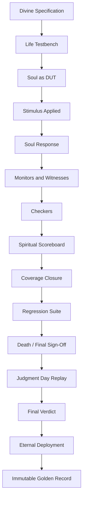

---

# 2. Chapter 01 — Soul as DUT

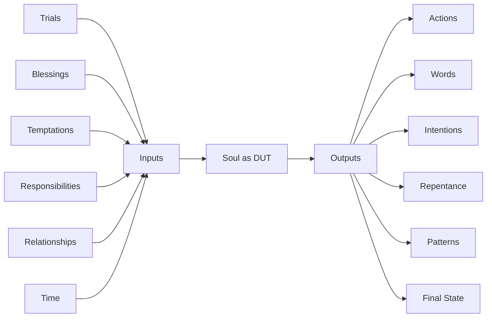

---

# 3. Chapter 02 — Spiritual Testbench Architecture

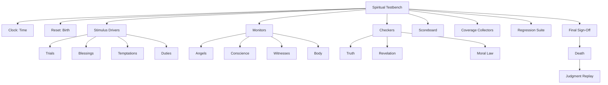

---

# 4. Chapter 03 — The Unseen War

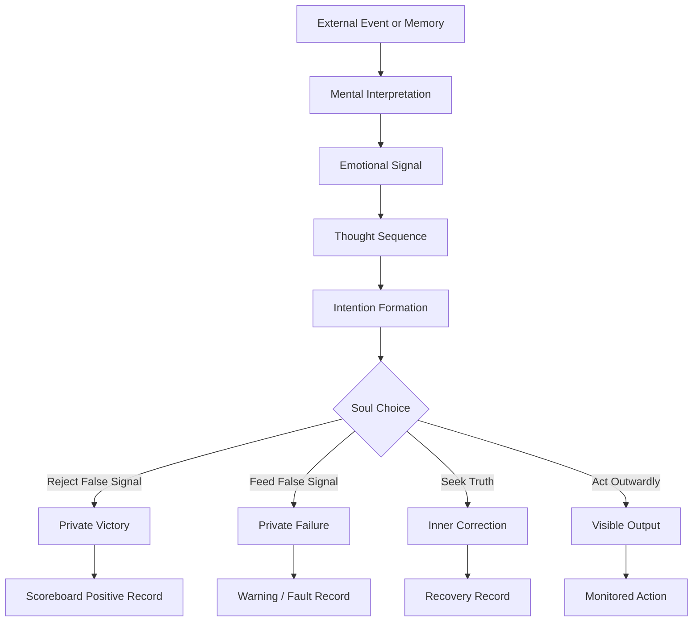

---

# 5. Whispers as Adversarial Stimulus

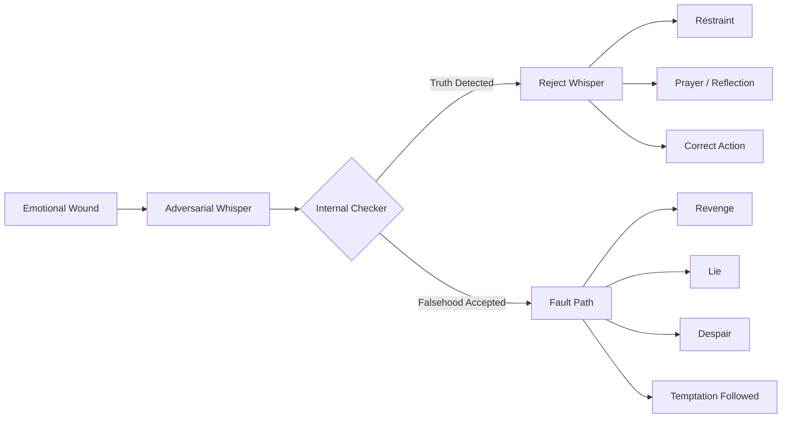

---

# 6. Chapter 04 — Testbench of the Soul

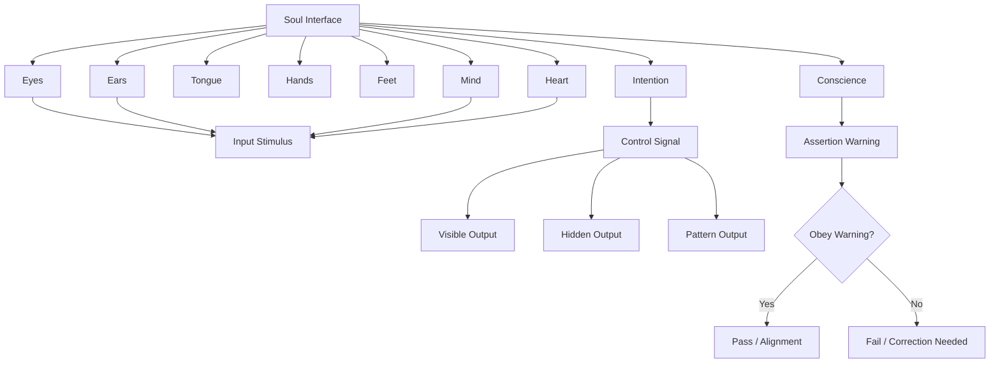

---

# 7. Conscience as Assertion Engine

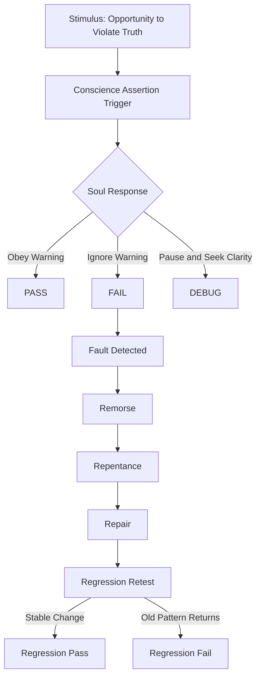

---

# 8. Chapter 05 — Multi-Agent Verification

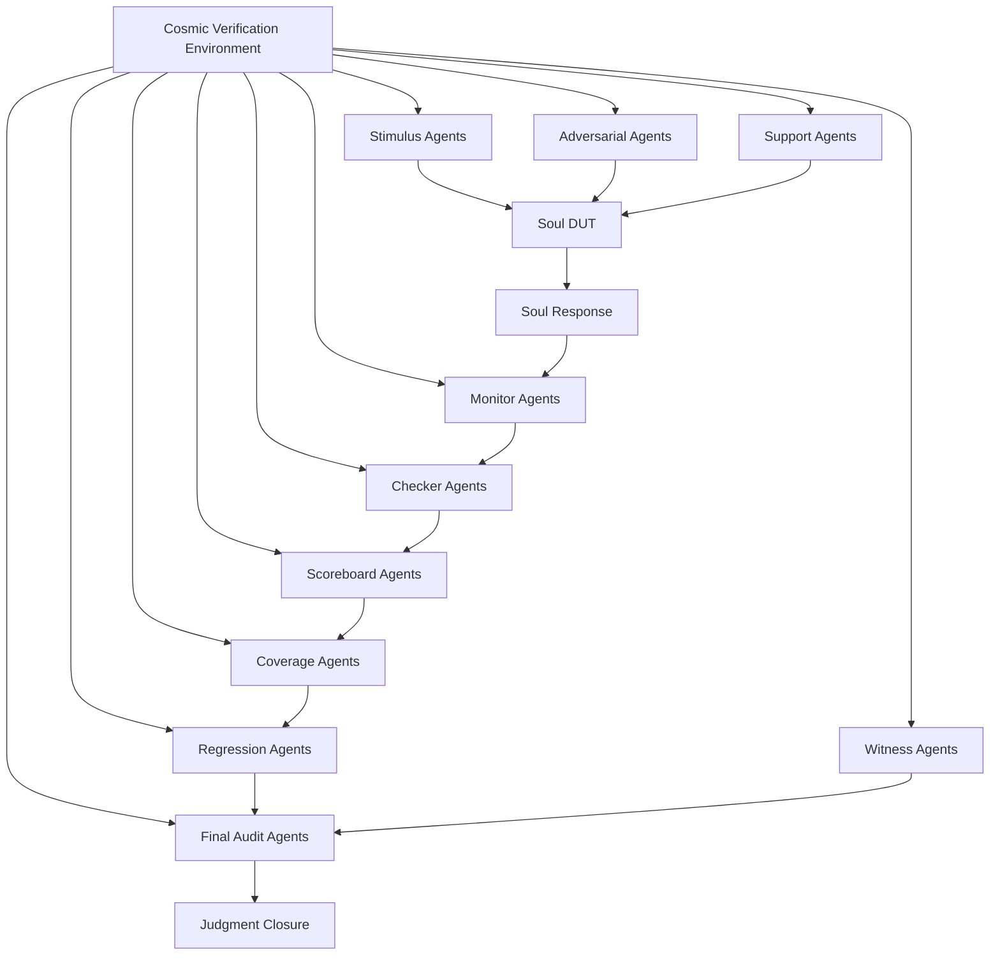

---

# 9. Multi-Agent Signal Conflict

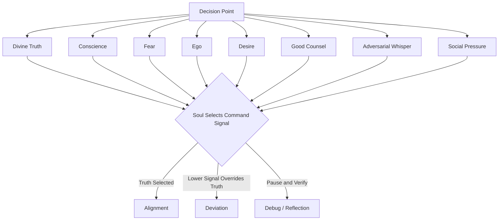

---

# 10. Spiritual Scoreboard Flow

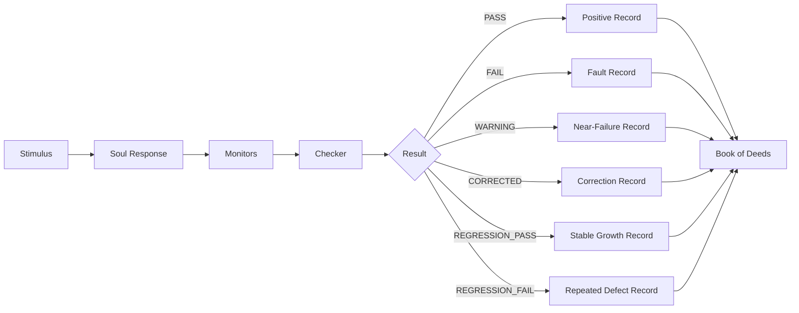

---

# 11. Repentance and Recovery Pipeline

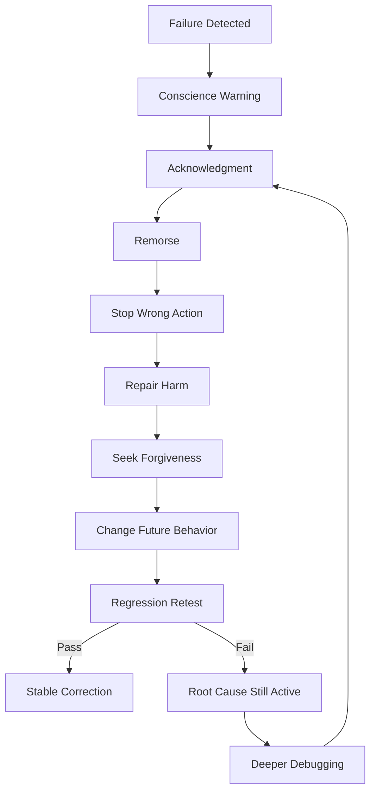

---

# 12. Coverage Closure Map

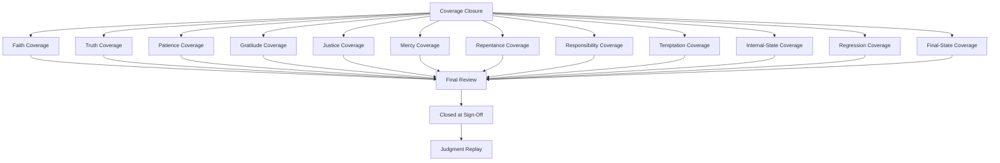

---

# 13. Coverage State Machine

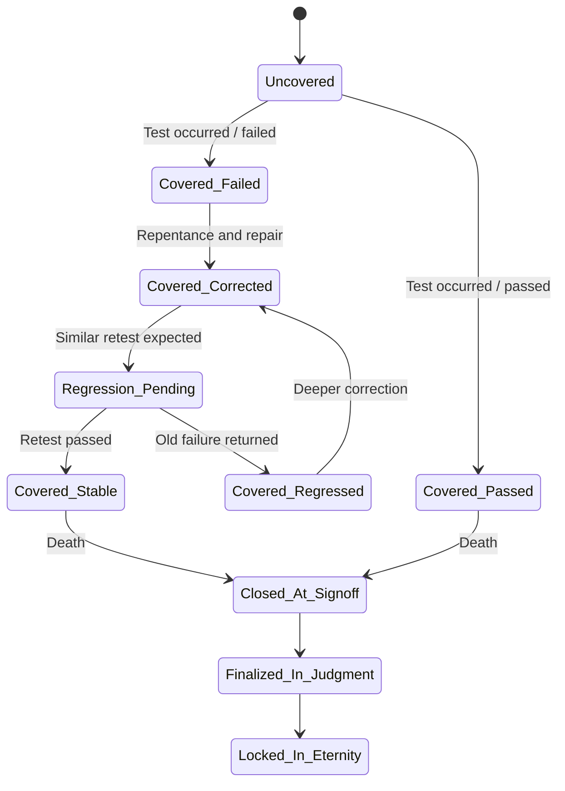

---

# 14. Regression Suite of Destiny

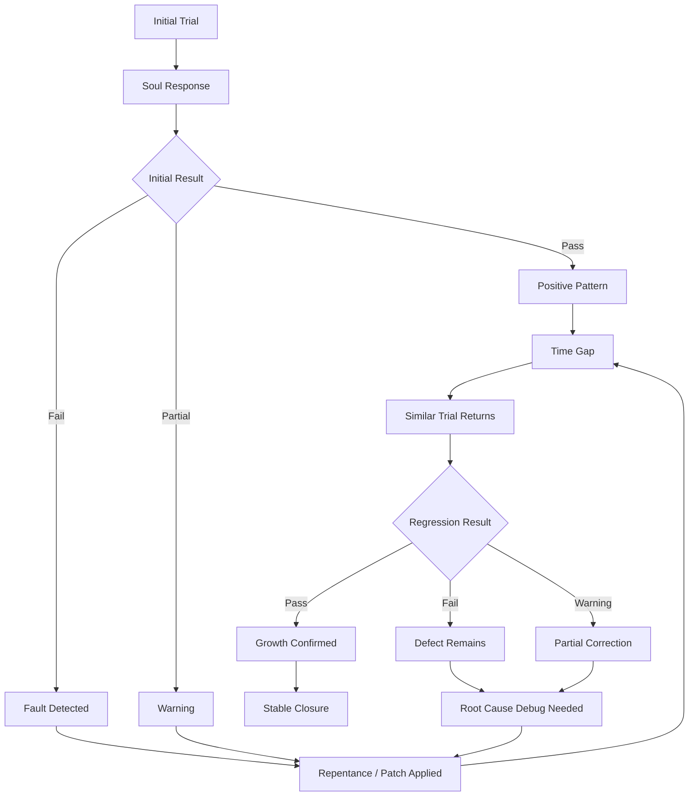

---

# 15. Golden Sequence 1 — Soul Through Worldly Life

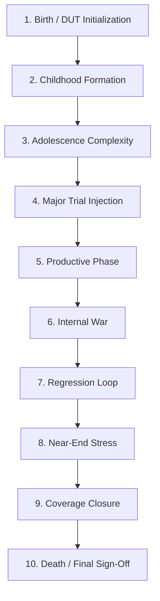

---

# 16. Golden Sequence 2 — Judgment and Eternal Deployment

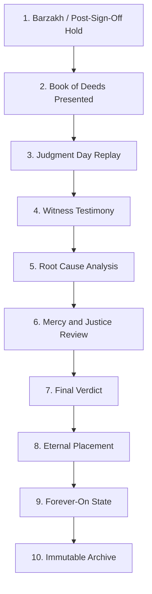

---

# 17. Immutable Golden Record Architecture

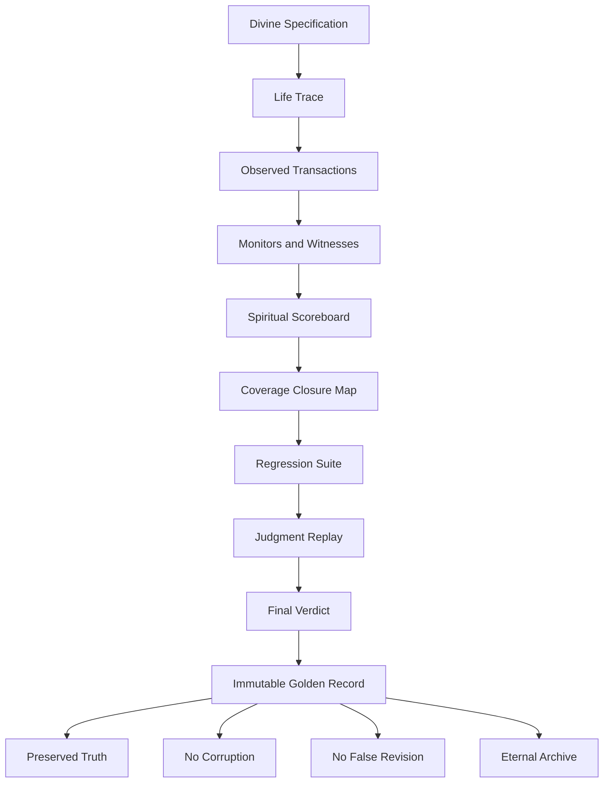

---

# 18. Immutable Record State Flow

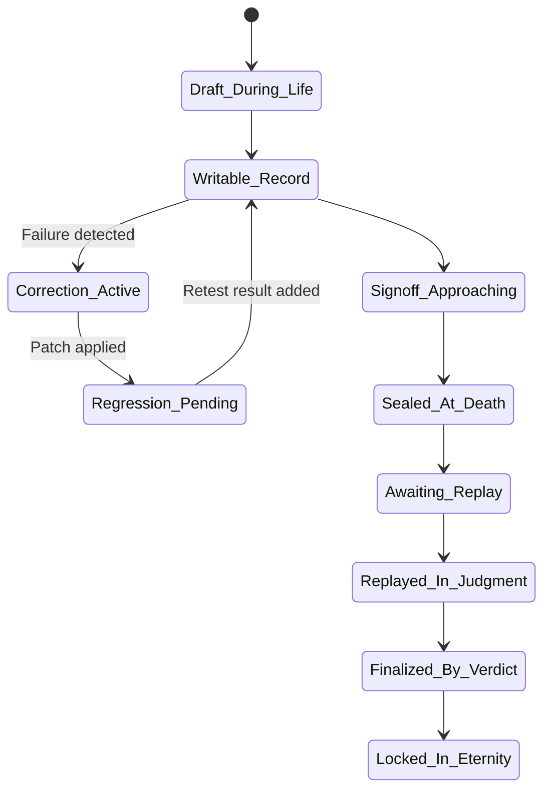

---

# 19. Testcase-to-Record Flow

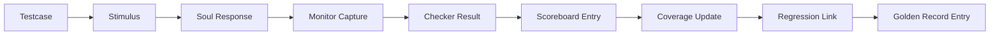

---

# 20. Repository Documentation Map

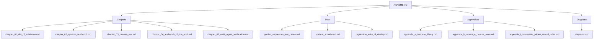

---

# 21. Recommended Repository Placement

```txt
COSMOS-to-SOUL-Before-the-Bang/
├── README.md
├── chapters/
│   ├── chapter_01_dut_of_existence.md
│   ├── chapter_02_spiritual_testbench.md
│   ├── chapter_03_unseen_war.md
│   ├── chapter_04_testbench_of_the_soul.md
│   └── chapter_05_multi_agent_verification.md
├── docs/
│   ├── diagrams.md
│   ├── golden_sequences_test_cases.md
│   ├── spiritual_scoreboard.md
│   └── regression_suite_of_destiny.md
└── appendices/
    ├── appendix_a_testcase_library.md
    ├── appendix_b_coverage_closure_map.md
    └── appendix_i_immutable_golden_record_index.md
```

Recommended README link:

```md
## Diagrams

The full Mermaid diagram collection is available here:

[Diagrams](docs/diagrams.md)
```

---

# 22. Conclusion

These diagrams convert the *COSMOS to SOUL* framework into visual verification architecture.

They show the full path:

```txt
Soul as DUT
    -> Life Testbench
    -> Unseen War
    -> Multi-Agent Verification
    -> Scoreboard
    -> Coverage Closure
    -> Regression Suite
    -> Death Sign-Off
    -> Judgment Replay
    -> Immutable Golden Record
```

The diagrams help readers see that the framework is not only symbolic. It is structured like a verification system with stimulus, response, monitoring, checking, scoring, coverage, regression, archive, and final closure.
