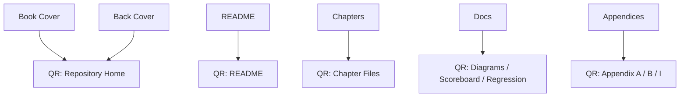

# QR Codes — COSMOS to SOUL: Before the Bang

**Book:** COSMOS to SOUL: Before the Bang  
**Author:** Sakinder Ali  
**Framework:** Spiritual Verification, Golden Sequences, Life-as-Testbench Model  
**File:** `qr_codes.md`

---

## Purpose

This file defines the QR code index for the **COSMOS to SOUL: Before the Bang** repository and book package.

The QR codes are intended for:

- Book pages
- Posters
- GitHub documentation
- NotebookLM source references
- PDF appendices
- Chapter navigation
- Print handouts
- Cover/back-cover placement
- Verification-framework quick access

Each QR code points to a stable GitHub path.

---

# 1. QR Code Master Index

| ID | Title | Target |
|---|---|---|
| `QR-REPO-HOME` | Repository Home | `https://github.com/zakinder/COSMOS-to-SOUL-Before-the-Bang` |
| `QR-README` | README | `https://github.com/zakinder/COSMOS-to-SOUL-Before-the-Bang/blob/main/README.md` |
| `QR-COVERS` | Covers | `https://github.com/zakinder/COSMOS-to-SOUL-Before-the-Bang/blob/main/docs/covers.md` |
| `QR-DIAGRAMS` | Diagrams | `https://github.com/zakinder/COSMOS-to-SOUL-Before-the-Bang/blob/main/docs/diagrams.md` |
| `QR-GOLDEN-SEQUENCES-TEST-CASES` | Golden Sequences and Test Cases | `https://github.com/zakinder/COSMOS-to-SOUL-Before-the-Bang/blob/main/docs/golden_sequences_test_cases.md` |
| `QR-SPIRITUAL-SCOREBOARD` | Spiritual Scoreboard | `https://github.com/zakinder/COSMOS-to-SOUL-Before-the-Bang/blob/main/docs/spiritual_scoreboard.md` |
| `QR-REGRESSION-SUITE-OF-DESTINY` | Regression Suite of Destiny | `https://github.com/zakinder/COSMOS-to-SOUL-Before-the-Bang/blob/main/docs/regression_suite_of_destiny.md` |
| `QR-CHAPTER-01-DUT-OF-EXISTENCE` | Chapter 01 — The DUT of Existence | `https://github.com/zakinder/COSMOS-to-SOUL-Before-the-Bang/blob/main/chapters/chapter_01_dut_of_existence.md` |
| `QR-CHAPTER-02-SPIRITUAL-TESTBENCH` | Chapter 02 — The Spiritual Testbench | `https://github.com/zakinder/COSMOS-to-SOUL-Before-the-Bang/blob/main/chapters/chapter_02_spiritual_testbench.md` |
| `QR-CHAPTER-03-UNSEEN-WAR` | Chapter 03 — The Unseen War | `https://github.com/zakinder/COSMOS-to-SOUL-Before-the-Bang/blob/main/chapters/chapter_03_unseen_war.md` |
| `QR-CHAPTER-04-TESTBENCH-OF-THE-SOUL` | Chapter 04 — Testbench of the Soul | `https://github.com/zakinder/COSMOS-to-SOUL-Before-the-Bang/blob/main/chapters/chapter_04_testbench_of_the_soul.md` |
| `QR-CHAPTER-05-MULTI-AGENT-VERIFICATION` | Chapter 05 — Multi-Agent Verification | `https://github.com/zakinder/COSMOS-to-SOUL-Before-the-Bang/blob/main/chapters/chapter_05_multi_agent_verification.md` |
| `QR-APPENDIX-A-TESTCASE-LIBRARY` | Appendix A — Testcase Library | `https://github.com/zakinder/COSMOS-to-SOUL-Before-the-Bang/blob/main/appendices/appendix_a_testcase_library.md` |
| `QR-APPENDIX-B-COVERAGE-CLOSURE-MAP` | Appendix B — Coverage Closure Map | `https://github.com/zakinder/COSMOS-to-SOUL-Before-the-Bang/blob/main/appendices/appendix_b_coverage_closure_map.md` |
| `QR-APPENDIX-I-IMMUTABLE-GOLDEN-RECORD-INDEX` | Appendix I — Immutable Golden Record Index | `https://github.com/zakinder/COSMOS-to-SOUL-Before-the-Bang/blob/main/appendices/appendix_i_immutable_golden_record_index.md` |

---

# 2. Recommended QR Code Placement

| Location | Recommended QR Code |
|---|---|
| Front matter | Repository Home |
| README section | README |
| Back cover | Repository Home |
| Cover design notes | Covers |
| Diagram section | Diagrams |
| Golden sequence section | Golden Sequences and Test Cases |
| Scoreboard section | Spiritual Scoreboard |
| Regression section | Regression Suite of Destiny |
| Chapter 01 ending | Chapter 01 — DUT of Existence |
| Chapter 02 ending | Chapter 02 — Spiritual Testbench |
| Chapter 03 ending | Chapter 03 — Unseen War |
| Chapter 04 ending | Chapter 04 — Testbench of the Soul |
| Chapter 05 ending | Chapter 05 — Multi-Agent Verification |
| Appendix A header | Appendix A — Testcase Library |
| Appendix B header | Appendix B — Coverage Closure Map |
| Appendix I header | Appendix I — Immutable Golden Record Index |

---

# 3. QR Code Naming Convention

Recommended asset names:

```txt
qr_repo_home.png
qr_readme.png
qr_covers.png
qr_diagrams.png
qr_golden_sequences_test_cases.png
qr_spiritual_scoreboard.png
qr_regression_suite_of_destiny.png
qr_chapter_01_dut_of_existence.png
qr_chapter_02_spiritual_testbench.png
qr_chapter_03_unseen_war.png
qr_chapter_04_testbench_of_the_soul.png
qr_chapter_05_multi_agent_verification.png
qr_appendix_a_testcase_library.png
qr_appendix_b_coverage_closure_map.png
qr_appendix_i_immutable_golden_record_index.png
```

---

# 4. QR Code Design Rules

## Print Rules

- Use high contrast: black code on white background.
- Keep a clear quiet zone around each QR code.
- Do not place QR codes over complex backgrounds.
- Minimum print size: 1 inch by 1 inch.
- Recommended book size: 1.25 to 1.5 inches square.
- Recommended poster size: 2 to 4 inches square.
- Test scan before printing final copies.

## Digital Rules

- Use PNG or SVG.
- Avoid compression artifacts.
- Use descriptive filenames.
- Keep target URLs stable.
- Prefer GitHub `blob/main` links for readable source pages.

---

# 5. QR Code Text Labels

Recommended visible labels under QR codes:

```txt
Scan for COSMOS to SOUL Repository
Scan for Golden Sequences
Scan for Spiritual Scoreboard
Scan for Regression Suite
Scan for Appendix A — Testcase Library
Scan for Appendix B — Coverage Closure Map
Scan for Appendix I — Immutable Golden Record
```

---

# 6. Back Cover QR Block

Recommended back-cover QR block:

```txt
Scan to access the COSMOS to SOUL repository,
chapters, appendices, diagrams, and verification framework files.
```

Suggested QR target:

```txt
https://github.com/zakinder/COSMOS-to-SOUL-Before-the-Bang
```

---

# 7. Mermaid QR Placement Map



---

# 8. Repository Placement

Recommended repository structure:

```txt
COSMOS-to-SOUL-Before-the-Bang/
├── README.md
├── chapters/
├── docs/
│   ├── covers.md
│   ├── diagrams.md
│   ├── qr_codes.md
│   ├── golden_sequences_test_cases.md
│   ├── spiritual_scoreboard.md
│   └── regression_suite_of_destiny.md
├── appendices/
└── assets/
    └── qr_codes/
        ├── repo_home.png
        ├── readme.png
        ├── covers.png
        ├── diagrams.png
        ├── golden_sequences_test_cases.png
        ├── spiritual_scoreboard.png
        ├── regression_suite_of_destiny.png
        ├── chapter_01_dut_of_existence.png
        ├── chapter_02_spiritual_testbench.png
        ├── chapter_03_unseen_war.png
        ├── chapter_04_testbench_of_the_soul.png
        ├── chapter_05_multi_agent_verification.png
        ├── appendix_a_testcase_library.png
        ├── appendix_b_coverage_closure_map.png
        └── appendix_i_immutable_golden_record_index.png
```

Recommended README link:

```md
## QR Codes

The QR code index is available here:

[QR Codes](docs/qr_codes.md)
```

---

# 9. Conclusion

The QR code system gives the book and repository a physical-to-digital bridge.

Readers can move from printed pages into:

- Source chapters
- Diagrams
- Testcase library
- Coverage map
- Scoreboard model
- Regression suite
- Immutable golden record index
- Full GitHub repository

The QR codes turn the book into a navigable verification archive.
